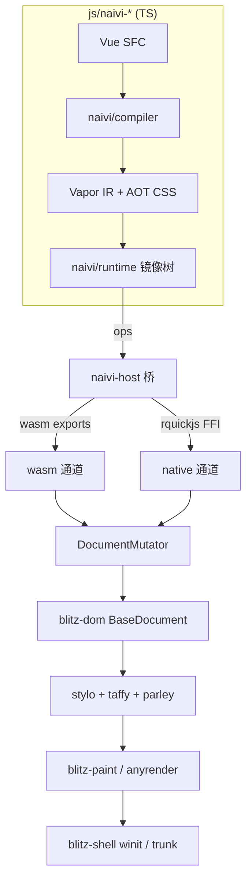
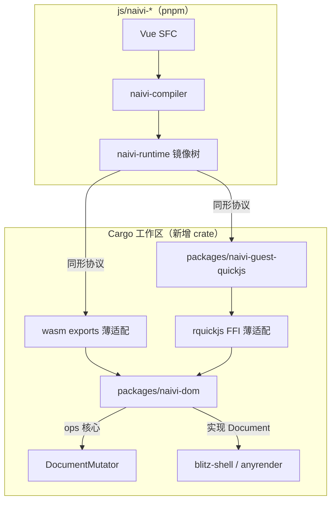
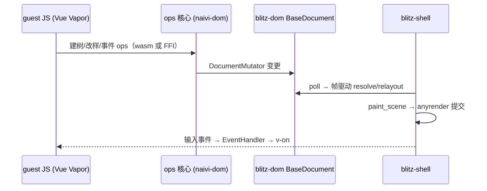

# Naivi Vapor Frontend - Plan

## Goal Capsule

- **Objective:** 在 blitz 仓库内实现 naivi——Vue Vapor AOT 前端。fork 的 TS 栈（`js/naivi-*`）经 Mutation 镜像桥双通道（wasm exports / rquickjs FFI）驱动 blitz-dom，复用 blitz 引擎（stylo / taffy / parley）、shell 与渲染（winit / trunk + anyrender）。首里程碑：hello/counter 双平台（浏览器 wasm + 原生窗口）跑通。
- **Product authority:** 用户整体 GUI 愿景（naive 仓库 `docs/gui.总体.md` 为愿景参考，非本仓库文件）；naivi 为 blitz 战略前端，Dioxus 路径非维护承诺。
- **Open blockers:** 无。
- **Execution profile:** 本计划已 enrich 为 implementation-ready，由 `ce-work` 按 U1→U7 实施；Rust 改动遵循 blitz 现有约定，js 改动遵循 `js/` pnpm workspace 约定。

## Product Contract

### Summary

naivi 是 blitz 的第二应用层：fork 的 Vue Vapor AOT 栈（TS，位于 `js/naivi-*`）通过双通道 Mutation 镜像桥把建树 / 改样 / 文本操作同步进 blitz-dom，复用 blitz 的样式、布局、文本、绘制与窗口。首里程碑以 hello/counter 双平台跑通为完成定义。naive 的 Rust 自研引擎不引入。

### Problem Frame

naive 拥有一套完整的 Vue Vapor AOT 前端（编译器 / 运行时 / CLI），但其自研 Rust 引擎存在天花板：`naive-css` 是手写 CSS 子集，WPT 基线仅 49 pass / 26 unsupported-property / 123 unsupported-value / 5 fail（naive 仓库 `docs/plans/2026-08-07-065-residuals.md`）。blitz 则拥有成熟引擎——Servo Stylo CSS、taffy 布局、parley 文本、anyrender 渲染与 blitz-shell——但没有 Vue 模板 DSL / fine-grained AOT 响应式前端，应用层只有 Dioxus（RSX 亦为编译期，差异在模板 DSL 与细粒度响应式）。合并两者的动机：以 blitz 引擎补上 CSS 符合性，以 Vue Vapor AOT 补上编译期 UI 管线，构成用户整体 GUI 愿景的载体。

naive 侧 plan 071（naive 仓库 `docs/plans/2026-08-11-071-arch-blitz-dom-engine-switch-plan.md`）选择"naive 消费 blitz-dom"（DOM / CSS / Layout 用 blitz，保留 naive 渲染 / 事件 / 文本）。本计划选择相反方向："blitz 承载、naivi 为前端"，naive Rust 不引入。两条线分叉，各自独立演进。

### Key Decisions

- KD1. **方向 = blitz 为主，接入 Vue Vapor AOT 前端**（session-settled: user-directed — chosen over 重构 blitz 内部为 naive 架构 / naive 整体并入 blitz: blitz 引擎已成熟，naive Rust 自研有 CSS 符合性天花板）。Governs R4-R11.
- KD2. **首里程碑双平台同时起步**（session-settled: user-directed — chosen over 单一平台先行: 从第一天验证引擎中立）。Governs R5, R11.
- KD3. **TS 侧 fork 进 blitz 仓库独立演进**（session-settled: user-directed — chosen over 外部 pnpm 依赖复用 / 全新实现: 与 naive 仓库脱钩）。Governs R1.
- KD4. **fork 位于 `js/naivi-*`**（session-settled: user-directed — chosen over `packages/naivi-*`: 用户指定，与 Rust `packages/` 区分）。Governs R1-R2.
- KD5. **首里程碑验收 = hello/counter 双平台，todomvc 后续**（session-settled: user-directed — chosen over counter+todomvc 双 demo / 性能基准: 先验证全链路通路）。Governs R11.
- KD6. **native JS 引擎 = rquickjs（QuickJS-NG）**（session-settled: user-directed — chosen over JSCore / 引擎后置: 与 naive 桌面端一致，模式可移植）。Governs R5, R7.
- KD7. **桥形态 = Mutation 镜像桥（方案 A），不做 HTML 物化探路**（session-settled: user-directed — chosen over HTML 物化楔子 / 整树 IR 交接: 增量精确，复用 naive native-tree 与 dioxus-native-dom 双模式）。Governs R4-R5.
- KD8. **Dioxus 非维护承诺，冲突可删**（session-settled: user-directed — chosen over 主动清理: 现路径保持可用，不主动迁移）。Governs R13.

### How This Work Fits Together

<!-- ce-section: work-relationships -->

本计划拥有 **naivi Vapor 前端** 这一独立工作单元（首里程碑 = hello/counter 双平台）。周边工作是当前理解，不是承诺路线图：

- naive plan 071（naive 仓库，naive 消费 blitz-dom）— **分叉线**：方向相反（naive 为主），本计划不执行也不依赖它；naivi 的 TS 协议重定向到 blitz 语义，两边独立演进
- naive-text 接入 — **Depends on** 本计划文本桥（parley 消费层）稳定后评估；当前文本统一用 blitz parley
- todomvc demo — **Depends on** 首里程碑（样式管线成熟后）
- AOT 性能基准（相对 Dioxus）— **Depends on** 样式 / 增量管线就绪
- Dioxus 清理 — **Can proceed independently of**：仅冲突时删除
- 动画引擎、golden 截图测试 — **Can proceed independently of**

### Actors

- A1. **naivi guest JS（Vue Vapor 编译产物 / 镜像树）** — 通过双通道 ops 驱动 blitz-dom 建树与改样
- A2. **naivi-host（Rust 桥）** — wasm exports 与 rquickjs FFI 两套薄适配，共享同一 ops 核心
- A3. **blitz-dom** — DOM、样式（stylo）、布局（taffy）、文本（parley）提供者
- A4. **blitz-shell + anyrender** — 窗口、帧驱动、输入来源、渲染提交
- A5. **naivi-cli（TS）** — dev / build 命令，支撑 web / wasm / desktop 三模式

### Requirements

**工具链与前端栈**

- R1. naivi 的 TS 栈（compiler / runtime / cli）fork 进 blitz 仓库 `js/naivi-*`，独立演进，不依赖 naive 仓库。（KD3, KD4）
- R2. blitz 仓库引入 pnpm workspace + Vite 工具链承载 `js/naivi-*`，与 Cargo 工作区并存。（KD4）
- R3. `js/naivi-cli` 提供 dev / build 命令（web / wasm / desktop），支撑首里程碑双平台运行。

**引擎接入与桥**

- R4. naivi 运行时经 Mutation 镜像桥驱动 blitz-dom：JS 侧维护镜像树，建树 / 改样 / 文本操作增量同步到 Rust。（KD7）
- R5. wasm 与 native 双通道共享同一 ops 核心：wasm 走 wasm-bindgen exports，native 走 rquickjs FFI。（KD2, KD6, KD7）
- R6. 新增 Rust crate 实现 blitz `Document` trait，经 `DocumentMutator` 写 `BaseDocument`；由 `BlitzApplication` 驱动窗口与渲染。
- R7. native 通道以 rquickjs（QuickJS-NG）嵌入 guest JS，单线程单 Context、每帧排微任务队列。（KD6）

**样式与文本**

- R8. 样式计算由 blitz stylo 完成：naivi AOT 产物以 CSS 文本注入（内联样式走 `set_style_property`，类 / 标签 / 复杂选择器走 author stylesheet）；`:hover` / `:active` / `:checked` 由 stylo 原生处理。
- R9. 文本排版使用 blitz parley；naive-text 方案作为后期独立工作接入。

**交互**

- R10. 事件与 hittest 复用 blitz-dom（事件驱动 + 布局盒 hittest）；naivi 只负责把 Vapor v-on handler 绑定进 blitz 事件系统。

**验收与共存**

- R11. 首里程碑验收锚点：hello / counter demo 双平台（wasm + native）跑通，交互与样式正常。（KD2, KD5）
- R12. `cargo test --workspace` 全绿；`js/naivi-*` 构建、类型检查与 lint 通过；新增 demos 构建可用。
- R13. 现有 Dioxus 路径保持可用但不作为维护承诺；与 naivi 冲突时可删除。（KD8）

### Key Flows

- F1. 帧循环（Covers R4, R6, R8, R9, R10）
  - **Trigger:** naivi-frame / 渲染驱动每帧。
  - **Actors:** A2, A3, A4
  - **Steps:** guest 变更应用到 blitz-dom → blitz-dom restyle + relayout → 渲染桥遍历读 computed style / layout / text → paint → 提交。
- F2. JS 建树映射（Covers R4, R5, R8）
  - **Trigger:** Vue SFC 编译产物在 guest 执行建树 / 改样操作。
  - **Actors:** A1, A2, A3
  - **Steps:** 镜像树变更 → ops（wasm exports / rquickjs FFI）→ `DocumentMutator` → `BaseDocument` → 变更标记进入下一帧。
- F3. 事件分发与 hittest（Covers R10）
  - **Trigger:** 输入事件到达 blitz-shell。
  - **Actors:** A4, A3, A1
  - **Steps:** 输入 → blitz-dom 事件驱动 → 布局盒 hittest → 命中节点 handler → Vapor 响应式更新。

### Visualizations

桥接管线结构（对应 R4-R8）：

### Acceptance Examples

- AE1. counter（Vue SFC）在浏览器（wasm）运行：点击计数递增，类 / 内联样式呈现正常（Covers R3, R4, R8, R11）。
- AE2. counter 在原生窗口（native）运行：行为与 wasm 一致（Covers R5, R7, R11）。
- AE3. hello_world demo 双平台运行，布局呈现正常（Covers R6, R11）。
- AE4. `naivi-cli` 的 wasm 与 desktop 两模式命令可用，产物可加载（Covers R3, R12）。
- AE5. `cargo test --workspace` 全绿；js 侧类型检查与 lint 通过（Covers R12）。

### Scope Boundaries

- **不引入** naive 自研 Rust 层：场景图、`naive-css`、`naive-paint`、`naive-text` 均不进 blitz。
- **naive-text 接入** — 后期独立工作，当前文本统一用 blitz parley。
- **todomvc** — 后续里程碑（依赖样式管线成熟）。
- **AOT 性能基准**（相对 Dioxus）— 后续。
- **Dioxus 主动清理** — 不做，仅冲突时删除。
- **动画引擎、golden 截图测试** — 不做。
- **wpt-runner** — 不引入（naive 自研 CSS 引擎的验证设施；本计划无 CSS 引擎，CSS 符合性由 blitz 上游 wpt 承担）。
- **Dioxus 沟通** — `docs/naivi.md` 说明 naivi 为战略前端、Dioxus 保持现状支持（R13）。

### Outstanding Questions

- wasm exports / FFI 协议的具体签名与 `js/naivi-*` 镜像树改动清单 — **Resolved**：KTD1，落于 U3/U4
- AOT CSS 注入 stylo 的字段集与格式（CSS 文本 vs 直接映射） — **Resolved**：KTD4，落于 U6
- rquickjs guest 的具体形态（移植 naive-guest-quickjs 模式 vs 新写） — **Resolved**：KTD5，落于 U5
- hittest 复用 blitz-dom 布局盒时与 Vapor 交互语义的偏差处理 — **Deferred to Implementation**（A5）

### Assumptions

- A1. 事件 / hittest 复用 blitz-dom（EventDriver + 布局盒 hittest），naivi 只负责 handler 绑定；若 blitz 内部 hittest 与预期不一致，以 naivi 侧校正并记录偏差。
- A2. 首里程碑验证"编译 → 桥 → 引擎 → 渲染"全链路通路；Vapor AOT 的细粒度增量优势在后续（样式 / 增量管线）验证。
- A3. `js/` 目录引入 pnpm / Vite 工具链是 blitz 技术栈的预期新增，接受其维护成本。
- A4. 样式注入走 CSS 文本（借鉴 naive plan 071 的 KTD4 思路，但为 blitz 侧实现），具体字段由规划枚举。

---

## Planning Contract

> Product Contract preservation: unchanged。R/AE/KD 原 ID 与语义保留；仅 frontmatter readiness 提升为 implementation-ready，并追加规划与实施段。

### Key Technical Decisions

- KTD1. **桥协议重定义为 blitz-dom 语义**——wasm 与 native 双通道呈现同一协议面。naive 的 `WasmExports` 十七个函数重定向：建树/文本/属性/树操作映射 `DocumentMutator`；`set_attr`（naive 仅 class/id）扩展为 `set_attribute`（QualName）；补 `insert_nodes_before/after` 与 `replace_node_with`；删除 `compute_layout`/`get_layout_rect`（blitz 自动布局）；删除 `set_rule_table`/`flush_styles`/`get_computed_style_json`/`apply_conditional_styles`（stylo 接管）。继承 KD5/KD7（session-settled: user-directed）。Governs R4, R5, R8.
- KTD2. **`naivi-dom` crate 形态**——实现 blitz `Document` trait（`inner`/`inner_mut` 必需，覆盖 `poll`/`handle_ui_event`），仿 `dioxus-native-dom` 栈机模式（NodeId 映射 + 事件计数）；crate 内持有引擎中立 ops 核心，wasm 与 native 两套薄适配都调用它。Governs R4, R6.
- KTD3. **事件模型 = 复用 blitz-dom**——实现 blitz `EventHandler`（仿 `DioxusEventHandler`）把 Vue v-on handler 绑进 blitz 事件链，handler 经 `data-naivi-id` 属性注册；hittest 用 blitz-dom 布局盒与 `set_hover_to`。继承 A1。Governs R10.
- KTD4. **AOT CSS 注入 = CSS 文本 → stylo**——naivi compiler 输出改为 CSS 文本（含 `:hover`/`:active`/`:checked` 伪类），运行时经 `make_stylesheet` + `add_stylesheet_for_node` 注入 author stylesheet，内联样式走 `set_style_property`；`styles.json`/rule-table 产物移除。（本会话 5.1.5 规划综合时用户确认）Governs R8.
- KTD5. **native guest = rquickjs**——mirror `naive-guest-quickjs` 模式：单线程单 Context、每帧 pump 微任务、事件 drain；新 crate 复用共享 ops 核心。继承 KD6（session-settled: user-directed）。Governs R7.
- KTD6. **工具链布局 = `js/` pnpm workspace**——`@naivi/*`（compiler/runtime/cli）与 Cargo 工作区并存；fork 保留 naive 的 dual-mode（标准 Vue fallback 用于 `naivi web` 开发验证，wasm 模式走桥）。继承 KD3/KD4（session-settled: user-directed）。Governs R1, R2, R3.
- KTD7. **实施形态 = 单计划覆盖首里程碑**——U1→U7 一次交付；wasm 与 native 共享 ops 核心，实施次序（先 wasm 后 native）是依赖序而非交付差异。（本会话 5.1.5 规划综合时用户确认）Governs R11.

### Sequencing

按 U1 → U2 → U3 → U4 → U5 → U6 → U7 实施。U3 是双通道共同依赖；U4/U5 可并行（共享 ops 核心）；U6 可随 U4 提前开始；U7 收口验收。

### High-Level Technical Design

帧循环数据流（对应 R4/R6/R10）：

### Assumptions

- A5. 协议 op 映射的偏差（hittest 与 naive 事件语义差异）以实施期记录并校正，不阻塞本计划（承接 Product Contract OQ #4）。
- A6. fork 后 `js/naivi-*` 与 naive 仓库不再同步；`vue ^3.6.0-rc.1` 版本由 fork 自行跟进。

### Risks & Dependencies

- **unsafe lint 对齐**：rquickjs 绑定内部含 unsafe。若 blitz workspace 的 lint 策略为 `unsafe_code = deny`，`naivi-guest-quickjs` crate 需豁免或局部放行——实施期先确认根 `Cargo.toml` 现有策略（对照 naive 的 deny 惯例）。
- **Vue Vapor 预发布依赖**：`vue ^3.6.0-rc.1` 为 rc 版本，Vapor runtime API 可能变动；fork 锁定该版本并按需跟进（A6）。
- **fork 分叉漂移**：`js/naivi-*` 与 naive 仓库脱钩后，naive 的后续修复不再自动进入；以 U2 冒烟与 U7 验收为回归锚点。
- **wasm 体积/首编译**：stylo 首编译与 wasm 体积增长不加硬预算（承接 A2）；若超出预期，作为后续独立优化项。
- **事件语义映射**：naive `EventType`（`dblclick`/`contextmenu`/`mouseenter` 等）到 blitz `DomEventKind` 的映射表在 U3 落地；无法一一对应的项记录为已知缺口（A5）。

### System-Wide Impact

- 仓库新增 `js/` 目录与 pnpm/Vite 工具链，CI 需增加 node 构建步骤（U7）。
- Cargo workspace 新增 `naivi-dom`、`naivi-guest-quickjs` 两个 crate，与现有 Dioxus 路径共存（R13）。
- `examples/naivi/` 成为新的示例目录，与 `examples/wasm_hello`、`examples/todomvc` 并列。
- 维护面：naivi 成为 blitz 第二应用层；后续 naive-text、todomvc、性能基准均在此线路上叠加（见 How This Work Fits Together）。

---

## Implementation Units

### U1. Fork naivi TS 包与 pnpm 工具链

- **Goal:** 把 naive 的 compiler/runtime/cli fork 进 blitz `js/`，更名 `@naivi/*`，建立 pnpm workspace 与共享 TS 配置。
- **Requirements:** R1, R2, R3
- **Dependencies:** 无（首单元）
- **Files:** `js/pnpm-workspace.yaml`、`js/package.json`、`js/tsconfig.base.json`、`js/naivi-compiler/**`、`js/naivi-runtime/**`、`js/naivi-cli/**`（源码 fork 自 naive 仓库对应包）
- **Approach:** 拷贝 naive `packages/compiler|runtime|cli` 源码进 `js/naivi-*`；包名与内部 import 改为 `@naivi/*`；保留 naive 的 exports 映射形状（`./vue-vapor`、`./native-tree`、`./wasm-types`、`./desktop-main` 等）；保留 `vue ^3.6.0-rc.1` 依赖；暂不改协议面（U3/U4 落地时改）。
- **Test scenarios:**
  - `pnpm install` 后 `pnpm -r build` 全绿（compiler/runtime/cli 各 tsc 构建）
  - `@naivi/runtime` 的 exports 子路径均可解析
  - `pnpm -r typecheck` 通过
- **Verification:** `js/` 下 `pnpm -r build` 与 typecheck 无错误。

### U2. naivi-cli web 冒烟（fork 验证与 dev 基础设施）

- **Goal:** `naivi web` 用 Vite 把 Vue SFC demo 跑起来（标准 Vue fallback 路径），验证 fork 编译链；为后续 wasm/native 提供 dev 基础。非 HTML 物化桥（KD7 已弃该路线）。
- **Requirements:** R3
- **Dependencies:** U1
- **Files:** `js/naivi-cli/src/cli.ts`、`js/naivi-cli/src/vite-config.ts`、`js/naivi-runtime/src/index-vue-vapor.ts`（fallback 分支）、`examples/naivi/hello/`（新 Vue SFC demo，含 counter 组件）、`examples/naivi/hello/index.html`
- **Approach:** 保留 naive `web` 命令（纯 Vite passthrough）；新建 `examples/naivi/` 放 Vue SFC 应用；`naivi web` 指向该 demo；不改 Rust。
- **Test scenarios:**
  - `naivi web` 启动 dev server，hello/counter 页面在浏览器渲染
  - counter 组件 `@click` 计数自增
  - 修改 SFC 触发 HMR 热更新
- **Verification:** dev server 冒烟通过，浏览器无 console 错误。

### U3. naivi-dom crate：Document 实现与共享 ops 核心

- **Goal:** 新增 `packages/naivi-dom`，实现 blitz `Document` trait 与引擎中立 ops 核心，把镜像树操作映射到 `DocumentMutator`。
- **Requirements:** R4, R5, R6, R10
- **Dependencies:** U1（协议面定义）、U2
- **Files:** `packages/naivi-dom/Cargo.toml`、`packages/naivi-dom/src/lib.rs`、`packages/naivi-dom/src/document.rs`、`packages/naivi-dom/src/ops.rs`、`packages/naivi-dom/src/events.rs`、`packages/naivi-dom/tests/ops.rs`
- **Approach:** 仿 `dioxus-native-dom`：`NaiviDocument { inner: Rc<RefCell<BaseDocument>>, ... }` 栈机 + NodeId 映射；ops 核心定义 `apply_ops`（KTD1 协议面 → `DocumentMutator`）；事件实现 blitz `EventHandler`，handler 经 `data-naivi-id` 注册（KTD3）。对照 `packages/dioxus-native-dom/src/mutation_writer.rs` 与 `packages/blitz-dom/src/mutator.rs`。
- **Patterns to follow:** `packages/dioxus-native-dom/src/dioxus_document.rs`、`packages/dioxus-native-dom/src/mutation_writer.rs`、`packages/blitz-dom/src/mutator.rs`
- **Test scenarios:**
  - 建树：`create_element(div)` + `append_children` → BaseDocument 节点与层级正确
  - 文本：`create_text_node`/`set_node_text` → 文本内容更新
  - 属性：`set_attribute`（QualName，含 class/id）与 `clear_attribute` 生效
  - 样式：`set_style_property`/`remove_style_property` → computed style 生效
  - 树操作：`insert_nodes_before/after`、`replace_node_with`、`remove_node` 的顺序与移除正确
  - 事件：handler 注册写入 `data-naivi-id`、计数更新、移除后计数递减
  - 集成：`apply_ops` 批处理后 resolve 布局可跑、无 panic
- **Verification:** `cargo test -p naivi-dom` 全绿。

### U4. wasm 通道（浏览器）

- **Goal:** wasm-bindgen exports 实现协议面；浏览器入口把 Vue Vapor counter 跑到 blitz-dom（wasm），trunk 示例构建可用。
- **Requirements:** R3, R4, R5, R11（部分）
- **Dependencies:** U3
- **Files:** `packages/naivi-dom/src/wasm.rs`（exports 薄适配）、`examples/naivi/counter-wasm/`（新 cdylib crate，仿 wasm_hello）、`examples/naivi/counter-wasm/index.html`、`js/naivi-runtime/src/wasm-export.ts`、`js/naivi-runtime/src/index-vue-vapor.ts`（wasm 分支绑定）
- **Approach:** mirror naive `wasm_exports.rs`（thin adapter over ops 核心）；运行时 `loadWasm` 绑定（mirror naive `index-vue-vapor.ts`）；trunk + vello-hybrid；字体用 `build_single_font_ctx` 内置（公共 helper 位于 `packages/blitz-dom`，wasm 入口模式 mirror `examples/wasm_hello/src/lib.rs`）。
- **Patterns to follow:** `examples/wasm_hello/src/lib.rs`、naive `crates/naive-host/src/wasm_exports.rs`、naive `packages/runtime/src/index-vue-vapor.ts`
- **Test scenarios:**
  - counter wasm 在浏览器点击自增（Covers AE1）
  - 控制台无错误，canvas 渲染正常
  - 每个协议 op 经 wasm 往返正确（暴露测试钩子或浏览器 smoke）
- **Verification:** trunk 构建成功、浏览器 smoke 通过。

### U5. native 通道（rquickjs + winit）

- **Goal:** rquickjs guest 嵌入 Vue Vapor 产物，经 FFI 调共享 ops 核心；原生窗口（winit + anyrender）跑 counter。
- **Requirements:** R5, R7, R11（部分）
- **Dependencies:** U3、U4（协议与入口模式）
- **Files:** `packages/naivi-guest-quickjs/`（新 crate）、`packages/naivi-dom/src/ffi.rs`、`examples/naivi/counter-native/`（新 crate，winit 入口）、`js/naivi-cli/src/desktop.ts`
- **Approach:** mirror naive `naive-guest-quickjs`（单 Context、每帧 pump 微任务、事件 drain）；desktop.ts 用 Vite bundle main/page + alias 到 desktop 入口 + `cargo run`（mirror naive `desktop.ts`）。
- **Patterns to follow:** naive `crates/naive-guest-quickjs/src/guest.rs`、naive `packages/cli/src/desktop.ts`
- **Test scenarios:**
  - counter native 点击自增（Covers AE2）
  - guest 微任务每帧排空（连续点击无事件丢失）
  - 窗口 resize/关闭正常、无崩溃
- **Verification:** desktop 命令启动原生窗口 smoke 通过。

### U6. AOT CSS → stylo 注入

- **Goal:** naivi compiler 输出 CSS 文本；运行时注入 stylo（author stylesheet + inline）；`:hover`/`:active`/`:checked` 走 stylo 原生状态。
- **Requirements:** R8（R9 由 U3/U4 复用 blitz-dom parley 文本管线满足，无专属交付）
- **Dependencies:** U3、U4
- **Files:** `js/naivi-compiler/**`（产出改 CSS 文本）、`js/naivi-runtime/src/stylesheet.ts`、`js/naivi-cli/src/compile.ts`（styles.json → styles.css）、`packages/naivi-dom/src/ops.rs`（样式 op 扩展）
- **Approach:** compiler 把 SFC `<style>` 与 VariantProperties 编译为 CSS 文本（`:hover`/`:active`/`:checked` 伪类）；运行时经 `make_stylesheet` + `add_stylesheet_for_node` 注入，inline 走 `set_style_property`（KTD4）；删除 rule-table 协议。
- **Test scenarios:**
  - SFC 类选择器样式在 blitz 生效（Covers AE1 样式部分）
  - `:hover` 状态样式随鼠标移入生效
  - `:checked` 状态生效（stylo 原生 checked 状态，覆盖 R8）
  - 内联 style 覆盖类规则（级联正确）
- **Verification:** 样式断言测试通过（优先 blitz-test-harness；若用截图仅为人工目检，非自动化 golden 基线——golden 已延期）。

### U7. 验收收口

- **Goal:** hello/counter 双平台样式完整、验收锚点全绿；清理死代码；文档与 CI 更新。
- **Requirements:** R11, R12, R13
- **Dependencies:** U4, U5, U6
- **Files:** `examples/naivi/**`（最终样式）、`docs/naivi.md`（新增使用说明）、根 `justfile`（新增 naivi 命令）、`.github/workflows/`（js 构建步骤）
- **Approach:** 跑 AE1-AE5 全量验收；删除被替换的协议面残留（set_rule_table 等）与未用 fork 代码；确认 Dioxus 路径未被破坏或记录冲突点（R13）。
- **Test scenarios:**
  - AE1-AE5 全部满足
  - `cargo test --workspace` 全绿（新增 crate 不破坏现有）
  - js 侧 lint/typecheck 通过
- **Verification:** 见 Verification Contract。

---

## Verification Contract

- `cargo test --workspace`（blitz 全量，含新增 `naivi-dom`/guest crate）
- `cargo test -p naivi-dom`（ops/桥核心）
- `js/` 下 `pnpm -r build`、`pnpm -r typecheck`、lint 通过
- `naivi web` dev server 冒烟（U2）
- wasm：trunk 构建成功且浏览器 counter smoke 通过（AE1）
- native：desktop 命令启动原生窗口 counter smoke 通过（AE2）
- 样式：U6 样式断言通过
- 不引入 wpt-runner（无自研 CSS 引擎，CSS 符合性由 blitz 上游 wpt 承担，见 Scope Boundaries）

---

## Definition of Done

- U1-U7 全部完成，每单元 Verification 通过。
- `cargo test --workspace` 全绿；js 构建/类型/lint 通过。
- AE1-AE5 全部满足。
- 清理完成：被替换的 naive 协议面（rule-table/conditional styles 等）与死代码已删除，不残留在 diff。
- 文档：`docs/naivi.md` 可用，`justfile` 与 CI 覆盖新命令。
- 本计划为 `implementation-ready`，无 launch-blocking 开放问题（OQ 均 Resolved 或 Deferred to Implementation）。
