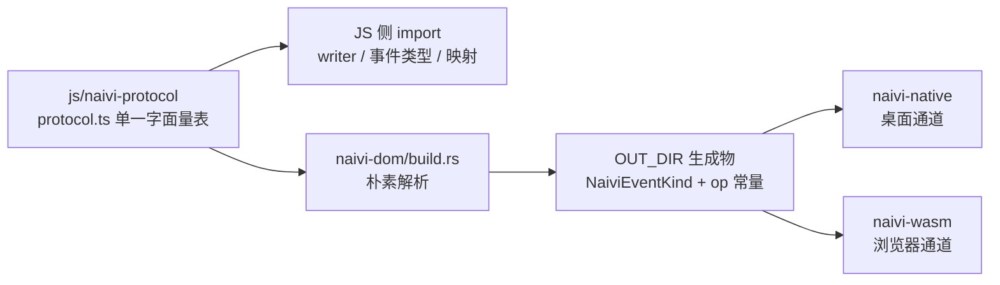
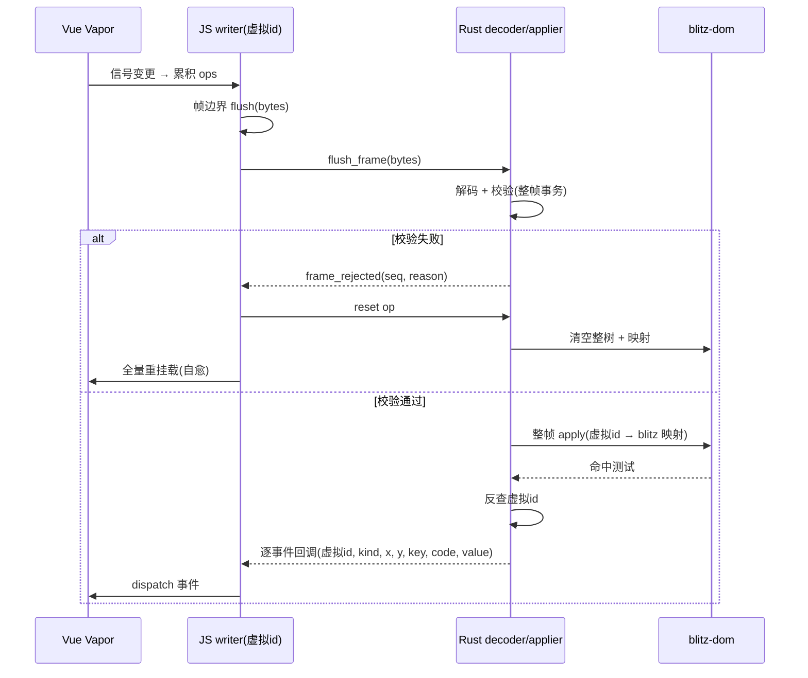
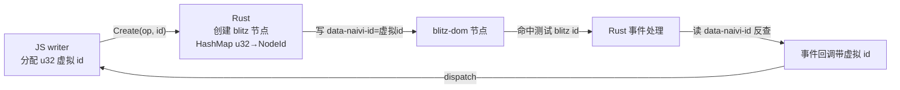

# Naivi Bridge TS SOT + Binary Frames - Plan

## Goal Capsule

- **Objective:** 把 naivi 的 JS↔Rust 桥接协议升级为「TS 单一事实来源 + 二进制帧」：新增独立 `js/naivi-protocol` 包，用单一字面量表定义事件 kind / op；Rust 侧由 `naivi-dom` 的 build.rs 在构建时自动生成枚举与常量，漂移在构造上不可能；在此之上把 wasm 与 native 双通道从逐 op 直调改为每帧一批的二进制帧传输，节点 id 切到 JS 虚拟 id + Rust 映射，事件回流保持逐事件函数回调。一个 plan、两个阶段：先 SOT 打底、再帧批处理。
- **Product authority:** naivi 桥接协议（`js/naivi-runtime` + `packages/naivi-dom` + `naivi-wasm` / `naivi-native` 双 host）；范围已由用户确认。
- **Open blockers:** 无。
- **Execution profile:** 代码实现；阶段一（U1–U3）独立交付并验证后，再进入阶段二（U4–U9）。

## Product Contract

**Product Contract preservation:** changed — 新增 R14/R15（帧拒绝预防 + 自愈）与 F3/AE7，KD4 修订，新增 KD8；KD2 修订（事件回流保持逐事件函数回调、不再走帧），R1/R3/R8 及关联章节相应更新；其余 R/A/F/AE/KD 保持原样。

### Summary

naivi 的桥接协议从「TS 与 Rust 两侧手写、靠约定同步」升级为「TS 单一事实来源 + build.rs 构建期生成」，并在此基础上把双通道的 DOM 变更从逐 op 直调改为每帧一批的二进制帧传输（id 切到 JS 虚拟 id + Rust 映射；事件回流保持逐事件函数回调）。两阶段交付：阶段一 SOT 打底独立生效，阶段二帧批处理在其上落地。

### Problem Frame

naivi 的事件 kind 协议目前有三处手写副本靠约定同步：`packages/naivi-dom/src/events.rs` 的 `NaiviEventKind`（12 种 + `to_u8` / `from_u8` / `from_str` / `name` / `ALL`）、`packages/naivi-wasm/src/lib.rs` 的重复 `kind_to_u8` / `u8_to_kind`（注释已过期，只写到 `dblclick=8`）、`js/naivi-runtime/src/wasm-types.ts` 的 `EventType` / `EVENT_KINDS`。历史上 kinds 从 9 增到 12（commit `064e15da`）横跨 4+ 文件手写；wasm 与 native 的 `bind_event` 还不对称（u8 vs 字符串）。同时 op 目前按名字直调、无编号，无法支撑「每帧一批」的传输。plan 072 的 KTD1 要求双通道呈现同一协议面，但没有提供除约定之外的机制。

### Requirements

**阶段一 — SOT 协议定义层**

- R1. 协议定义收敛到独立 `js/naivi-protocol` 包内的单一字面量表，包含：事件 kind 表（12 种 wire kind，各带稳定字符串名与 u8 号）、op 表（帧内编号）；`change` 作为合成事件标记（见 R10），不进入 wire 表。
- R2. SOT 表必须是裸字面量（`const X = { … } as const`）：build.rs 用朴素解析读取、不执行 TS；JS 侧正常 `import` 同一份表。表格式变更需要同步更新解析器。
- R3. Rust 侧由 `naivi-dom` 的 build.rs 在 cargo build 时读取 SOT 表，生成 `NaiviEventKind` 完整枚举与 `to_u8` / `from_u8` / `from_str` / `name` / `ALL`、op 常量；生成物写 `OUT_DIR`、不提交；SOT 文件变更通过 `cargo:rerun-if-changed` 触发重生成。
- R4. 删除 `packages/naivi-wasm/src/lib.rs` 的重复 `kind_to_u8` / `u8_to_kind`，wasm 与 native 共享 `naivi-dom` 的生成类型，不再各自维护事件映射。
- R5. 生成边界：与 blitz `DomEventKind` 的映射（`from_dom_event` / `to_dom_event_kind`）与帧编解码逻辑保持手写，不进入生成范围（TS 无法表达 blitz 的 Rust 类型）。

**阶段二 — 二进制帧传输层**

- R6. DOM 变更按帧批处理：JS 侧 writer 把 op 压进 `Uint8Array`，每帧边界一次 flush；帧格式含帧序号、op 数、op 序列，字符串用长度前缀（参考 blitz-quick 线格式）。
- R7. 节点 id 所有权切到 JS 虚拟 id（u32，generation + free-list + GC 回收）；Rust 维护 虚拟 id → blitz id 映射，事件回流反查 blitz → 虚拟 id。
- R8. 事件回流保持逐事件函数回调（`(nodeId, kind, x, y, key, code, value)`），不走帧批处理；只有 DOM 变更按帧传输。事件 kind 仍按 SOT 事件表编码为 u8 作为回调参数。
- R9. 帧 apply 为整帧事务：先完整解码与校验（id 已创建、parent 存在等），任一步失败整帧丢弃，不留下半改 DOM，不 panic。
- R10. wasm 与 native 双通道使用同一帧格式与同一 SOT；`bind_event` 的通道不对称（wasm u8 / native 字符串）随绑定成为帧内 op 而消亡；合成事件 `change` 保持 JS 侧合成、不进 wire。
- R11. 行为保真：改造后 counter 与 todomvc 在 wasm 与 native 上的交互行为与改造前一致（正确性为验收门槛）。

**验收**

- R12. 阶段一交付后，新增一个事件 kind 只改 SOT 表一处（除 R5 规定的 blitz 映射），无其他手写同步点。
- R13. 阶段二性能验收先跑通后量化：不设量化门槛，正确性为唯一验收标准。

**帧拒绝自愈**

- R14. 预防：JS writer 强制 u16 字符串上限，超限在 JS 侧显式报错、绝不产出无法编码的帧；writer 对引用的节点 id 做镜像校验（debug 断言）。
- R15. 自愈：协议提供 `frame_rejected(seq, reason)` 回传与 `reset` op；帧被拒绝时 JS 发 `reset` 并全量重挂载，Rust 清空整树与 id 映射，两侧重新对齐。

**SOT 扇出结构**

### Key Decisions

- KD1. 一个 plan 内部两阶段（SOT 打底 → 帧批处理）。(session-settled: user-directed — chosen over 拆两个独立 plan: 协议表与传输一起设计，SOT 表形状由帧协议决定，分开会返工)
- KD2. 事件回流保持逐事件函数回调，不进二进制帧；只有 DOM 变更走帧批处理。(session-settled: user-directed — 修订自原「事件也走帧」: 用户要求仅 DOM 调用 batch，事件保持函数参数回调。Governs R8、R10)
- KD3. 节点 id 所有权为 JS 虚拟 id + Rust 映射。(session-settled: user-approved — chosen over Rust 分配 + 响应帧: 零响应帧、最高吞吐；用户授权按「正确 + 性能」定。Governs R7)
- KD4. 帧失败语义为整帧事务（先校验再 apply、出错整帧丢弃）。(session-settled: user-directed — chosen over 逐 op 尽力而为: 正确性优先。Governs R9；后经用户修订叠加预防 + 自愈，见 KD8)
- KD5. 生成方式为 build.rs 构建期生成、生成物不提交。(session-settled: user-directed — chosen over 脚本 + 提交生成物: 漂移在构造上不可能，省掉 `pnpm gen` 步骤与漂移守卫测试。Governs R3)
- KD6. SOT 表放独立 `js/naivi-protocol` 包。(session-settled: user-directed — chosen over 放 `js/naivi-runtime` 内: 协议表物理独立于任何一侧，JS 与 build.rs 共同消费。Governs R1)
- KD7. 性能验收先跑通后量化。(session-settled: user-directed — chosen over 设量化门槛: 用户选先跑通，量化基准后续补。Governs R13)
- KD8. 帧拒绝自愈：整帧事务之上加预防与自愈——writer 强制 u16 上限 + id 断言（预防），`frame_rejected` + `reset` + 全量重挂载（自愈）。(session-settled: user-directed — 修订自 KD4 的无错误回传: 用户要求优化失同步风险。Governs R14、R15)

### Key Flows

- F1. 帧生命周期（阶段二核心行为）
  - **Trigger:** Vue 信号变更触发 renderer 产生 DOM 变更。
  - **Actors:** JS 运行时（writer）、Rust host（decoder / applier）、blitz-dom。
  - **Steps:** renderer 把 op 压入 writer 缓冲 → 帧边界（rAF / vsync tick）一次 flush `Uint8Array` → Rust 完整解码 + 校验 → 整帧 apply（虚拟 id → blitz id 映射建树 / 改样式 / 绑事件）→ 布局渲染 → 命中测试得 blitz 节点 → 反查虚拟 id → 逐事件回调回传 JS → JS dispatch 到监听器。
  - **Outcome:** DOM 变更方向每帧一次边界穿越；事件方向逐事件回调；失败帧整帧丢弃（Covers R6、R7、R8、R9）。

- F2. 新增事件 kind 流程（阶段一验收行为）
  - **Trigger:** 需要暴露新 DOM 事件。
  - **Steps:** 在 SOT 事件表加一行（名 + 字符串 + u8 号）→（若 blitz 有对应 `DomEventKind`）手写一行映射 → 下一次 `cargo build` 自动重生成。
  - **Outcome:** 除 blitz 映射外零手写协议代码（Covers R1、R3、R12）。
- F3. 帧拒绝与自愈
  - **Trigger:** Rust 校验失败拒绝整帧。
  - **Actors:** JS writer、Rust frame 核心。
  - **Steps:** Rust 回传 `frame_rejected(seq, reason)` → JS 记录并丢弃该帧的镜像期望 → JS 发 `reset` op → Rust 清空整树与映射 → JS 全量重挂载 → 正常帧流恢复。
  - **Outcome:** 两侧重新对齐，无残留失同步（Covers R15）。

### Acceptance Examples

- AE1. 阶段一 SOT 生效（Covers R1、R3、R12）：在 SOT 事件表新增一种 kind，除（若需要）blitz 映射外零手写；`cargo build -p naivi-dom`、`cargo test -p naivi-dom`、`pnpm -r typecheck` 与 `pnpm -r test` 全绿；现有 12 种事件在 wasm 与 native 上行为不变。
- AE2. 漂移在构造上不可能（Covers R3）：修改 SOT 表中的 u8 编号后不跑任何额外命令，直接 `cargo build -p naivi-dom` 即得到新编号；`target/.../out/` 生成物与表一致。
- AE3. wasm 重复映射删除（Covers R4）：`packages/naivi-wasm/src/lib.rs` 不再含 `kind_to_u8` / `u8_to_kind`，wasm 事件编码走 `naivi-dom` 生成类型。
- AE4. 帧批处理行为保真（Covers R6、R7、R11）：counter 与 todomvc 在 wasm（trunk 像素级验证）与 native（合成事件）上，新增 / 删除 / 切换 / 输入等交互与改造前一致。
- AE5. 整帧事务（Covers R9）：构造含非法 id 的帧，整帧被丢弃、DOM 无半改、无 panic。
- AE6. 事件回调（Covers R8、R10）：checkbox 切换在 wasm 与 native 上触发合成 `change`；`key` / `code` / `value` 随逐事件回调正确到达 JS。
- AE7. 帧拒绝自愈（Covers R14、R15、F3）：构造含非法 id 的帧 → 整帧被拒、DOM 无半改、无 panic；JS 收到 `frame_rejected` → `reset` → 全量重挂载 → 后续交互恢复正常、两侧一致。

### Scope Boundaries

- 不含性能量化基准（先跑通后量化，后续补）。
- 不含 CSS subset check 工作线（独立 plan `docs/plans/2026-08-12-073-feat-css-subset-check-plan.md`）。
- 不含新增事件种类（保持当前 12 种 + 合成 `change`）。
- 不含 blitz-dom 引擎改动。
- 不含 Vite / HMR dev 流程改造。
- 不含 blitz-quick 的其他传输优化（如共享内存、varint 压缩）。

### How This Work Fits Together

<!-- ce-section: work-relationships -->
本计划是 naivi 工具链（plan `docs/plans/2026-08-12-072-arch-naivi-vapor-frontend-plan.md`）之后对桥接协议与传输层的升级，交付物是协议定义层（SOT + 生成）与传输层（帧批处理）。
- **Depends on** plan 072 的协议面（KTD1：wasm / native 双通道同形协议）与 U1–U7 已落地的 runtime / host。
- **Can proceed independently of** CSS subset check（plan 073）：两者互不依赖。
- **Enables** 后续性能量化与更多事件种类的低成本扩展。

### Dependencies / Assumptions

- **依赖：** `cargo build -p naivi-dom` 将要求 `js/naivi-protocol` 的 SOT 文件存在且为裸字面量格式；文件缺失或解析失败时 build.rs 给出清晰错误（R2、R3）。
- **假设：** 阶段二会整体替换逐 op 直调面（`WasmExports` 的逐 op 函数消亡），runtime 的 bridge 层（native-tree / naive-dom / renderer）改写为「写 writer + 每帧 flush」，不是叠加。

### Outstanding Questions

- OQ1. 帧驱动 tick 来源 —— 已解决（KTD5）：wasm 用浏览器 rAF；native 由 host 每帧调 guest `__tick()`。
- OQ2. 生成代码可读性 —— 已解决（KTD4）：生成物在 OUT_DIR，review 读 `target/debug/build/naivi-dom-*/out/protocol_gen.rs`；如不便可加 dev dump 脚本（Deferred to Implementation）。
- OQ3. op 表具体编号 —— 已解决（KTD1，U4 落地）；`frame_rejected` 载体为独立回调（KTD6），实施期确认（Deferred to Implementation）。

### Sources / Research

- blitz-quick 的 SOT 参考实现（本仓库外）：`packages/protocol/src/index.ts`（SOT 表）、`scripts/gen-rust-op.ts`（生成器）、`crates/blitz-quick/src/gen/op.rs`（生成物）、`src/protocol.rs`（roundtrip 漂移守卫测试）。
- 仓库内现状：`js/naivi-runtime/src/wasm-types.ts`（`EventType` / `EVENT_KINDS` / `eventTypeToKind`）、`js/naivi-runtime/src/wasm-export.ts`（wasm 字符串→u8）、`js/naivi-runtime/src/native-tree.ts`（合成 `change`、dispatch）、`packages/naivi-dom/src/events.rs`（`NaiviEventKind`）、`packages/naivi-dom/src/ops.rs`（`NaiviOp` 14 变体无编号）、`packages/naivi-wasm/src/lib.rs`（重复映射 + 过期注释）、`js/naivi-runtime/tests/checkbox-change.test.ts`（硬编码 kind 11）。
- 实施研究要点：`batched-bridge.ts` 是现成批处理接缝（当前纯透传、`isBatchPending=false`、`flush()` no-op）；`native-tree.ts` 有 15 个 per-op 宿主调用点 + `ir-loader.ts` 5 个直连 `host.*`；`OpsCore::apply_ops` 已存在批处理路径但其 create 变体当前不带 id（阶段二对其做协议变更）。

---

## Planning Contract

### Key Technical Decisions

- KTD1. 帧线格式（仅 DOM 变更方向；参考 blitz-quick 线格式）。（Governs R6、R8）
  - DOM 变更帧（JS→Rust）：`[seq: u32][count: u16][op…]`；每个 op `[opcode: u8][operands]`；字符串 `[len: u16][utf8]`。
  - 事件方向（Rust→JS）不帧化：逐事件回调参数（虚拟 id u32 + kind u8 + x/y + key/code/value 字符串）。
  - op 表编号由 SOT 表定义（U4 落地）；`reset` 为保留 op。
- KTD2. JS 虚拟 id 模型。（Governs R7）
  - JS 分配 u32 虚拟 id：slot + generation + free-list；`FinalizationRegistry` 与显式 removeNode 双通道回收。
  - Rust 维护 `HashMap<u32, NodeId>`；`data-naivi-id` 属性存虚拟 id，事件反查直接读命中节点的属性（复用现有机制，无需第二张表）。
  - 事件回调携带虚拟 id；JS 镜像与 `_elByWasmId` 键仍按 id 语义工作（id 值从 blitz id 变为虚拟 id）。
- KTD3. 整帧事务 + 预防 + 自愈。（Governs R9、R14、R15）
  - 事务：先完整解码 + 校验（id 已映射、parent 存在、字符串合法），失败整帧丢弃、不 panic。
  - 预防（writer）：u16 字符串超限在 JS 侧显式报错、绝不产出坏帧；引用 id 做镜像断言（debug）。
  - 自愈：`frame_rejected(seq, reason)` 回传 → JS 发 `reset` op → Rust 清空整树与映射 → JS 全量重挂载。
- KTD4. build.rs 生成机制。（Governs R3）
  - `packages/naivi-dom/build.rs` 朴素正则解析 SOT 裸字面量表，输出 `OUT_DIR/protocol_gen.rs`（`NaiviEventKind` 枚举 + `to_u8`/`from_u8`/`from_str`/`name`/`ALL` + op 常量），src 经 include! 接入。
  - `cargo:rerun-if-changed` 指向 SOT 文件；缺文件/解析失败 → 带文件路径的清晰构建错误。
  - 生成物不提交；review 读 `target/debug/build/naivi-dom-*/out/protocol_gen.rs`。
- KTD5. 帧驱动（tick 来源）。（Governs R6）
  - wasm：JS 用浏览器 `requestAnimationFrame`，帧边界 flush。
  - native：host 每帧（winit vsync）调 guest 暴露的 `__tick()`（运行 rAF 队列 → flush），与 blitz-quick 的宿主驱动模型一致。
- KTD6. 事件与拒绝信号交付。（Governs R8）
  - 事件按 KTD1 以逐事件回调交付（复用现有 QueuedEvent → 回调参数路径，仅 id 变虚拟 id）。
  - `frame_rejected(seq, reason)` 作为独立 Rust→JS 回调（`set_frame_rejected_callback`）——它不是 DOM 事件，不进事件回调（OQ3）。
- KTD7. Rust apply 复用 OpsCore 路径。（Governs R6）
  - decoder/applier 放 `naivi-dom`（引擎中立、双 host 共享），host 只做 FFI 薄适配。
  - `OpsCore::apply_ops` 已存在批处理路径；`NaiviOp` create 变体增加虚拟 id 字段，apply 时建 blitz 节点并记录 `虚拟id → NodeId` 映射。
- KTD8. 阶段二整体切换、无双模式。（Governs R10）
  - per-op `WasmExports` 面整体替换为 `flush_frame` + `set_event_callback` + `set_frame_rejected_callback`；无新旧双跑/降级层。
  - `batched-bridge.ts` 是接缝；facade 层（mirror、style stub、事件注册）语义不变，只是 id 从 blitz id 变虚拟 id。

### High-Level Technical Design

帧生命周期（含拒绝与自愈路径）：

id 所有权与反查：

### Alternatives Considered

- **生成器载体**：脚本（`pnpm gen` + 提交生成物 + 漂移守卫）vs build.rs（OUT_DIR + rerun-if-changed）。用户已定 build.rs（KD5，session-settled）；代价是生成物不出现于仓库、cargo build 依赖 TS 表文件存在。
- **事件反查机制**：`data-naivi-id` 属性（复用现有机制、免第二张表）vs Rust 侧独立 `NodeId→虚拟id` HashMap。选属性（KTD2）；若属性被应用覆盖，实施期回退 HashMap。
- **id 回收**：仅显式 removeNode vs 叠加 `FinalizationRegistry`。选叠加（KTD2），GC 驱动回收是 blitz-quick 已验证模式。
- **失同步处理**：仅整帧丢弃（blitz-quick 同款、接受失同步）vs 预防 + 自愈。用户已选预防 + 自愈（KD8，session-settled，修订自 KD4）。
- **`frame_rejected` 载体**：独立回调 vs 事件 kind。选独立回调（KTD6），实施期确认。

### Assumptions

- 阶段二整体替换逐 op 直调面（`WasmExports` 逐 op 函数消亡），runtime 的 bridge 层（native-tree / naive-dom / renderer 的宿主调用）改写为「写 writer + 每帧 flush」，不是叠加。
- 帧拒绝仅发生在 guest bug 或（writer 拦截后的残余）编码错误；自愈路径是兜底、不是常规路径。
- `ir-loader.ts` 遗留 AOT-IR 路径同样改走 writer（在 U5 范围）。
- 事件以逐事件回调交付（不经帧路径、不新增握手）；只有 DOM 变更按帧传输。
- `change` 合成事件保持 JS 侧合成、不进 wire（R10）。

---

## Implementation Units

### Stage 1 — SOT 协议定义层

#### U1. `js/naivi-protocol` 包 + 事件 kind 表
- **Goal:** 建立协议唯一事实来源包，以裸字面量表定义事件 kind（12 种 wire kind + 字符串名 + u8 号），TS 侧可直接 import。
- **Requirements:** R1、R2、R12
- **Dependencies:** 无
- **Files:**
  - `js/naivi-protocol/package.json`（新建，仿 `js/naivi-runtime/package.json`，exports 直指 `./src/*.ts`）
  - `js/naivi-protocol/tsconfig.json`（新建，extends `../tsconfig.base.json`）
  - `js/naivi-protocol/src/index.ts`（新建：裸字面量表 + 类型 + 映射函数）
  - `js/naivi-protocol/tests/event-kinds.test.ts`（新建）
- **Approach:**
  1. 建包骨架；`pnpm-workspace.yaml` 的 `js/naivi-*` glob 自动纳入。
  2. `src/index.ts` 定义裸字面量表：`EVENT_KINDS`（名 + 字符串 + u8 号，顺序即编号）、`change` 合成标记、类型导出；保持 `const X = {…} as const` 形态（build.rs 可朴素解析，R2）。
  3. 迁移 `js/naivi-runtime/src/wasm-types.ts` 的 `EventType`/`EVENT_KINDS`/`eventTypeToKind`/`kindToEventType` 到本包，runtime 改从 `@naivi/protocol` import。
  4. `change` 作为合成事件标记，不进 wire 表。
- **Patterns to follow:** `js/naivi-runtime/package.json` 的 exports 直指 src 模式；blitz-quick `packages/protocol/src/index.ts` 的裸字面量风格。
- **Test scenarios:**
  - 表完整性：12 种 kind 各含字符串名、u8 号，顺序编号 0–11，无重复、无空洞。
  - `change` 标记为合成、不在 wire 编号序列。
  - `eventTypeToKind` / `kindToEventType` 双向映射（未知 kind 默认 `click` 的既有语义）。
  - 表格式可被 U2 的朴素解析器消费（格式断言）。
- **Verification:** `pnpm -r typecheck` 与 `pnpm -r test` 全绿（含新包）；runtime 测试在引用迁移后仍绿。
- **Execution note:** 阶段一每单元先保测试绿再合入；本单元以事件表迁移为收尾（runtime 引用切换后旧 `wasm-types.ts` 相应收窄）。

#### U2. `naivi-dom` build.rs 生成器
- **Goal:** build.rs 在 cargo build 时朴素解析 SOT 表，产出 `OUT_DIR/protocol_gen.rs`（`NaiviEventKind` 枚举 + `to_u8`/`from_u8`/`from_str`/`name`/`ALL`），缺文件/解析失败给出带路径的清晰构建错误。
- **Requirements:** R2、R3
- **Dependencies:** U1
- **Files:**
  - `packages/naivi-dom/build.rs`（新建）
  - `packages/naivi-dom/src/gen.rs`（新建：include! `OUT_DIR` 生成物并再导出）
  - `packages/naivi-dom/Cargo.toml`（修改：无新依赖，build.rs 自动生效）
  - `packages/naivi-dom/tests/gen.rs`（新建：生成物形状断言）
- **Approach:**
  1. build.rs 朴素正则解析 `js/naivi-protocol/src/index.ts` 的事件表（blitz-quick `gen-rust-op.ts` 的解析思路，输出代码块而非常量）。
  2. 路径基于 `CARGO_MANIFEST_DIR` 相对解析；`cargo:rerun-if-changed` 指向 SOT 文件。
  3. 生成物：枚举 + `to_u8`/`from_u8`/`name`/`FromStr`/`ALL`；`FromStr` 保留 trim `"on"` 语义。
  4. 缺文件/解析失败 → 构建错误（`panic!` with clear message 含文件路径）。
  5. `src/gen.rs` include! 生成物；blitz `DomEventKind` 映射（`from_dom_event`/`to_dom_event_kind`）留在手写 impl 块（R5 边界）。
- **Patterns to follow:** blitz-quick `scripts/gen-rust-op.ts` 的朴素解析；标准 cargo build.rs 的 `rerun-if-changed` + `OUT_DIR` 模式。
- **Test scenarios:**
  - 生成物含 12 个变体，`to_u8`/`from_u8`/`name`/`FromStr` 全映射（0–11 往返）。
  - 修改 SOT 表编号后重 build，生成物编号跟随（Covers AE2）。
  - 删除/改名 SOT 文件 → `cargo build -p naivi-dom` 报错，错误信息含文件路径。
  - `FromStr` 接受 `"click"` 与 `"onclick"`（trim 语义保留）。
- **Verification:** `cargo build -p naivi-dom` + `cargo test -p naivi-dom` 绿；OUT_DIR 生成物内容与表一致。

#### U3. 接入生成代码 + 删除 wasm 重复映射
- **Goal:** `events.rs` 改用生成类型；删除 `naivi-wasm/src/lib.rs` 的 `kind_to_u8`/`u8_to_kind` 重复映射与过期注释；阶段一验收（AE1–AE3）。
- **Requirements:** R3、R4、R5、R12
- **Dependencies:** U2
- **Files:**
  - `packages/naivi-dom/src/events.rs`（修改：手写枚举/协议 impl 替换为 gen 接入；保留 `from_dom_event`/`to_dom_event_kind` 手写块）
  - `packages/naivi-dom/src/lib.rs`（修改：导出 gen）
  - `packages/naivi-wasm/src/lib.rs`（修改：删 `kind_to_u8`/`u8_to_kind`，改调 `NaiviEventKind` 方法；修过期注释）
  - `packages/naivi-dom/tests/ops.rs`（修改：断言生成类型行为不变）
  - `packages/naivi-wasm/tests/ops_surface.rs`（修改：跟随删减）
- **Approach:**
  1. 将 `events.rs` 的手写枚举与协议 impl（`to_u8`/`from_u8`/`from_str`/`name`/`ALL`）替换为 `crate::gen` 的生成物。
  2. 仅保留 `from_dom_event`/`to_dom_event_kind`（blitz 映射，TS 无法表达）。
  3. 删除 wasm host 重复映射，统一走 `NaiviEventKind` 方法。
- **Patterns to follow:** 现有 `events.rs` 的事件处理模式；生成代码 + 手写映射块的边界。
- **Test scenarios:**
  - 现有 `ops.rs` 事件测试全绿（枚举语义不变）。
  - wasm `ops_surface.rs` 全绿（不再引用已删函数）。
  - Covers AE1：在 SOT 加一种 kind → 零手写（除 blitz 映射）→ build/test 全绿。
  - Covers AE2：改 u8 编号 → 直接 build 生效、无额外命令。
  - Covers AE3：`git grep kind_to_u8` 为空。
- **Verification:** `cargo build -p naivi-dom -p naivi-wasm`、`cargo test -p naivi-dom -p naivi-wasm`、`pnpm -r typecheck && pnpm -r test` 全绿。

### Stage 2 — 二进制帧传输层

#### U4. 帧协议：op 表 + 生成 + TS writer
- **Goal:** 扩展 SOT 为完整帧协议（op 表编号、`reset` op、`frame_rejected` 信号），build.rs 生成 op 常量；TS 侧提供帧 Writer 助手与帧格式单测。
- **Requirements:** R1、R6、R10、R14
- **Dependencies:** U1、U2、U3
- **Files:**
  - `js/naivi-protocol/src/index.ts`（修改：加 op 表 + `reset` 标记 + `frame_rejected` 信号）
  - `js/naivi-protocol/src/writer.ts`（新建：帧 Writer，Uint8Array 累积、u16 长度前缀、op 发射、取帧）
  - `packages/naivi-dom/build.rs`（修改：生成 op 常量）
  - `js/naivi-protocol/tests/frame-format.test.ts`（新建）
- **Approach:**
  1. SOT 增加：op 表（编号，含 create/attr/style/append/insert/remove/bind/reset 等）、`frame_rejected` 信号定义（KTD1）。
  2. TS Writer：小端、u16 前缀字符串、opcode u8；超 u16 上限抛错而非产出坏帧（R14）。
  3. 帧头 `[seq u32][count u16]`（DOM 变更帧）按 KTD1；事件方向不帧化（KTD1，R8）。
- **Patterns to follow:** blitz-quick `protocol.rs` 的线格式与 writer 思路；本包裸字面量表风格。
- **Test scenarios:**
  - Writer 编码的帧字节与 KTD1 线格式一致（所有 op 类型，供 U6 解码往返）。
  - 帧头 seq/count 正确；空 writer flush 输出空帧或跳过。
  - 超 u16 字符串：writer 抛错、不产出坏帧（Covers R14）。
  - op 常量生成与 SOT 一致。
- **Verification:** `pnpm -r typecheck && pnpm -r test` 绿；`cargo build -p naivi-dom` 后 OUT_DIR 含 op 常量。

#### U5. JS 桥接层重写：writer + 虚拟 id + flush + 事件分发 + 自愈触发
- **Goal:** 把 runtime 的逐 op 宿主调用改为「写 writer + 帧边界 flush」；引入 JS 虚拟 id 分配/回收；事件回调分发；`frame_rejected` → `reset` → 全量重挂载恢复路径。
- **Requirements:** R6、R7、R8、R9、R10、R14、R15
- **Dependencies:** U4
- **Files:**
  - `js/naivi-runtime/src/batched-bridge.ts`（修改：透传改为真 writer 接入 + flush）
  - `js/naivi-runtime/src/native-tree.ts`（修改：per-op 调用点改 writer；虚拟 id 分配/回收；事件回调分发；`frame_rejected` 注册）
  - `js/naivi-runtime/src/wasm-export.ts`（修改：`WasmExports` 面改为 `flush_frame`/`set_event_callback`/`set_frame_rejected_callback`）
  - `js/naivi-runtime/src/wasm-types.ts`（修改：接口面更新；事件/op 定义改从 `@naivi/protocol` 引用）
  - `js/naivi-runtime/src/naive-dom.ts`（修改：facade 的 id 语义改虚拟 id；`_elByWasmId` 键改虚拟 id）
  - `js/naivi-runtime/src/ir-loader.ts`（修改：直连 `host.*` 改 writer）
  - `js/naivi-runtime/src/index-vue-vapor.ts` + `desktop-entry.ts`（修改：挂载流程接入帧驱动 tick，KTD5）
  - `js/naivi-runtime/tests/*`（修改：mock 从 per-op 记录改为 writer/帧断言）
- **Approach:**
  1. 虚拟 id：u32 槽位 + generation + free-list + `FinalizationRegistry`（KTD2）；`NodeMirror.wasmId` 语义从 blitz id 变虚拟 id。
  2. writer 接入 `batched-bridge.ts` 接缝；所有 per-op 调用改 writer；帧边界 flush（wasm 用浏览器 rAF，native 由 host `__tick()` 驱动，KTD5）。
  3. 事件分发：`set_event_callback` 收到逐事件回调参数 `(nodeId, kind, x, y, key, code, value)` → 按虚拟 id dispatch（原 `dispatchHostEvent` 逻辑保留，输入变虚拟 id，R8）。
  4. 自愈：`set_frame_rejected_callback((seq, reason))` → 记录 → 发 `reset` op → 全量重挂载（R15）。
  5. u16 上限强制 + debug id 断言（R14）。
  6. `change` 合成逻辑不变（仍在 dispatch 层，不进 wire，R10）。
- **Patterns to follow:** blitz-quick `solid-renderer`/`core` 的 writer + 虚拟 id + FinalizationRegistry；现有 `batched-bridge.ts` 的 facade 稳定面。
- **Test scenarios:**
  - 渲染序列：一次信号变更 → writer 累积 → flush 单帧，op 顺序与逐 op 时代一致。
  - 虚拟 id：连续创建递增；删除后 free-list 复用；generation 防悬挂复用。
  - 事件回调 → dispatch → `change` 合成（checkbox）与键盘/输入（key/code/value）不变（Covers AE6）。
  - 空帧：无变更不 flush 或 flush 空帧被跳过。
  - 超长字符串：writer 抛错、不产坏帧（Covers R14）。
  - `frame_rejected` → reset → 重挂载：镜像重建、后续交互正常（Covers AE7）。
  - ir-loader 路径改 writer 后行为不变。
- **Verification:** `pnpm -r typecheck && pnpm -r test` 全绿（runtime 测试改写为帧断言）；wasm demo 在浏览器跑通（与 U7 联动）。
- **Execution note:** 帧格式以 U4 测试向量为准；先写 writer 编码测试再实现桥接。

#### U6. Rust 帧核心：decode/apply/事务/reset/拒绝回传
- **Goal:** 在 `naivi-dom` 实现引擎中立的帧解码、整帧事务 apply（虚拟 id 映射）、`reset` 与 `frame_rejected` 队列；`NaiviOp` create 变体加虚拟 id；事件保持逐事件回调（R8）。
- **Requirements:** R6、R7、R8、R9、R10、R15
- **Dependencies:** U4
- **Files:**
  - `packages/naivi-dom/src/frame.rs`（新建：FrameDecoder / FrameApplier / 校验）
  - `packages/naivi-dom/src/ops.rs`（修改：`NaiviOp` create 变体加虚拟 id；新增 `Reset` 变体；apply 记录 `虚拟id→NodeId` 映射）
  - `packages/naivi-dom/src/document.rs`（修改：reset 支持——清空整树与映射）
  - `packages/naivi-dom/src/ffi.rs`（修改：`flush_frame`/`set_frame_rejected_callback` 入口；事件保持现有 QueuedEvent → 回调路径）
  - `packages/naivi-dom/tests/frame.rs`（新建）
- **Approach:**
  1. FrameDecoder：`Cursor<&[u8]>` 单遍线性解码（定长 opcode + 长度前缀串，借用零分配），复用 U4 生成的常量。
  2. 校验 + 事务：apply 前完整校验（id 已映射、parent 存在），失败整帧丢弃、入 `frame_rejected(seq, reason)` 队列、不 panic（KTD3）。
  3. FrameApplier：按序 apply；create 变体建 blitz 节点并记录 `HashMap<u32, NodeId>`；事件反查用 `data-naivi-id` 属性（KTD2）。
  4. reset：drop 整树 + 清空映射 + 清事件注册（自愈起点，R15）。
  5. 事件交付：命中 → 读 `data-naivi-id` 反查虚拟 id → 经现有 QueuedEvent → 逐事件回调参数（R8、KTD6）。
- **Patterns to follow:** blitz-quick `protocol.rs` 的 Reader 与 `applier.rs` 的 apply 结构；现有 `OpsCore` 的 DocumentMutator 用法。
- **Test scenarios:**
  - 解码往返：U4 测试向量编码的帧解码一致。
  - 整帧事务：非法 id 帧 → 整帧丢弃、DOM 无半改、`frame_rejected` 入队、无 panic（Covers AE5）。
  - 虚拟 id 映射：create 后映射存在；remove 后失效；复用失效 id → 拒绝。
  - reset：清空整树/映射/事件注册，后续 apply 从零可建。
  - 事件交付：命中节点 → 逐事件回调参数带虚拟 id 与 key/code/value 正确（R8）。
- **Verification:** `cargo test -p naivi-dom` 绿（新增 frame 测试）；`cargo check --workspace` 绿。
- **Execution note:** 以整帧事务与拒绝回传为第一验收点（AE5），先实现事务再补 reset。

#### U7. wasm 通道切换
- **Goal:** wasm host 从 per-op 导出改为 `flush_frame` + 逐事件回调回传 + `frame_rejected` 回调；删 per-op wasm-bindgen 导出。
- **Requirements:** R6、R7、R8、R10、R11
- **Dependencies:** U6
- **Files:**
  - `packages/naivi-wasm/src/lib.rs`（修改：导出 `flush_frame`、`set_frame_rejected_callback`；`WasmEventSink` 保持逐事件回调参数；删 per-op 导出；tick 机制调整）
  - `packages/naivi-wasm/tests/ops_surface.rs`（修改：跟随新导出面）
- **Approach:**
  1. `flush_frame` 作为唯一 DOM 变更入口，内部走 U6 的 decoder/applier。
  2. `WasmEventSink` 保持逐事件回调参数（虚拟 id + kind + x/y + key/code/value）回传 JS 回调（R8）。
  3. `set_frame_rejected_callback` 注册拒绝回调。
  4. 删除全部 per-op 导出（仅保留 `start`/`flush_frame`/`set_event_callback`/`set_frame_rejected_callback`/`tick`）。
- **Patterns to follow:** 现有 wasm host 的 `with_core`/`WasmEventSink` 结构；U6 帧核心。
- **Test scenarios:**
  - host 级：flush_frame 一帧（create+append+attr）后文档可见（AE4 单测版）。
  - 事件回调：合成 pointer 事件 → 回调收到带虚拟 id 的逐事件参数。
  - 拒绝帧：非法 id → `frame_rejected` 回调触发、无 panic。
- **Verification:** `cargo test -p naivi-wasm` 绿；`naivi wasm --release` + `trunk serve` 后 demo 可用（与 U9 联动）。

#### U8. native 通道切换
- **Goal:** rquickjs FFI 从 per-op 命名空间改为 `flush_frame` + 逐事件回调 + `frame_rejected`；guest pump/drain 更新。
- **Requirements:** R6、R7、R8、R10、R11
- **Dependencies:** U6
- **Files:**
  - `packages/naivi-dom/src/ffi.rs`（修改：`build_naive_namespace` 改 `flush_frame`/`set_frame_rejected_callback`；`drain_events` 保持逐事件回调）
  - `packages/naivi-native/src/main.rs`（修改：`QuickJsEventSink` 保持逐事件回调参数；tick 调 guest `__tick`）
  - `packages/naivi-guest-quickjs/src/guest.rs`（修改：`__tick` 注入/帧 flush 驱动）
  - `packages/naivi-dom/tests/*`（修改：FFI 面断言）
- **Approach:**
  1. `flush_frame` 成为唯一 DOM 变更 FFI 入口（与 wasm 同形，R10）。
  2. `QuickJsEventSink` 保持逐事件回调参数（虚拟 id）；`drain_events` 按现有 QueuedEvent 路径交付（R8、KTD6）。
  3. host 每帧调 guest `__tick()`（KTD5）；`bind_event` 字符串→u8 的不对称消亡（绑定成为帧内 op，KTD1/R10）。
- **Patterns to follow:** 现有 `ffi.rs` 的 `Ctx<'js>` 首个参数 + 不内嵌 `Context::with`（防重入）；guest 的 pump/drain 循环。
- **Test scenarios:**
  - `flush_frame` 一帧在 native 文档中可见。
  - 事件回调：合成 pointer/keyboard 事件 → JS 收到带虚拟 id 的逐事件参数 + key/code/value。
  - 拒绝帧 → `frame_rejected` 回调。
  - 空帧/无变更不破坏 tick 循环。
- **Verification:** `cargo test -p naivi-dom`（quickjs feature）绿；`naivi desktop` 跑通（与 U9 联动）。

#### U9. 行为保真 + 自愈端到端验证
- **Goal:** counter + todomvc 在 wasm 与 native 上与改造前交互行为一致；帧拒绝自愈端到端成立；记录性能观察（不设门槛）。
- **Requirements:** R11、R13、R14、R15
- **Dependencies:** U7、U8
- **Files:**
  - `examples/naivi/counter`（验证）
  - `examples/naivi/todomvc`（验证）
  - `js/naivi-runtime/tests/`（补充端到端帧测试，如适用）
- **Approach:**
  1. wasm：`naivi wasm --release` + `trunk serve`；Playwright 像素/交互验证（新增/删除/切换/输入、checkbox `change`、过滤器），沿用仓库既有手法。
  2. native：`naivi desktop`；合成事件验证（点击/键盘/输入/checkbox）+ 窗口截图。
  3. 自愈端到端：构造含非法 id 的帧注入 → `frame_rejected` → `reset` → 重挂载 → 后续交互一致（AE7）。
  4. 性能观察：日志记录每帧 op 数/穿越次数，记录观察值供后续量化（不设门槛，R13）。
- **Patterns to follow:** 仓库既有 wasm/native 验证手法（repo memory 的 todomvc 像素与合成事件验证记录）。
- **Test scenarios:**
  - Covers AE4：counter/todomvc 双通道交互与改造前一致（新增/删除/切换/输入）。
  - Covers AE6：checkbox `change` 合成 + 键盘 key/code/value 正确。
  - Covers AE7：注入坏帧 → 自愈 → 后续正常。
  - Covers AE5：整帧事务无半改、无 panic（U6 单测基础上端到端复验）。
- **Verification:** 双通道交互验收通过；`pnpm -r typecheck && pnpm -r test`、`cargo check --workspace`、`cargo test -p naivi-dom -p naivi-wasm` 全绿。

---

## Verification Contract

- **阶段一（U1–U3 每单元）：** `cargo build -p naivi-dom -p naivi-wasm`、`cargo test -p naivi-dom -p naivi-wasm`、`pnpm -r typecheck`、`pnpm -r test` 全绿；`git grep kind_to_u8` 为空（AE3）。
- **阶段二（U4–U9 每单元）：** 同上 + `cargo check --workspace`；U4 后帧格式单测绿；U5 后 runtime 帧测试绿；U6 后 frame 测试绿。
- **通道验收：** wasm = `naivi wasm --release` + `trunk serve --release --port 8090` + Playwright 像素/交互验证；native = `naivi desktop` + 合成事件 + 截图（含 `caffeinate -u -d` 防息屏）。
- **CI：** 现有 `naivi-js` job（`pnpm -r typecheck` + `pnpm -r test`）保持绿；构建期生成在 cargo 侧，不改变 CI 流程。

---

## Definition of Done

- **Global:**
  - R1–R15 全部满足；阶段一（AE1–AE3）与阶段二（AE4–AE7）验收通过。
  - 事件 kind / op 协议无任何手写同步点（除 R5 的 blitz 映射边界）；加一种事件 kind 只改 SOT 一处。
  - counter 与 todomvc 在 wasm 与 native 上行为与改造前一致。
  - 帧拒绝自愈端到端成立；整帧事务无半改、无 panic。
- **Per-unit:** 各 U 的 Verification 通过；U1–U3 组成阶段一独立交付，先于 U4–U9 合入。
