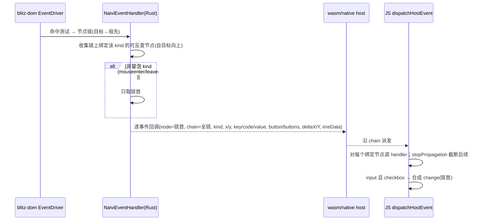

# Naivi Event Parity + Bubbling - Plan

## Goal Capsule

- **Objective:** 把 naivi 的事件面从 12 种 wire kind 对齐到 blitz 引擎 `DomEventKind` 的**字面全量 34 种**（pointer\* 8、mouse\* 7、touch\* 4、scroll、wheel、click、contextmenu、dblclick、keypress、keydown、keyup、input、ime、focus/blur/focusin/focusout、applekeybinding）；逐事件 payload 折中扩展（pointer/mouse/touch 带 button/buttons，scroll 带 deltaX/deltaY，keypress/composition 带对应数据，其余沿用现有 `(node, kind, x, y, key, code, value)`）；并实现 JS 侧冒泡 + `stopPropagation`（参照 blitz-quick 的 `EVENT_CODE` 与分发模型），使 Vue 应用能绑定引擎能发的所有事件、语义接近浏览器。
- **Product authority:** naivi 事件协议（`js/naivi-protocol` SOT + `packages/naivi-dom` events/ffi + `js/naivi-runtime` 事件分发 + wasm/native 双通道）；范围已由用户确认。
- **Open blockers:** 无。

## Product Contract

**Product Contract preservation:** unchanged — 全部 R1–R10 / KD1–KD4 / F1–F2 / AE1–AE5 原样保留，仅新增 Product Contract 层的 KD5（非冒泡事件集）以明确 R7 的行为边界；实现层决策见 Planning Contract 的 KTD1–KTD5。

### Summary

naivi 的事件支持从「有界子集」升级为「引擎全量对齐 + 冒泡」：wire 事件表扩展为引擎 `DomEventKind` 全 34 种（沿用 SOT + build.rs 生成路径，见 plan 074），逐事件回调 payload 折中扩展（新增 button/buttons、deltaX/deltaY 等最常用字段），分发模型从「按节点绑定、只送命中节点」改为「JS 侧冒泡 + `stopPropagation`」。`change` 合成、`preventDefault` no-op、无 capture 阶段保持现状。

### Problem Frame

naivi 当前只向 Vue 暴露 12 种事件（`EVENT_KINDS`，click=0 … input=11），而 blitz 引擎的 `DomEventKind` 有 34 种——缺失 22 种：`pointercancel/enter/leave/over/out`（5）、`mousemove/down/up/over/out`（5，`mouseenter`/`mouseleave` 已在 wire 表）、`touchstart/move/end/cancel`（4）、`scroll`、`keypress`、`ime`、`focus/blur/focusin/focusout`（4）、`applekeybinding`。后果：Vue 应用无法绑定 mousemove（拖拽）、scroll（滚动监听）、focus/blur（表单校验）、touch（移动端）、composition（输入法）等常用事件；且事件只送达命中节点、无冒泡，`stopPropagation` 是 no-op，与浏览器语义不一致。参照系：blitz-quick 的 `EVENT_CODE`（23 种，21 实际发射）已覆盖 pointer\* / focus / blur / scroll / imecommit，其分发模型是 JS 侧冒泡 + `stopPropagation`、`preventDefault` no-op、无 capture。

### Requirements

**事件类型对齐**

- R1. wire 事件表扩展为引擎 `DomEventKind` 全 34 种：`PointerMove/Down/Up/Cancel/Enter/Leave/Over/Out`、`MouseMove/Down/Up/Enter/Leave/Over/Out`、`TouchStart/Move/End/Cancel`、`Scroll`、`Wheel`、`Click`、`ContextMenu`、`DoubleClick`、`KeyPress`、`KeyDown`、`KeyUp`、`Input`、`Ime`（wire 名 `composition`）、`Focus/Blur/FocusIn/FocusOut`、`AppleStandardKeybinding`。每种有稳定字符串名与显式 u8 号（SOT 表为权威来源，沿 plan 074 的生成路径）。
- R2. `change` 保持 JS 侧合成、不进 wire（`SYNTHESIZED_EVENT_TYPES` 不变）；不新增其他合成事件。
- R3. `AppleStandardKeybinding` 暴露为 wire kind，但仅在 macOS 平台发射（引擎行为），文档标注。

**payload 折中扩展**

- R4. pointer/mouse/touch 事件（`BlitzPointerEvent`）回调携带 `button` 与 `buttons`；`scroll` 携带 `deltaX` / `deltaY`（引擎无 delta 字段，恒为 0，见 OQ1）；`keypress` 携带 `key` / `code`（引擎不发射，见 Scope Boundaries）；`composition`（引擎 `Ime`）携带提交文本（进 `imeData` 字段）。现有字段 `(node, kind, x, y, key, code, value)` 保持兼容，新字段附加不替换。
- R5. `focus/blur/focusin/focusout` 无需坐标/按钮数据；`mouseenter/mouseleave` 沿用现有坐标。

**分发模型**

- R6. 事件沿节点链冒泡：命中节点（目标）及其绑定祖先都收到事件，**目标优先、随后逐级祖先**；任一 handler 调 `stopPropagation()` 停止向上派发。
- R7. 非冒泡事件（`mouseenter`、`mouseleave`）只送达目标节点（浏览器语义）。
- R8. `preventDefault()` 保持 no-op；不引入 capture 阶段（blitz-quick 同款）。

**验收**

- R9. 新增/调整事件 kind 只改 SOT 表一处（除与 blitz `DomEventKind` 的映射），继续满足 plan 074 的 R12 单点修改原则。
- R10. 回归保真：改造后 counter 与 todomvc 在 wasm 与 native 上既有交互（click、`change` 合成、键盘 key/code/value、输入）行为不变。

### Key Decisions

- KD1. 事件类型**字面全量对齐引擎 34 种**，不排除 legacy mouse\*/touch\*/keypress。(session-settled: user-directed — chosen over 排除 legacy 事件、仅补 pointer/focus/scroll 等: 用户明确选择「字面全量 34 种」，要求引擎能发的 naivi 都应能绑)
- KD2. payload **折中扩展**：只加最常用新字段（pointer/mouse/touch 的 button/buttons、scroll 的 deltaX/deltaY、composition 的数据），不加 mods / 触点坐标 / 完整 blitz-quick 7 槽+JSON 模型。(session-settled: user-directed — chosen over 完整保真与最小保真: 覆盖主流场景、改动可控)
- KD3. 分发模型改为 **JS 侧冒泡 + `stopPropagation`**。(session-settled: user-directed — chosen over 保持按节点绑定只送命中节点: 更接近浏览器语义，参照 blitz-quick)
- KD4. 冒泡在既有逐事件回调 + 帧协议之上实现（plan 074 的 KD2/R8 不变：事件仍逐事件回调、不进帧）；引擎 `EventDriver` 已提供节点链，无需改动 blitz-dom。(推断: 引擎命中链含目标到祖先的节点，冒泡原料已具备；wire 形状（链如何跨到 guest）交由 planning 定)
- KD5. 非冒泡事件集固定为 `mouseenter` / `mouseleave`（浏览器语义），其余事件默认冒泡。(session-settled: user-approved — chosen over 由引擎事件类型推断: 用户确认实现冒泡 + stopPropagation，非冒泡集合按浏览器语义固定，避免把引擎内部冒泡属性泄漏到协议。Governs R7)

### Key Flows

- F1. 冒泡事件派发
  - **Trigger:** 引擎命中测试产生一次 DOM 事件（含节点链）。
  - **Actors:** 引擎 `EventDriver`、naivi 事件处理器（Rust）、guest 分发器（JS）。
  - **Steps:** 引擎沿链派发 → naivi 收集链上所有「绑定了该 kind 且可反查虚拟 id」的节点（自目标向上）→ 逐事件回调回传（含链或目标，wire 形状由 planning 定）→ guest 自目标向上调用各绑定 handler → 任一 handler `stopPropagation()` 停止向上。
  - **Outcome:** 祖先绑定节点收到子孙事件；`stopPropagation` 截断；非冒泡事件只送目标（Covers R6、R7）。
- F2. 新增 payload 字段流转
  - **Trigger:** pointer/scroll 事件到达。
  - **Steps:** 引擎 `DomEventData` 携带 button/buttons、deltaX/deltaY → naivi 事件结构携带 → 逐事件回调附加字段回传 → guest `makeDomEvent` 填入事件对象。
  - **Outcome:** Vue handler 读到 `event.button` / `event.buttons` / `event.deltaX` / `event.deltaY`（Covers R4）。

### Acceptance Examples

- AE1. 全事件绑定（Covers R1）：naivi 应用能绑定引擎支持的全部 34 种事件；`mousemove`、`touchstart`、`scroll`、`focus`、`blur`、`composition`、`pointerover/out` 等回调在对应引擎事件发生时可达（`keypress` 除外——引擎从不发射，wire kind 保留但无可达性）。
- AE2. payload 保真（Covers R4）：pointerdown/mousedown 回调带 `button`/`buttons`；wheel 带 `deltaX`/`deltaY`；composition 带提交文本（`imeData`）；scroll 回调带 `deltaX`/`deltaY`（恒为 0，引擎无 delta 字段）；keypress 因引擎不发射无实际负载路径。
- AE3. 冒泡语义（Covers R6、R7）：点击绑定过 click 的祖先内的子元素，祖先 handler 触发且目标优先；handler 调 `stopPropagation` 后祖先不再收到；`mouseenter`/`mouseleave` 不冒泡。
- AE4. 回归保真（Covers R10）：counter 与 todomvc 在 wasm（trunk 像素/交互）与 native（合成事件）上，click、`change` 合成、键盘 key/code/value、输入等既有交互与改造前一致。
- AE5. SOT 单点修改（Covers R9）：新增一种事件只改 SOT 表一处（除 blitz 映射），`cargo build` 自动重生成。

### Scope Boundaries

- 不含 capture 阶段与 `preventDefault` 默认行为（保持 no-op）。
- 不含新增合成事件（`change` 保持现状；blitz-quick 声明但未发射的 `submit` 不引入）。
- 不含 blitz-dom 引擎改动（引擎能发射 33 种事件并已提供节点链；`keypress` 为**声明但不发射**——仓库无构造点，`packages/blitz-dom/src/node/text.rs` 有 TODO，wire kind 因 KD1 保留但回调永不可达）。
- 不含 blitz-quick 的其他传输优化（共享内存、varint 压缩等）。
- 不含事件性能量化（延续 plan 074 的「先跑通后量化」）。

### How This Work Fits Together

<!-- ce-section: work-relationships -->

承接 plan 074 交付的 SOT + build.rs 生成路径与逐事件回调/帧协议：R1 的事件表扩展走既有生成流程（074 的 F2 新增事件 kind 流程直接适用）；R4 的 payload 扩展触及事件 wire 形状与 wasm/native 双通道的回调签名（074 的 R8/KD2 保持逐事件回调不变）；R6 的冒泡在既有 dispatch 层（`js/naivi-runtime/src/native-tree.ts` 的 `dispatchHostEvent`）之上，引擎 `EventDriver` 已提供节点链。与 plan 072（架构）、073（CSS subset）、075（inline-box 警告）正交。

- 前置依赖: plan 074（SOT 事件表 + 逐事件回调 + 帧协议）已交付。
- 相邻工作线: CSS subset（073）、inline-box 警告（075）——互不依赖。
- 潜在后续: 完整 payload 保真（mods、触点）、capture 阶段、`preventDefault` 默认行为——均明确不在本 plan。

---

## Planning Contract

### Key Technical Decisions

- KTD1. 事件编号策略：现有 12 种编号 0–11 保持不变，新增 22 种接 12–33。(Governs R1)
  - 不重排、不仿 blitz-quick 的 1–23 起始：现有 pin 测试（`EVENT_KINDS` 12 项 0..11）与已发绑定不破坏。
  - SOT 表为权威来源（u8 显式编号），顺序仅测试不变量，build.rs 朴素解析自动覆盖新增项。
- KTD2. 回调参数追加式扩展。(Governs R4)
  - 逐事件位置参数从 `(node, kind, x, y, key, code, value)` 扩展为末尾追加 `(button, buttons, deltaX, deltaY, imeData)`；不切换对象参数（折中、改动可控、与 074 逐事件回调形状延续）。
  - 字段来源：`button`/`buttons` 取 `BlitzPointerEvent`（pointer/mouse/touch 共用）；`deltaX`/`deltaY` 取 `BlitzWheelEvent`（scroll 因引擎无 delta 字段恒为 0，见 OQ1）；`keypress` 用现有 `key`/`code` 字段（引擎不发射，见 Scope Boundaries）；`composition`（引擎 `Ime`）只透传 `Ime(Commit)`、提交文本进新增 `imeData` 字段；`applekeybinding` 的字符串进现有 `key` 字段。
- KTD3. 冒泡 wire 形状：事件携带「有序绑定链」。(Governs R6)
  - Rust `NaiviEventHandler` 遍历引擎节点链，收集所有「绑定了该 kind 且可经 `data-naivi-id` 反查虚拟 id」的节点（自目标向上），链首进 `NaiviEvent.node`，全链进新字段 `NaiviEvent.chain: Vec<u32>`。
  - wire 上 `chain` 作为逐事件回调的**末尾可选参数**（wasm 传数组、native 传数组）；JS 无 `chain` 或 `chain` 仅含首元素时退化为现有单节点派发（向后兼容）。
  - `stopPropagation` 只能靠「一次回调携带全链、JS 侧沿链派发」实现——逐绑定节点多次回调无法跨回调截断。
- KTD4. 非冒泡事件在 JS 分发层标记（KD5）：`mouseenter`/`mouseleave` 只派发链首，其余默认沿链派发。(Governs R7)
- KTD5. 复用 074 的既有机制，无新抽象：SOT 表 + build.rs 生成 + 逐事件回调 + 帧协议均不变；事件不进帧（074 KD2）。本 plan 只改事件表内容、回调参数、事件队列与分发层，不碰 DOM 变更帧格式。

### High-Level Technical Design

冒泡事件派发（含非冒泡分支）：

### Dependencies / Assumptions

- **依赖：** plan 074 已交付的 SOT + build.rs 生成路径、逐事件回调、帧协议；引擎 `DomEventKind` 34 种与 `DomEventData` 负载（`packages/blitz-traits/src/events.rs`）已存在，无需引擎改动。
- **假设：** 引擎 `EventDriver` 对非冒泡 kind 直接剪枝派发链为 `[target]`（`DomEventData::bubbles()==false`：scroll、focus、blur、pointerenter/leave、applekeybinding），故这些 kind 无论如何到不了祖先——naivi 的固定非冒泡集（mouseenter/leave，KD5）是引擎行为的子集，KD5 的「其余默认冒泡」在该子集外仍成立。
- **假设：** `data-naivi-id` 只在绑定节点上存在（`bind_event_v` 写入虚拟 id），所以「可反查」= 绑定节点；未绑定的命中节点不参与链（与冒泡语义一致——只派发到绑定了该事件的节点）。

### Outstanding Questions

- OQ1. `scroll` 的 `deltaX`/`deltaY` —— **已解决**：`BlitzScrollEvent` 无 delta 字段（仅 scroll_top/left、scroll_width/height、client_width/height），故 scroll 的 `deltaX`/`deltaY` 定义为 0；暴露 `scrollTop`/`scrollLeft`（blitz-quick 先例）列入 Scope Boundaries 后续工作。
- OQ2. `composition`（引擎 `Ime`）的 Commit 判断 —— **已解决**：`BlitzImeEvent::Commit(text)` 是唯一转发形态（blitz-quick 同款），文本进 `imeData` 字段。
- OQ3. `chain` 作为逐事件回调末尾可选参数的 JS 表达 —— 已定：native 经 `Rest<Vec<Value>>` 展开（rquickjs 7 元组上限），wasm 经 `js_sys::Array` 追加；跨通道参数顺序一致（KTD2/KTD3），以 U4 实现为基准。

---

## Implementation Units

### U1. SOT 事件表扩展（34 种）+ TS 测试

- **Goal:** 把 `EVENT_KINDS` 从 12 种扩展到引擎全 34 种，编号 0–33 连续、显式。
- **Requirements:** R1、R2、R3、R9
- **Dependencies:** 无（plan 074 已交付 SOT 包）
- **Files:**
  - `js/naivi-protocol/src/index.ts`（修改：`EVENT_KINDS` 追加 22 种，编号 12–33，保持现有 12 种 0–11 不动）
  - `js/naivi-protocol/tests/event-kinds.test.ts`（修改：12→34 断言、编号连续/无重复、roundtrip、build.rs 可解析）
- **Approach:**
  1. 在 `EVENT_KINDS` 末尾追加：`pointercancel:12, pointerenter:13, pointerleave:14, pointerover:15, pointerout:16, mousemove:17, mousedown:18, mouseup:19, mouseover:20, mouseout:21, touchstart:22, touchmove:23, touchend:24, touchcancel:25, scroll:26, keypress:27, composition:28, focus:29, blur:30, focusin:31, focusout:32, applekeybinding:33`。
  2. `WireEventType` / `eventTypeToKind` / `kindToEventType` 自动覆盖新项（表驱动，无手写分支）。
  3. `SYNTHESIZED_EVENT_TYPES` 与 `change` 合成逻辑不动（R2）。
- **Patterns to follow:** 现有 `EVENT_KINDS` 字面量表 + `event-kinds.test.ts` 的 pin 风格（074 U1）。
- **Test scenarios:**
  - 表恰有 34 项，编号 0..33 连续无重复、与 key 顺序一致。
  - 每一项能被 build.rs 朴素解析正则匹配（格式契约）。
  - `change` 仍不在 wire 表，`SYNTHESIZED_EVENT_TYPES` 仍为 `['change']`。
  - `eventTypeToKind`/`kindToEventType` 对全部 34 种 roundtrip；`kindToEventType(255)` 仍回退 `'click'`。
- **Verification:** `pnpm -C js/naivi-protocol typecheck && test` 绿。

### U2. 生成枚举 + blitz 映射补全 + 事件负载结构（Rust）

- **Goal:** `NaiviEventKind` 生成枚举随 build.rs 自动扩到 34 种；手写 blitz 映射补全 22 变体；`NaiviEvent`/`QueuedEvent` 增加新 payload 字段。
- **Requirements:** R1、R3、R4、R5
- **Dependencies:** U1
- **Files:**
  - `packages/naivi-dom/build.rs`（修改：`camelize` 的 WORDS 词边界表补 `touch`/`focus`/`blur`/`over`/`out`/`cancel`/`press`/`scroll`/`enter`/`leave`/`apple`/`standard`/`keybinding` 等，使生成变体为 `TouchStart`/`TouchMove`/`TouchEnd`/`TouchCancel`/`FocusIn`/`FocusOut`/`AppleStandardKeybinding`；`composition` 单字 camelize 为 `Composition`）
  - `packages/naivi-dom/src/events.rs`（修改：`from_dom_event` / `from_dom_event_kind` / `to_dom_event_kind` 补全 22 个变体；`NaiviEvent` 增加 `button`/`buttons`/`delta_x`/`delta_y`/`ime_data` 字段）
  - `packages/naivi-dom/src/ffi.rs`（修改：`QueuedEvent` 同步新字段）
  - `packages/naivi-dom/tests/gen.rs`（修改：`EXPECTED` 表 12→34）
  - `packages/naivi-dom/tests/ops.rs`（修改：现有事件测试适配新字段默认值）
- **Approach:**
  1. `from_dom_event` 对 `PointerCancel/Enter/Leave/Over/Out`、`MouseMove/Down/Up/Over/Out`、`TouchStart/Move/End/Cancel`、`Scroll`、`KeyPress`、`Ime`、`Focus/Blur/FocusIn/FocusOut`、`AppleStandardKeybinding` 各返回对应 `NaiviEventKind` 变体（生成枚举自动含这些变体；`composition` key 生成 `Composition` 变体，映射引擎 `DomEventKind::Ime`）。
  2. `to_dom_event_kind` 反向映射补全（`Composition`→`Ime`、`KeyPress`→`KeyPress`、`FocusIn`→`FocusIn` 等）。
  3. 事件负载：`button`/`buttons` 从 `BlitzPointerEvent` 提取（pointer/mouse/touch 共享该结构）；`delta_x`/`delta_y` 从 `BlitzWheelEvent` 提取（scroll 按 OQ1）；`ime_data` 从 `BlitzImeEvent` Commit 提取（OQ2）；`applekeybinding` 的字符串进 `key` 字段。
- **Patterns to follow:** 074 U3 的生成接入 + 现有 `events.rs` 手写映射段落。
- **Test scenarios:**
  - `generated_enum_matches_sot_table`：`EXPECTED` 表扩展为 34 项且与 SOT 编号一致（漂移守卫）。
  - `from_dom_event` 对 22 个新增 `DomEventData` 变体各返回正确 `NaiviEventKind`（覆盖新映射）。
  - `to_dom_event_kind` roundtrip 34 种。
  - payload 提取：pointer/mouse 事件 `button`/`buttons` 正确；wheel 事件 `delta_x`/`delta_y` 正确；ime Commit 的 `ime_data` 正确；focus/blur 无坐标。
  - `NaiviEvent` 新字段默认值：非 pointer/wheel 事件为 0/空，不影响既有断言。
- **Verification:** `cargo test -p naivi-dom` 绿（gen 5 测试扩展为 34 项断言 + 新增映射/负载测试）。

### U3. Rust 冒泡链：事件处理器收集绑定链

- **Goal:** `NaiviEventHandler` 从命中链收集所有可反查绑定节点（自目标向上），`NaiviEvent.chain` 携带全链；非冒泡 kind 只取链首。
- **Requirements:** R6、R7
- **Dependencies:** U2
- **Files:**
  - `packages/naivi-dom/src/events.rs`（修改：`NaiviEventHandler::handle_event` 遍历 `chain`，收集 `bindings` 中含该 kind 且 `data-naivi-id` 可反查的节点；`NaiviEvent` 增加 `chain: Vec<u32>`；非冒泡 kind 只收首个）
  - `packages/naivi-dom/src/ffi.rs`（修改：`QueuedEvent` 增加 `chain: Vec<u32>`）
  - `packages/naivi-dom/tests/ops.rs`（修改/新增：冒泡链收集测试）
- **Approach:**
  1. 现逻辑「找链上第一个绑定节点」改为「收集链上所有绑定节点」；每个节点经 `data-naivi-id` 反查虚拟 id（复用现有反查逻辑），反查失败跳过。
  2. 链首（目标侧最深绑定节点）进 `NaiviEvent.node`（保持既有单节点字段语义），全链进 `NaiviEvent.chain`。
  3. 非冒泡 kind 集合（KD5：`mouseenter`/`mouseleave`）只收链首。
  4. `change` 合成不在此层（仍在 JS dispatch，见 U5）。
- **Patterns to follow:** 现有 `NaiviEventHandler::handle_event` 的链查找 + `data-naivi-id` 反查（074 U6）。
- **Test scenarios:**
  - 目标与祖先都绑定 click：事件队列含链 `[target, ancestor]`（自目标向上）。
  - 只有祖先绑定：链含祖先（冒泡语义，目标未绑定也送达祖先）。
  - `mouseenter`：只收链首（非冒泡）。
  - 链上某节点无 `data-naivi-id`（未绑定）：跳过，其余保留。
  - 既有事件测试（click/键盘/输入）：`node` 仍为链首虚拟 id，`chain` 含该节点。
- **Verification:** `cargo test -p naivi-dom` 绿（新增冒泡链测试 + 既有事件测试适配）。

### U4. 双通道回调扩展（wasm + native）

- **Goal:** wasm 与 native 两个 host 的逐事件回调参数携带新 payload 字段与绑定链。
- **Requirements:** R4、R6
- **Dependencies:** U3
- **Files:**
  - `packages/naivi-wasm/src/lib.rs`（修改：`WasmEventSink::on_event` 回调参数追加 `button`/`buttons`/`deltaX`/`deltaY`/`imeData` 与 `chain` 数组）
  - `packages/naivi-wasm/tests/ops_surface.rs`（修改：适配/新增事件参数断言）
  - `packages/naivi-dom/src/ffi.rs`（修改：`drain_events` 回调参数追加相同字段与 `chain`）
  - `packages/naivi-native/src/main.rs`（修改：`QuickJsEventSink` 填 `QueuedEvent.chain` 与新字段）
  - `packages/naivi-dom/tests/ffi_surface.rs`（修改/新增：quickjs 面回调参数断言）
- **Approach:**
  1. wasm：`WasmEventSink` 把 `NaiviEvent.chain` 压成 `js_sys::Array` 作为末尾参数；新 payload 字段依次追加。
  2. native：rquickjs 的 `IntoArgs` 只实现到 7 元组，逐事件回调参数不能继续按位置元组增长——`ffi::drain_events` 改为构造 `Vec<Value>` 并以 `Rest` 展开调用（JS 回调保持位置参数）；`chain` 为 `Vec<u32>` → JS 数组；`QueuedEvent` 已是共享结构。
  3. 两个通道参数形状保持一致（KTD2/KTD3）。
- **Patterns to follow:** 现有 `WasmEventSink` / `ffi::drain_events` 参数构造（074 U7/U8）。
- **Test scenarios:**
  - wasm host 级：合成 pointer 事件 → 回调收到 `button`/`buttons` 与 `chain`。
  - native FFI 面：`globalThis.naive` 回调收到相同形状（ffi_surface 扩展）。
  - 无 `chain`/链仅首元素时参数形状仍可用（向后兼容路径）。
- **Verification:** `cargo check -p naivi-wasm --target wasm32-unknown-unknown`、`cargo test -p naivi-wasm`、`cargo test -p naivi-dom --features quickjs` 绿。

### U5. JS runtime 分发：冒泡 / stopPropagation / 新字段

- **Goal:** `dispatchHostEvent` 沿绑定链派发、`stopPropagation` 截断、非冒泡 kind 只派链首、事件对象带新字段、`change` 合成保留。
- **Requirements:** R4、R6、R7、R8
- **Dependencies:** U4（回调签名）
- **Files:**
  - `js/naivi-runtime/src/wasm-types.ts`（修改：`WasmExports.set_event_callback` 签名扩展 + 事件参数类型）
  - `js/naivi-runtime/src/native-tree.ts`（修改：`registerEventCallback` / `dispatchHostEvent` 新参数；沿 `chain` 冒泡派发；`makeDomEvent` 增加 `button`/`buttons`/`deltaX`/`deltaY`/`imeData`；非冒泡 kind 集）
  - `js/naivi-runtime/tests/helpers/frame-harness.ts`（修改：事件回调 mock 签名）
  - `js/naivi-runtime/tests/checkbox-change.test.ts`（修改/新增：冒泡下 `change` 合成仍只在链首）
  - `js/naivi-runtime/tests/bubbling.test.ts`（新建：冒泡/stopPropagation/非冒泡/新字段）
- **Approach:**
  1. `dispatchHostEvent(node, kind, x, y, key, code, value, button, buttons, deltaX, deltaY, imeData, chain?)`：有 `chain` 且长于 1 时沿链逐节点派发；每节点用其虚拟 id 查 `_listeners`，调 handler；handler 调 `stopPropagation()`（事件对象置位）后停止后续节点。
  2. 非冒泡 kind（`mouseenter`/`mouseleave`）只派发 `chain[0]`。
  3. `change` 合成：在链首（目标侧）执行 `input`→`change` 翻译，逻辑与现有一致。
  4. `makeDomEvent` 增加 `button`/`buttons`/`deltaX`/`deltaY`/`imeData` 字段（缺省 0/''）。
- **Patterns to follow:** 现有 `dispatchHostEvent`/`makeDomEvent`/`isCheckboxLike`（074 U5）。
- **Test scenarios:**
  - 冒泡：目标与祖先均绑 click，fireEvent 带 `chain` → 两者 handler 都触发、目标先于祖先。
  - `stopPropagation`：目标 handler 调用 → 祖先不触发。
  - 非冒泡：`mouseenter` 只触发链首。
  - 新字段：pointer 事件 `event.button`/`buttons`、wheel 事件 `event.deltaX`/`deltaY`、ime `event.imeData` 正确。
  - `change` 合成在冒泡链首（checkbox）仍触发一次；`mouseenter` 等不合成。
  - 无 `chain` 参数（旧形状）退化为单节点派发。
- **Verification:** `pnpm -C js/naivi-runtime typecheck && test` 绿（新增 bubbling.test.ts）。

### U6. 行为保真 + 新增事件 E2E 验证

- **Goal:** counter/todomvc 双通道交互回归保真；新增事件抽查（mousemove/focus/scroll）在 wasm 可绑定可达。
- **Requirements:** R10
- **Dependencies:** U5
- **Files:**
  - `examples/naivi/counter`（验证：wasm 交互回归）
  - `examples/naivi/todomvc`（验证：wasm 交互回归 + 新增事件抽查）
  - `js/naivi-runtime/tests/`（如适用，补充端到端帧/事件测试）
- **Approach:**
  1. wasm：`naivi wasm --release` + trunk + Playwright 像素/交互验证（沿用 074 U9 手法）：counter 点击计数、todomvc 增删/切换/输入/`change`。
  2. 新增事件抽查：给 demo 绑定 `mousemove`/`focus`/`scroll` 之一，验证回调可达（单测已有全量覆盖，E2E 只抽查）。
  3. native：`naivi desktop` 合成事件验证（点击/键盘/输入/checkbox），若环境不可运行 GUI 则以 `cargo test` 与 wasm E2E 为准并记录。
- **Patterns to follow:** 074 U9 的验证手法（Playwright + 合成事件）。
- **Test scenarios:**
  - Covers AE4：counter/todomvc 既有交互（click、`change`、键盘 key/code/value、输入）双通道与改造前一致。
  - Covers AE3：嵌套元素点击触发祖先 handler，`stopPropagation` 生效（单测已覆盖，E2E 复验）。
  - Covers AE2：抽查 `mousemove`/`focus`/`scroll` 回调带新字段。
  - 无帧拒绝/自愈噪音（日志检查）。
- **Verification:** wasm E2E 通过；`pnpm -r typecheck && pnpm -r test`、`cargo check --workspace`、`cargo test -p naivi-dom -p naivi-wasm` 全绿。

---

## Verification Contract

- 每单元（U1–U5）：
  - `pnpm -C js/naivi-protocol typecheck && test`（U1）
  - `cargo build -p naivi-dom`（build.rs 随 SOT 重生成）、`cargo test -p naivi-dom`（U2、U3）
  - `cargo check -p naivi-wasm --target wasm32-unknown-unknown`、`cargo test -p naivi-wasm`、`cargo test -p naivi-dom --features quickjs`（U4）
  - `pnpm -C js/naivi-runtime typecheck && test`（U5）
- 全量（U6 收尾）：
  - `pnpm -r typecheck && pnpm -r test`
  - `cargo check --workspace`
  - `cargo test -p naivi-dom -p naivi-wasm`
  - wasm E2E：counter/todomvc 交互回归 + 新增事件抽查（trunk + Playwright）
  - `git grep` 确认无残留「12 种」硬编码或旧事件编号（除文档历史）

## Definition of Done

- **全局：** 34 种事件全部可绑定、编号与 SOT 一致（33 种回调实际可达；`keypress` 因引擎不发射无可达性，wire kind 保留）；`change` 合成保持；既有 counter/todomvc 交互与改造前一致；全部测试与 E2E 绿。
- **逐单元：**
  - U1：`EVENT_KINDS` 34 项 0–33 连续，protocol 测试绿。
  - U2：生成枚举 34 变体 + blitz 映射全量 + `NaiviEvent`/`QueuedEvent` 新字段，naivi-dom 测试绿。
  - U3：绑定链收集（含非冒泡只收链首），事件测试绿。
  - U4：双通道回调参数同形扩展，wasm/quickjs 测试绿。
  - U5：JS 冒泡 + stopPropagation + 新字段 + `change` 合成保留，runtime 测试绿。
  - U6：wasm E2E 回归 + 新增事件抽查通过。

