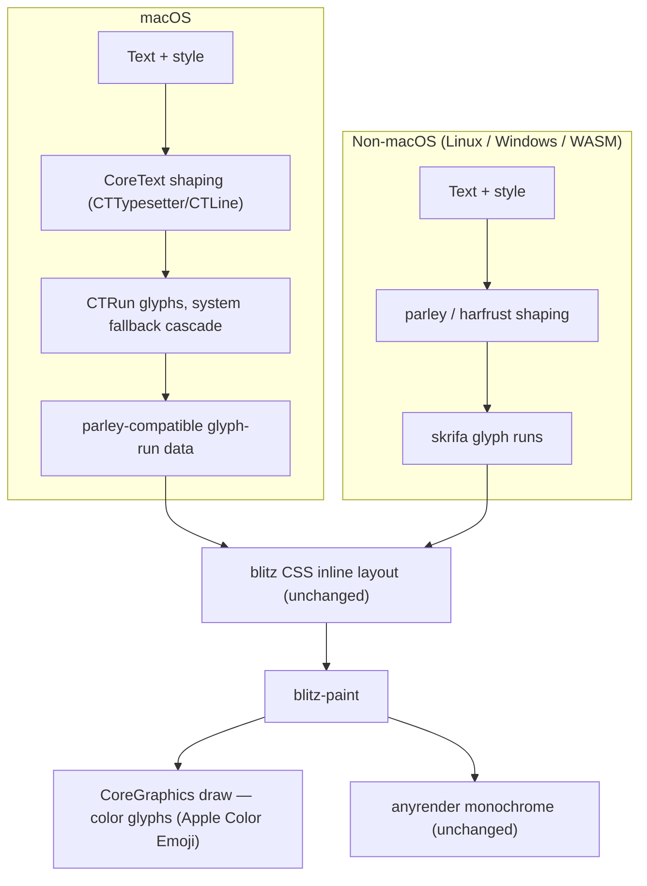
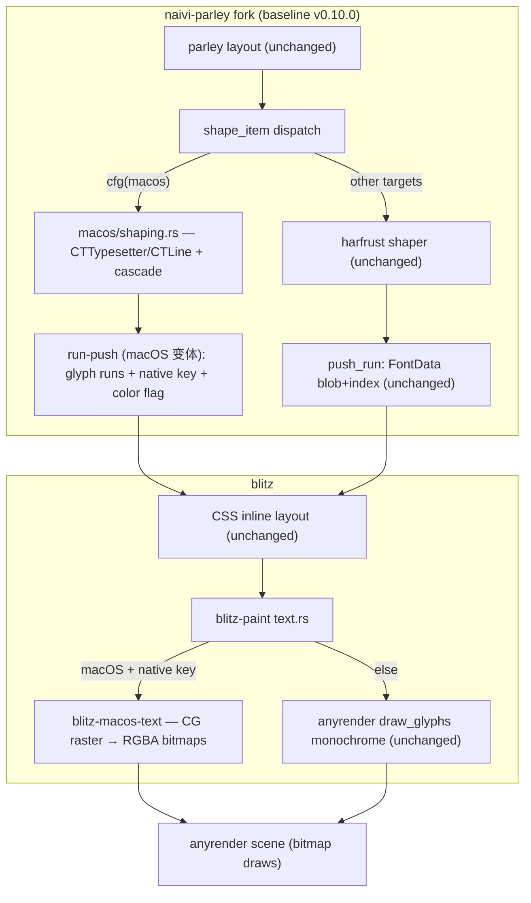

# macOS CoreText Text Backend - Plan

## Goal Capsule

- **Objective:** 在 macOS 上让 blitz 的文本 shaping 与光栅化都走 CoreText/CoreGraphics,以获得原生渲染质量(系统 fallback 级联、Apple Color Emoji、复杂脚本);非 macOS(含 WASM)保持现有 parley/harfrust Rust 栈。后端通过一个由 blitz 维护的 parley fork 注入,blitz 侧以 git-rev pin 接入,使上游合并保持低摩擦。
- **Product authority:** 本计划只拥有 macOS CoreText 文本后端这一块工作;非 macOS 文本栈改动、blitz 内并行 CoreText 路径、仅补彩色字形、引入 naive-text 均不是活动范围(是上下文候选,非承诺路线图)。
- **Open blockers:** 无阻塞项。

---

## Product Contract

### Summary

macOS 上的文本将改由 CoreText 端到端处理(shaping 经 CTTypesetter/CTLine、光栅化经 CoreGraphics,含 Apple Color Emoji),非 macOS 继续走 parley/harfrust。实现载体是一个维护中的 parley fork,blitz 通过 git-rev pin 接入,因此上游合并几乎不会触碰本工作。

### Problem Frame

blitz 目前的文本全栈都是 parley:shaping 硬编码 HarfBuzz(harfrust),字体发现走 fontique,光栅化是单色 `draw_glyphs`。质量短板集中在 macOS:Apple Color Emoji(sbix)无法正确渲染、系统字体 fallback 不遵循 CoreText 级联、复杂脚本的原生 shaping 观感与 Safari 不一致。parley 0.10 的 shape 模块没有可插拔 shaper 接口,因此"在 macOS 换掉 shaping"无法在 blitz 侧通过配置完成。

naive 项目已经解决过同一问题:它自建 `naive-text`,按 `cfg(target_os = "macos")` 在 CoreText 后端与 skrifa/harfrust 后端之间编译期切换,并明确 macOS 应把 fallback 委托给 CoreText。blitz 不能直接照搬,因为 blitz 的 CSS 内联布局深度依赖 parley 的 `Layout<TextBrush>` 输出(断行、inline boxes、双向文本),naive-text 不提供这一层。所以 blitz 的形态是:保留 parley 的布局,只在其内部为 macOS 换掉 shaping 与光栅化。

关键约束来自维护方式:本仓库需要频繁合并上游 blitz,而上游 churn 最狠的正是文本相关文件(`packages/blitz-dom/src/layout/inline.rs`、`document.rs`、`node/text.rs`、`packages/blitz-paint/src/text.rs`)。任何把 CoreText 逻辑写进这些文件的方案都会把每次上游合并变成冲突现场。

### Key Decisions

- **macOS 文本走 CoreText 全路径(shaping + 光栅化)** (session-settled: user-directed — chosen over "只换 shaping"与"只做字体发现/fallback": 目标是原生渲染质量最大化,不满足于部分收益)。Governs R1, R2, R3。
- **通过维护 parley fork 注入后端** (session-settled: user-directed — chosen over "blitz 内并行 CoreText 路径"与"引入 naive-text": 需要频繁合并上游 blitz,要求最小冲突面)。Governs R6, R7, R8。
- **不接受 skrifa 兜底退路** (session-settled: user-directed — chosen over "先用 skrifa 彩色字形兜底": CoreText 光栅化是硬性交付,正常路径不得回退)。Governs R3。
- **非 macOS 保持 parley/harfrust 现状** (session-settled: user-directed — 原诉求即"非 macOS 使用 Rust 技术栈",无替代被否决)。Governs R4。
- **输出契约保持 parley 兼容** — fork 的 CoreText 路径产出 parley 兼容的 glyph-run/line 数据,使 blitz 现有布局层零改动;这是 fork 方案的立身假设。Governs R5。
- **fork 托管为独立仓库 + git-rev pin** (session-settled: user-directed — chosen over submodule 形式: Rust 社区惯例是 cargo git 依赖而非 submodule,与现有 taffy pin 机制一致;仓库为 `WaiSiuKei/naivi-parley`,本地 `/Users/yq/private-repos/naivi-parley`)。Governs R6。
- **fork 基线锁定 parley 0.10** (session-settled: user-directed — chosen over 跟踪 linebender main(0.11-dev): 匹配 blitz 当前 pin,接入成本最低;0.11 升级留作后续独立工作)。Governs R6。

### Requirements

**macOS CoreText 后端**

- R1. macOS 上文本 shaping 由 CoreText 完成(CTTypesetter/CTLine),字体 fallback 级联委托给 CoreText,渲染观感与 Safari 一致。
- R2. macOS 上文本光栅化由 CoreGraphics 完成,彩色字形(Apple Color Emoji / sbix)原生渲染。
- R3. macOS 上 CoreText 是文本的唯一后端;任何情况下不得降级到 skrifa/harfrust 的彩色或单色渲染(正常路径无回退)。

**非 macOS 保持 Rust 栈**

- R4. 非 macOS(Linux / Windows / WASM)保持现有 parley/harfrust shaping 与字体发现不变;WASM 继续使用内置字体并禁用系统字体。

**输出契约与布局**

- R5. fork 的 macOS 路径产出与 parley 兼容的 glyph-run 数据,blitz 现有 CSS 内联布局(断行、inline boxes、双向文本)无需改动即可消费。

**集成与合并卫生**

- R6. blitz 通过 git-rev pin 接入维护的 parley fork,接入机制与现有 taffy pin 一致。
- R7. CoreText/CoreGraphics 后端逻辑不写入上游活跃文件:`packages/blitz-dom/src/layout/inline.rs`、`document.rs`、`node/text.rs` 零改动,`packages/blitz-paint/src/text.rs` 只保留特性开关接缝行;shaping 在 fork 内,光栅化在新增的 cfg(macos) crate `packages/blitz-macos-text`;上游合并的冲突面只限于 pin、特性开关与接缝行。
- R8. fork 维护契约:基线锁定 v0.10.0(`1df9544`);上游无 0.10.x 发布时保持 pinned,发布后沿 0.10.x 线 rebase;任何 pin 更新都执行最小验证门(fork 双 target 测试 + blitz workspace/wasm 全绿),rebase 成本不随版本漂移累积(有流程或测试验证)。

### Key Flows

- F1. macOS 文本渲染流
  - **Trigger:** 任一文本节点进入布局。
  - **Steps:** 文本与样式交给 CoreText shaping → CTTypesetter/CTLine 产出 CTRun(系统 fallback 自动解析)→ 提取 CTRun 的 glyph/advance/实际 CTFont → 转换为 parley 兼容数据 → blitz 内联布局照常断行排版 → blitz-paint 经 CoreGraphics 绘制(含彩色字形)。
  - **Outcome:** 与 Safari 观感一致的原生文本,布局层无感知。
  - **Covers:** R1, R2, R5
- F2. 上游合并流
  - **Trigger:** 合并上游 blitz 到本仓库。
  - **Steps:** fetch upstream → merge → 冲突应只出现在 Cargo.toml / Cargo.lock 的 pin 行与特性开关 → fork 侧独立 rebase parley 上游。
  - **Outcome:** 文本/布局源码零冲突。
  - **Covers:** R6, R7, R8

### Acceptance Examples

- AE1. macOS 渲染 "Hello 世界 😀"(混合 Latin / CJK / Emoji)
  - **Covers R1, R2, R3.**
  - **When:** 页面包含该混合文本。
  - **Then:** CJK 走系统字体(如 PingFang)fallback,😀 显示彩色 Apple emoji,观感与 Safari 一致;不出现单色或豆腐块。
- AE2. macOS 渲染复杂脚本(阿拉伯语 / 印度语系)
  - **Covers R1, R3.**
  - **When:** 文本包含合字与重排敏感的脚本。
  - **Then:** 合字与序列正确,由 CoreText 完成,不触发任何回退路径。
- AE3. 非 macOS 渲染同一文本
  - **Covers R4.**
  - **When:** Linux / Windows / WASM 渲染与改动前相同的页面。
  - **Then:** 输出与改动前完全一致(harfrust 路径无回归)。
- AE4. 执行一次上游合并
  - **Covers R6, R7, R8.**
  - **When:** 合并一次新的上游 main。
  - **Then:** 冲突集不超出 Cargo.toml / Cargo.lock 的 pin 行与特性开关;blitz-dom 布局/文本源码零冲突,blitz-paint 仅接缝行(特性开关)。

### Success Criteria

- macOS 上 Apple Color Emoji 与系统字体 fallback 达到原生观感(与 Safari / 原生 App 对照)。
- 合并上游后的冲突面不扩大,持续停留在 pin 与开关行。
- 非 macOS 与 WASM 文本渲染无回归(改动前测试集全绿)。

### Scope Boundaries

**不在本计划范围内**

- 非 macOS(Linux / Windows / WASM)文本栈的任何改动。
- blitz 内并行 CoreText 路径(方案 B)。
- 仅补彩色字形、不动 shaping(方案 C)。
- 引入 / 移植 naive-text 作为 blitz 文本层。
- 向上游 linebender/parley 提交 shaper 支持(属于上游独立工作,不阻塞本计划)。

**延后处理**

- fork 的自动化 rebase 工具 / 同步 CI(最小验证门已在 R8 内定义;自动化工具仍延后)。
- 0.11 迁移(parley_engine split、Shaper trait)——触发时作为独立工作项。
- 非 macOS 平台的彩色字形统一(若将来 Linux/Windows 也要 emoji,属于另一份工作)。

### Dependencies / Assumptions

- 需要一个由 blitz 维护的 parley fork(基线 parley 0.10)。
- CoreText / CoreGraphics 在目标 macOS 可用(naive 项目已证明此依赖组合可行)。
- skrifa 已支持 sbix / CBDT / COLRv1 彩色字形(已验证,但按 R3 不作为 macOS 回退)。
- fontique 已按平台接入 CoreText / Windows / fontconfig 的字体发现(已验证;macOS 的 CoreText 路径将自行负责发现,不依赖 fontique)。
- blitz 现有文本栈的事实断言(shaping 100% parley、无彩色字形路径、taffy git-rev pin 先例、WASM 内置字体)均已对照代码验证。

### Outstanding Questions

**Resolved during planning**

- CoreText shaping 与 parley 字体选择 / 双向文本的接缝 → KTD1 / KTD3(U2:cfg 门控替换 harfrust 调用点;段落基向用 parley 解析结果钉入 CTParagraphStyle)。
- macOS 彩色字形与 glyph 的缓存策略 → KTD4 / U6(per-run CTFont 注册表 + 按字形位图,naive 同款策略)。
- 像素级对照测试基础设施 → 转为 `Deferred to Implementation`(本次以功能断言 + 人工视觉清单验收 AE1/AE2)。

**Deferred to Implementation**

- native font key 的去重 / 注册表结构细化(key 语义已在 KTD4 定死:自描述 + fork 导出 resolver)。
- 字形位图缓存的具体容量 / 失效策略(粒度已定:逐字形 + per-run CGContext 一次绘制,见 U6)。
- 与 Safari 的自动化像素对照基础设施(本次不做,记录为后续工作)。

### Sources / Research

- naive 项目的 `docs/font.md` 与 `docs/font-resolution.md`(六层文本架构、FontResolver/FontProvider 分离、macOS CoreText fallback 模式——naive 仓库,本仓库之外)。
- naive 项目的 `crates/naive-text`(`macos.rs` / `macos_shaping.rs` / `macos_raster.rs` 与 `skrifa_font.rs` / `skrifa_raster.rs` / `skrifa_colr.rs` 的 cfg 双后端,naive 仓库)。
- 本仓库 grounding 档案(ce-brainstorm 会话生成的临时档案,blitz 文本/字体管线现状的引用摘录,含 `document.rs` / `node/text.rs` / `blitz-paint` / `Cargo.toml` 的关键行号)。
- 本仓库关键位置:`packages/blitz-dom/src/document.rs`(FontContext/collection 构造)、`packages/blitz-dom/src/node/text.rs`(TextLayout)、`packages/blitz-paint/src/text.rs`(draw_glyphs 单色绘制)、`Cargo.toml`(parley 0.10 与 taffy git-rev pin 先例)。
- 规划期研究(2026-08-14):parley-0.10.0 shape 内部(`shape/mod.rs:65` 入口、`shape_item` 的 harfrust 调用与 `push_run` 输出契约、`FontSelector` 经 fontique Query 选字)、fork 的 `v0.10.0` tag 为 `1df9544`、fork 内无任何 core-text/core-graphics 依赖。

---

## Planning Contract

**Execution direction:** 跨仓库实现——先在 fork(`naivi-parley`)完成 U1–U4 并推送后端分支,再由 blitz 以 git-rev pin 接入(U5–U8)。CoreText 路径以测试先行为主:fork 侧每个 shaping 单元先写 macOS 单元测试,blitz 侧以真实页面视觉验收收尾。

**Product Contract preservation:** 澄清,无范围变化 — R7 措辞与已定的 KTD5 对齐(shaping 在 fork、光栅化在 `blitz-macos-text`),AE4 与 R7/F2/U8/DoD 的"特性开关"表述统一,R8 补全维护契约;R/F/AE 的 ID 与核心意图未变。

### Key Technical Decisions

- **KTD1 — CoreText shaper 落在 fork 的 shape 模块,cfg(macos) 门控替换 shape_item 的 shaping+度量产出** (session-settled: user-directed — chosen over "blitz 侧并行路径": 让 blitz 布局层零改动,R7 冲突面最小)。在 macOS 上,`shape_item` 的整段 shaping 与度量产出(harfrust 调用 + skrifa 度量 + push_run)被 CoreText 路径整体替换;`FontSelector` 仍负责为每个 segment 解析主字体与候选字体集合,CoreText 在该 segment 内用级联偏好完成 fallback(R1 的结构性保证);非 macOS 的 harfrust 路径原样保留。fork 相对 v0.10.0 的实际 diff 规模在 U4 明确量化。Governs U2。
- **KTD2 — fork 基线锁定 parley v0.10.0 tag(`1df9544`)** (session-settled: user-directed — chosen over 跟踪 0.11-dev: 匹配 blitz 当前 pin,接入成本最低)。U1 将分支重置到该 tag。Governs U1, U5。
- **KTD3 — macOS fallback 委托给 CoreText 级联** (session-settled: user-directed — R1 的 how 层落地)。fontique 只负责解析主字体(家族/字重),实际 shaping 与 fallback 由 CTLine 级联完成;段落基向用 parley 解析结果钉入 CTParagraphStyle,并在 U2 增加 run 级序一致性 falsification 测试(CTLine 内嵌层级重排 vs parley bidi 层级)。**naive 是单引擎、不覆盖双引擎接缝,不得引用 naive 作为该接缝的证据。** Governs U2。
- **KTD4 — run 的字体身份在 macOS 上携带自描述 native font key + 彩色标志** (planning — 使光栅化层可解析回 CTFont,同时保持 `Run::font()` 等 API 形状不变;非 macOS `FontData` 不动)。key 语义在规划期定死:自描述(字体家族/集合身份 + 属性 + 尺寸),`blitz-macos-text` 无需访问 fork 内部注册表即可解析为 CTFont;fork 另导出一个小型 resolver(镜像 naive 的 `id_for_native_font`)。单一归属:fork 产出、blitz 解析。Governs U3。
- **KTD5 — 光栅化放到新 crate `packages/blitz-macos-text`(cfg macos),blitz-paint 只留几行接缝** (planning — chosen over "把 CG 逻辑写进 blitz-paint/text.rs": R7 要求 CoreText 逻辑不落入上游活跃文件;新文件集上游合并永不触碰)。Governs U6, U7。

### High-Level Technical Design

数据流:blitz 现有布局层读取 fork 产出的 parley 兼容 glyph-run(断行 / inline boxes / 双向文本不变);blitz-paint 按 run 是否携带 native font key 分流——macOS 走 `blitz-macos-text` 的 CoreGraphics 位图(含彩色字形),其余走原有单色 `draw_glyphs`。

### Implementation Units

#### U1. [Fork] 重置 fork 到 parley v0.10.0 基线并添加 macOS 依赖

**Target repo:** naivi-parley(blitz 之外独立仓库)

- **Goal:** fork 落到 `v0.10.0` tag(`1df9544`)的干净基线上,建立后端工作分支,并为 macOS 引入 CoreText/CoreGraphics FFI 依赖。
- **Requirements:** R6
- **Dependencies:** 无
- **Files:**
  - `parley/Cargo.toml`(在 `[target.'cfg(target_os = "macos")'.dependencies]` 增加 core-text / core-foundation / core-graphics)
  - `README.md`(fork 状态说明:基线、diff 面、后端分支)
- **Approach:**
  1. 将工作分支重置到 `v0.10.0` tag(`1df9544`),而非当前 0.11-dev HEAD。
  2. 创建后端分支(默认 `coretext-backend-v0.10`,实现方可调整)。
  3. 在 `parley/Cargo.toml` 以 cfg(target_os="macos") 加入三个 FFI 依赖。
  4. 验证 workspace 在 macOS 可构建。
  5. **前置 spike(在本单元内、后端分支推送前):** 用 CoreGraphics 把一个 CG glyph 位图绘制进 anyrender scene 并计时,确认位图绘制能力与数量级,把 "anyrender 位图绘制未知" 风险在管线前端退役;结果记录到本单元验证。
- **Patterns to follow:** naive 的 Cargo.toml macOS 依赖门控;blitz 的 taffy git-rev pin 注释风格(仅作参考)。
- **Test scenarios:** `Test expectation: none -- 仓库卫生/依赖接线;前置 spike 的位图绘制检查见 Approach step 5 与 Verification。`
- **Verification:** `git rev-parse HEAD` 等于 `1df9544`(或其后端分支基于该提交);`cargo check -p parley` 在 macOS 全绿;交叉到非 macOS target `cargo check` 全绿(证明 cfg 门控不漏);前置 spike 确认单个 CG glyph 位图可绘制进 anyrender scene 且耗时在可接受数量级。

#### U2. [Fork] CoreText shaping 引擎

**Target repo:** naivi-parley

- **Goal:** 在 macOS 上文本 shaping 走 CTTypesetter/CTLine(级联 fallback),产出 parley 兼容的 `push_run` 输出;非 macOS 的 harfrust 路径原样不动。
- **Requirements:** R1, R3, R5
- **Dependencies:** U1
- **Files:**
  - `parley/src/shape/mod.rs`(在 `shape_item` 处按 `cfg(target_os = "macos")` 分流——整体替换 macOS 的 shaping+度量产出,harfrust 路径不加改动)
  - `parley/src/shape/macos/mod.rs`(新;模块入口与注册表)
  - `parley/src/shape/macos/shaping.rs`(新;CoreText shaping:attributed string + cascade preference、CTLine、per-run CTFont 提取、UTF-16→UTF-8 cluster 映射、由相邻位置与 typographic bounds 计算 advance)
  - `parley/src/layout/data.rs`(cfg(macos) 下新增 run-push 写入路径,接受 CTRun glyph/advance 数据与预计算 CoreText 度量,跳过 skrifa 度量与 font-unit 缩放)
- **Approach:**
  1. 主字体来自 fontique 已解析的集合字体,取其家族/字重映射为 CTFont;fallback 完全交给 CoreText 级联(KTD3)。
  2. 按 naive 的 cascade-preference 做法,把候选 fallback 字体的 descriptor 装入 `kCTFontCascadeListAttribute`。
  3. 段落基向用 parley 解析结果钉入 CTParagraphStyle,避免与 parley 双向文本逻辑冲突(KTD3)。
  4. 提取每个 CTRun 的实际 CTFont、glyph id、位置、string index;string index 按 UTF-16 映射回 UTF-8 字节 cluster。
  5. **输出不走 parley 既有 `push_run`**(其入参是 `&harfrust::GlyphBuffer`、度量经 skrifa `FontRef::from_index(...).unwrap()` 从 FontData blob 计算——级联字体无 blob 会在 unwrap 处 panic):在 `layout/data.rs` 增加 cfg(macos) 的 run-push 变体,接受 CTRun 的 glyph/advance 数据与预计算 CoreText 度量,跳过 skrifa 度量块与 font-unit 缩放(CoreText 位置已是 point)。
  6. 字体变体映射:parley 解析出的 `FontVariation` 写入 CTFontDescriptor 的 `kCTFontVariationAttribute`;合成斜体/粗体由 CoreText 合成处理(或位图变换),与 blitz 现有 glyph_xform/embolden 语义对齐。
  7. 输出使 blitz 布局层对后端无感知(R5)。
- **Patterns to follow:** naive `crates/naive-text/src/macos_shaping.rs`(cascade preference、per-run CTFont、cluster 映射、advance 计算——直接翻译参照);parley 现有 `push_run` 输出契约。
- **Test scenarios:**
  - macOS:纯拉丁 "Hello" → 单 run,glyph 数 > 0,advance 与相邻位置差一致,cluster 映射到 UTF-8 字节。
  - macOS:"Hello 世界 😀" → ≥3 个 run(拉丁 / CJK fallback / emoji),emoji run 的字体是彩色 emoji 字体,CJK run 是系统 CJK 字体,无 .notdef。Covers AE1。
  - macOS:阿拉伯语 "مرحبا" → 合字/连字正确,cluster 完整。Covers AE2。
  - macOS:含内嵌 LTR 的 RTL 段落 → 基向一致,段落中途不发生方向翻转;并做 **run 级序一致性断言**(提取 CTLine per-run string indices/顺序,断言与 parley bidi 层级推导一致;若不一致,在 U3 前决定 run 重排策略——KTD3)。
  - macOS:强制 CoreText shaping 失败(如非法 attributed string / 不可用字体)→ 记录日志并产出 notdef/占位字形,断言未回退到 harfrust/skrifa(R3)。
  - macOS:可变字体轴(font-variation-settings)经 `kCTFontVariationAttribute` 生效;`font-style: italic` / `font-weight: 700` 合成字形存在且可绘制。
  - 非 macOS:现有 parley shaping 测试原样通过(行为零变化)。Covers AE3。
- **Verification:** 新增 macOS cfg 门控的单元测试全绿;非 macOS 交叉构建全绿;既有 parley 测试套件全绿。

#### U3. [Fork] run 的 native font 身份与彩色标志

**Target repo:** naivi-parley

- **Goal:** shaped run 携带足够的原生字体身份与彩色标志,使光栅化层能解析回 CTFont,同时不改变 blitz 布局消费的 API 形状。
- **Requirements:** R2, R5
- **Dependencies:** U2
- **Files:**
  - `parley/src/layout/run.rs`(cfg(macos) 下 run 数据携带 native font key + 彩色标志)
  - `parley/src/layout/data.rs`(native font key 的注册表/去重;非 macOS `FontData` 不变)
  - `parley/src/shape/macos/shaping.rs`(每个 run 产出 native font key 与彩色标志)
- **Approach:**
  1. 在 cfg(macos) 下扩展 run 的字体身份:**自描述 native font key**(字体家族/集合身份 + 属性 + 尺寸),`blitz-macos-text` 无需访问 fork 内部注册表即可解析回 CTFont;fork 另导出小型 resolver(镜像 naive `id_for_native_font`)。`Run::font()` 与 `run.normalized_coords()` 保持可编译;macOS 下 normalized coords 为恒等/空。
  2. 每个 run 携带彩色标志(CoreText 可从 run 字体判定是否彩色),供光栅化层选路径。
  3. run 度量(ascent/descent/leading)取自 CoreText,保证 blitz 的 inline 背景与下划线/删除线继续可用。
  4. 级联字体在 `FontData` 中的物化:空 blob sentinel + 消费端守卫(blitz-paint 对 native-key run 在接缝前 early-continue,不把空 blob 交给 anyrender `draw_glyphs`)。
- **Patterns to follow:** naive 的 `FontId`/注册表模式;parley `data.rs` 的去重模式。
- **Test scenarios:**
  - macOS:混合串的每个 run 都带可解析 native key;"😀" run 彩色标志为 true,拉丁/CJK run 为 false。
  - macOS:run 度量与 CTLine typographic bounds 在容差内一致。
  - 非 macOS:`FontData` 路径与改动前逐字节一致(既有测试)。
- **Verification:** fork 单元测试 + 一个消费端测试:把 native key 解析回 CTFont 并绘制一个 glyph。

#### U4. [Fork] fork 验证与 diff 面文档化

**Target repo:** naivi-parley

- **Goal:** 证明 cfg 门控让非 macOS 行为完全不变,并把 fork 相对 v0.10.0 的改动面文档化,支撑 R8。
- **Requirements:** R4, R8
- **Dependencies:** U2, U3
- **Files:**
  - `parley/src/shape/mod.rs`(标注 macOS-only 块,便于未来 rebase 定位)
  - `README.md`(diff 面:相对 `v0.10.0` tag 被改动的文件清单)
- **Approach:**
  1. **以文档为重心**:以 `git diff v0.10.0 --stat` 记录被改文件集(含 KTD1 整段替换的实际 diff 规模),写进 README,作为未来 rebase 的已知冲突面(R8)。
  2. 作为 fork 阶段 Gate 1 汇总既有验证(U2/U3 的 macOS 测试 + 非 macOS 交叉构建),不重复新增测试。
  3. 标注 macOS-only 块(shape/mod.rs 内 cfg 块),便于未来 rebase 定位。
- **Test scenarios:** 见验证(套件双 target 全绿;改动面清单)。
- **Verification:** `cargo test`(macOS)与 `cargo check --target <非macOS>` 全绿;`git diff v0.10.0 --stat` 只列出后端文件。

#### U5. [Blitz] 以 git-rev pin 接入 fork

**Target repo:** blitz

- **Goal:** blitz 以与 taffy pin 一致的方式消费 fork;非 macOS 构建不变。
- **Requirements:** R6
- **Dependencies:** U4(fork U1–U4 完成,后端分支已推送)
- **Files:**
  - `Cargo.toml`(parley 依赖改为 `git = "https://github.com/WaiSiuKei/naivi-parley"` + rev pin,附说明注释)
  - `Cargo.lock`(重新生成)
- **Approach:**
  1. 将 parley 依赖切到 fork,rev 锁到后端分支头的**提交 SHA**(非分支名,保证可复现;仿 taffy pin 注释),注释说明 fork 用途;每次 fork rebase 后刷新该 SHA 并重新生成 lockfile(R8)。
  2. 重新生成 lockfile;macOS workspace 全量构建通过。
  3. 验证非 macOS / wasm target 解析同一 fork 且构建通过(行为零变化)。
- **Test scenarios:** `Test expectation: none -- 依赖接线单元;验证见下。`
- **Verification:** workspace `cargo check` 全绿;`cargo tree -i parley` 显示 fork rev;wasm target 构建全绿。

#### U6. [Blitz] macOS 原生文本光栅化 crate

**Target repo:** blitz

- **Goal:** 新 cfg-gated crate 把 CoreText shaped run 经 CoreGraphics 光栅化为 RGBA 位图(彩色感知),并把 fork 的 native font key 解析回 CTFont。
- **Requirements:** R2, R7
- **Dependencies:** U5
- **Files:**
  - `packages/blitz-macos-text/Cargo.toml`(新;cfg macos;core-text / core-graphics / core-foundation + parley fork + kurbo)
  - `packages/blitz-macos-text/src/lib.rs`(新;注册表 key → CTFont;`draw_run` API 返回按字形位图)
  - `packages/blitz-macos-text/src/raster.rs`(新;CGContext 位图光栅化、彩色检测、1px 扩张、blank sentinel)
  - `Cargo.toml`(workspace member)
- **Approach:**
  1. 新增 workspace member(全新文件集,上游合并永不触碰,符合 R7)。
  2. 注册表把 fork 的自描述 native font key 映射到 CTFont 实例(按尺寸),镜像 naive 的 `id_for_native_font`。
  3. **光栅化粒度定为逐字形位图**(经 per-run CGContext 一次绘制后按字形切出):CGContext 位图 → RGBA premultiplied;彩色字形保留颜色(`contains_non_grayscale_pixels` 守卫,naive 同款);blank/.notdef 返回 1x1 透明 sentinel。
  4. 返回带偏移的位图(naive 的 dilated-origin 处理)。
  5. **bounds 来源不引入 font-kit**:native key 只能还原 CTFont、无法构造 font-kit Font,故 bounds / 1px 扩张 / offset 数学改用 CoreText `CTFont` bounding rects(`get_bounding_rects_for_glyphs`),语义与 naive 一致。
  6. 按(字体, 尺寸, 字形)缓存位图,避免重复光栅化;整 run 单表面绘制在 anyrender 抽象下不可用(见 Risks),不做该路径。
- **Patterns to follow:** naive `crates/naive-text/src/macos_raster.rs`(prepare_glyph_context / draw_glyph / 彩色检测 / 扩张);blitz 既有图片渲染(anyrender scene 位图绘制 API——U6 先确认该 API 再写 U7)。
- **Test scenarios:**
  - macOS:光栅化 "😀" 字形 → 非灰阶 RGBA 像素,尺寸 > 1x1。
  - macOS:光栅化 "A" → 灰阶(单色)位图,带 alpha 覆盖。
  - macOS:blank/.notdef → 1x1 透明 sentinel。
  - macOS:同一(字体, 尺寸, 字形)重复绘制命中位图缓存(对象复用)。
  - 非 macOS:该 crate 编译为 cfg 门控的空实现(桩),不引入任何行为或构建产物变化。
- **Verification:** crate 单元测试全绿;与 U7 集成后真实页面验证。

#### U7. [Blitz] blitz-paint 接缝

**Target repo:** blitz

- **Goal:** blitz-paint 把携带 native font key 的 run(macOS)路由到新 crate 的位图绘制,其余路径保持单色 `draw_glyphs`;选区/背景/装饰逻辑不动。
- **Requirements:** R2, R5, R7
- **Dependencies:** U6
- **Files:**
  - `packages/blitz-paint/src/text.rs`(thin cfg-gated 分流:macOS + native key → blitz-macos-text 位图;其余 → 原 `draw_glyphs`)
  - `packages/blitz-paint/Cargo.toml`(cfg macos 下依赖 `blitz-macos-text`)
- **Approach:**
  1. 在 glyph-run 绘制点加分流:macOS + native key → 逐字形位图绘制进 scene;其余走原路径。
  2. 接缝控制在几行内,使上游合并冲突面最小(R7);全部 CoreText/CG 逻辑留在 `blitz-macos-text`。
  3. 背景 / 选区 / 下划线 / 删除线代码不动(run 度量保持有效)。
- **Patterns to follow:** 现有 `draw_glyphs` 调用点;anyrender 位图/图像绘制 API(镜像 blitz 既有图片渲染)。
- **Test scenarios:**
  - macOS:页面含 "Hello 世界 😀" 正确渲染彩色 emoji 与系统 CJK。Covers AE1。
  - macOS:选区高亮、inline 背景、下划线/删除线在 native 字形上仍正常。
  - 非 macOS:渲染输出与改动前一致(既有套件)。
- **Verification:** macOS 视觉检查 + 既有 blitz 测试套件全绿。

#### U8. [Blitz] 端到端验收与回归

**Target repo:** blitz(含 fork rebase 核验)

- **Goal:** AE1–AE4 全部通过;非 macOS 零回归;上游合并冲突面只落在 pin/开关行。
- **Requirements:** R1–R8
- **Dependencies:** U7
- **Files:**
  - 使用现有示例资产(如 todomvc / examples 下的 HTML)做 AE1/AE2 人工视觉对照,不新增源文件。
- **Approach:**
  1. macOS 上渲染 AE1/AE2 文本,与 Safari 人工视觉对照,记录清单。
  2. AE3:非 macOS + wasm 构建,既有测试套件(naivi-dom ops.rs、blitz-dom 等)全绿。
  3. AE4:干跑合并当前上游 blitz main 到本分支,断言冲突只出现在 Cargo.toml / Cargo.lock 的 pin 行与特性开关;文本/布局源码零冲突。
  4. fork 侧:后端分支保持 v0.10.0 基线;若上游发布 0.10.x 则 rebase 到其上并确认改动面与 U4 文档一致,否则核对 diff 面未漂移(R8)。
- **Test scenarios:**
  - 逐 AE 执行;Covers AE1, AE2, AE3, AE4。
  - 合并干跑:冲突集断言只含 pin/开关行。
- **Verification:** 记录 AE 结果;套件全绿;干跑输出符合断言。

### Verification Contract

- **Gate 1 — fork(U1–U4):** macOS `cargo test` 全绿;非 macOS target 交叉 `cargo check` 全绿;diff 面对照记录在 fork README。
- **Gate 2 — 集成(U5–U7):** blitz workspace 在 macOS 以 fork pin 构建并跑通既有文本相关测试;非 macOS 与 wasm 构建/测试与改动前一致。
- **Gate 3 — 验收(U8):** AE1/AE2 人工视觉对照 Safari 通过;AE3 非 macOS/wasm 零回归;性能 Go/No-Go 门通过(见 DoD);AE4 干跑断言冲突集只含 pin/开关行与接缝行。

### Definition of Done

- R1–R8 全部满足;AE1–AE4 全部通过。
- macOS 默认启用 CoreText 后端;非 macOS/wasm 行为与改动前一致(测试集全绿)。
- **性能 Go/No-Go 门通过**:macOS 代表性页面(如 todomvc / 拉丁密集页)的文本绘制耗时相对改动前矢量路径无显著回退(基准在 U8 记录)。
- 上游合并干跑:blitz-dom 布局/文本源码零冲突,冲突集不超出 Cargo.toml / Cargo.lock pin 行、特性开关与 blitz-paint 接缝行。
- fork 的 diff 面已文档化且维护契约(R8)验证过。
- 以 PR 形式落地并链接本计划。

### System-Wide Impact

- **parley 输出消费者(blitz)**:`packages/blitz-dom/src/layout/inline.rs` 读取 glyph-run 做内联布局、`packages/blitz-dom/src/node/text.rs` 持有 `TextLayout`、`packages/blitz-paint/src/text.rs` 绘制。fork 的 run 字体身份扩展(KTD4)必须保持这些 API 形状不变(R5);任何对 `Run::font()` / `run.normalized_coords()` / `glyph_run.positioned_glyphs()` 的破坏都会波及 blitz 布局。
- **fork 输出契约**:parley 0.10 的 `push_run` 与 harfrust glyph buffer + skrifa 度量硬耦合,级联字体无 blob 会在 unwrap 处 panic;macOS 需要 cfg(macos) 的 run-push 变体与空 blob sentinel,`Run::font()` 调用点(含 blitz-paint `stroke_text` 在接缝前对 native-key run 的 early-continue)需守卫(KTD1 / U2 / U3)。
- **对等面(parity surface)**:macOS 与 Linux / Windows / wasm 三条文本路径必须保持行为等价;非 macOS 路径改动为零,是每次合并与每次 CI 的可断言对等面(AE3)。
- **新工作区成员**:`packages/blitz-macos-text` 加入 blitz workspace;anyrender scene 需支持位图/图像绘制(blitz 已有图片渲染先例),文本按字形位图合成是新增的绘制路径。
- **失败传播**:macOS 上 CoreText shaping 或光栅化失败时,行为必须明确——记录日志并产出 notdef/占位字形,绝不静默回退到 harfrust/skrifa(R3 禁止);naive 对 `CTParagraphStyleCreate` 失败有 log + 继续的先例,可参照。
- **状态生命周期**:fork 内 native font key 注册表与 `blitz-macos-text` 的 CTFont/位图缓存按字体尺寸组织,生命周期跟随文档/字体上下文;避免跨尺寸混用导致的度量漂移。

### Risks & Mitigations

- **Cluster / 双向文本与 parley 布局预期不一致**(最大接缝风险):CoreText 的 cluster/indices 需映射回 UTF-8 字节;段落基向用 parley 解析结果钉入,并在 U2 做 run 级序一致性 falsification 测试。**naive 是单引擎、不覆盖双引擎接缝**,此缓解是本计划的独立证据,不引用 naive 作为双引擎证明。
- **性能回退 / 无低成本出口**:R3 使 CG 位图成为 macOS 唯一路径;逐字形位图合成可能慢于现有矢量路径,且 anyrender 抽象不暴露 CGContext,整 run 单表面绘制不可用(该替代实际不存在)。缓解:U1 前置 spike 退役能力未知;U6 粒度定为逐字形 + per-run CGContext 一次绘制 + (字体, 尺寸, 字形)位图缓存;DoD 增加 macOS 代表性页面(如 todomvc / 拉丁密集页)的耗时 Go/No-Go 门。
- **anyrender 位图绘制能力未知**:U1 前置 spike 先行确认并计时(镜像 blitz 既有图片渲染),不再留到 U6。
- **CoreText 失败路径**:失败时日志 + notdef,绝不静默回退(见 System-Wide Impact),纳入 U2/U6 测试。
- **fork 与上游漂移 / 单发布门**:基线锁定 v0.10.0;上游无 0.10.x 发布时保持 pinned;每个 pin 更新执行最小验证门(fork 双 target + blitz/wasm 全绿,R8);已知分歧项(#637 emoji variation selector 修复、#650 harfrust 升级,仅存在于 0.11-dev)记录为 fork 从 0.10.0 基线继承的 divergence 清单。
- **字体变体与合成回归**:macOS 需把 `FontVariation` 写入 `kCTFontVariationAttribute`,合成斜体/粗体由 CoreText 处理,否则可变轴静默失效(AE3 对等面)。缓解:U2 变体/合成测试。
- **emoji 度量 / 行高与 Safari 差异**:度量取自 CoreText per-run(U3),以视觉清单核验。
- **跨仓库管线风险**:ce-work 需先 fork 后 blitz,见 Repository Coordination。

### Assumptions

- fork 后端分支名假设为 `coretext-backend-v0.10`(实现方可调整)。
- macOS 主字体由 fontique 集合解析后转 CTFont;fallback 完全交给 CoreText 级联(KTD3)。
- 上游 parley 在可预见的未来不发布 0.10.x;fork 保持 pinned 于 v0.10.0,0.11 迁移为独立触发项(R8)。
- `blitz-macos-text` 不引入 font-kit 依赖,bounds 数学改用 CoreText bounding rects(U6)。
- 光栅化产物为按字形 RGBA 位图(per-run CGContext 一次绘制),经 anyrender scene 位图绘制合成,不引入新合成器。
- 像素级 Safari 对照属延后基础设施;本次用功能断言 + 人工视觉清单验收。

### Repository Coordination

本计划横跨两个仓库,执行顺序严格:

1. **naivi-parley(fork,`/Users/yq/private-repos/naivi-parley`)** — U1→U4 全部在此完成并推送后端分支;这是 blitz 之外独立 git 仓库,ce-work 需在其目录内执行 git 操作。
2. **blitz(`/Users/yq/private-repos/blitz`)** — U5→U8 在 blitz workspace 完成;U5 的 rev pin 依赖 fork 后端分支已推送。
