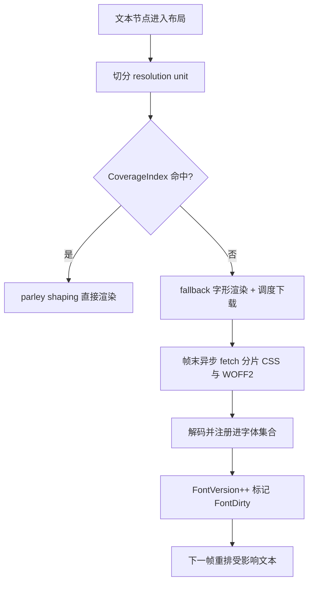
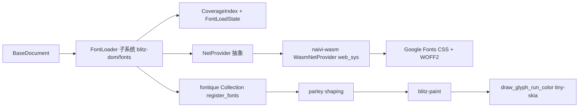
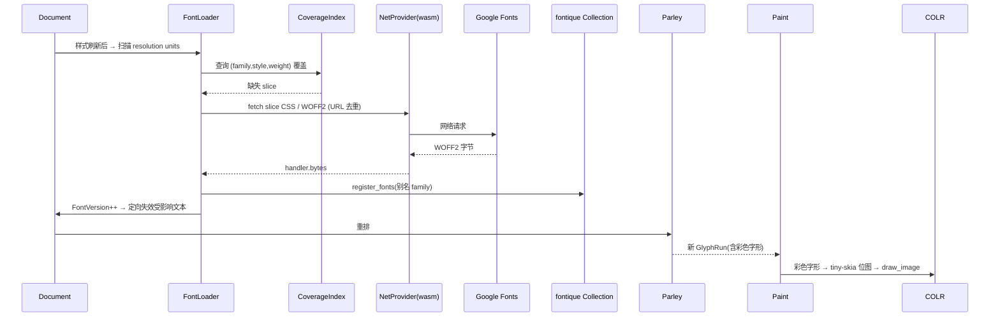

# Wasm On-Demand Font Slicing - Plan

## Goal Capsule

- **Objective:** 在 blitz 的 wasm 端实现 Google-Fonts 风格的按需字体分片获取:运行时拉取 Google Fonts CSS 定义分片,文本缺字时按 CoverageIndex 查找、异步下载 WOFF2 分片、注册进 parley/fontique 并触发 FontVersion 门控的重排;覆盖 Noto Sans / Noto Sans SC / Noto Color Emoji 与 RTL 的 Noto Sans Hebrew/Arabic;wasm 光栅化路径补齐 COLR 彩色 emoji 渲染。
- **Product authority:** 本计划移植 naive 项目 `docs/font.md` 与 `docs/font-resolution.md` 设计的六层字体架构(以 `crates/naive-text` 实现为蓝本),只拥有 wasm 端按需分片获取这一块工作;桌面/原生字体栈、作者 `@font-face` 整文件路径、parley/fontique shaper 本身均不是活动范围。
- **Open blockers:** 无阻塞项。

---

## Product Contract

### Summary

wasm 端从"一个内置 DejaVu 字体、无网络"升级为按需拉取 Google Fonts 分片的字体栈:文本需要什么就下载什么,缺字期间以 fallback 渲染、分片就绪后只重排受影响文本,并让 Noto Color Emoji 以彩色渲染。实现以 naive 的 FontResolver / FontLoader / FontSubsetManager 分层为蓝本,接入 blitz 现有的 parley/fontique shaping 管线。

### Problem Frame

wasm 端目前只有一个内置的 DejaVu Sans,网络层是 DummyNetProvider 无操作回退,系统字体在 wasm 上不可用——CJK、Emoji、RTL 文本都无法正确渲染。现有 `@font-face` 只支持整文件下载,没有 `unicode-range` / 子集概念;而 Google Fonts 把大字体(尤其 Noto Sans SC)拆成几十到上百个分片,整文件方案既不现实也浪费带宽。naive 项目已完整设计并实现六层字体架构(SceneGraph → Text Layout → FontResolver → FontLoader → GlyphRun cache → render),其核心主张是"布局永远同步、下载永远异步",与浏览器的 `@font-face` 下载-重排流程一致。本次把该架构中 Resolver / Loader / SubsetManager 相关的机制移植到 blitz wasm,其余五层 blitz 已有对应物(Document / parley / 布局缓存 / blitz-paint),不重写。

### Key Decisions

- K1. 移植 naive 六层架构 (session-settled: user-directed — chosen over 在现有 parley/fontique 之上只加按需分片层、或先做加载层但按 naive 接口形态:用户要求完整移植 naive 架构)。Governs R1–R9, R12。
- K2. 完整 naive 字体集、含 RTL (session-settled: user-directed — chosen over 最小可用集(Latin+CJK+Emoji)与可配置 family 列表:对齐 naive 的默认 CSS URL)。Governs R2。
- K3. CoverageIndex 而非线段树 (session-settled: user-directed — chosen over 用户最初提示的线段树与 font.md 提议的 IntervalTree:naive 实际实现的点查询已是 O(log n) 且增量插入友好,当前查询模式不需要线段树的区间重叠能力)。Governs R3。
- K4. 运行时拉取 Google Fonts CSS (session-settled: user-directed — chosen over 内置 unicode-range 表:复用浏览器缓存、始终与 Google 同步,与 naive 一致)。Governs R2。
- K5. 彩色 emoji 全量彩色渲染 (session-settled: user-directed — chosen over 纳入拉取但用现有单色能力、或本次排除 emoji:用户要求完整 COLR 彩色渲染,即使它需要新增光栅化能力)。Governs R10–R11。
- K6. 预扫描触发 (session-settled: user-directed — chosen over shaper 内懒加载哨兵与最小缺口补丁:保持"布局同步 / 下载异步"原则,触发点在文本布局前、清晰可测)。Governs R1, R5。

### Actors

- A1. 文档渲染管线:产生需要 shaping 的文本,消费字体集合中已注册的分片。
- A2. 字体加载子系统(移植自 naive):解析 CSS、维护 CoverageIndex 与下载状态、把分片注册进字体集合并推进 FontVersion。
- A3. Google Fonts 服务:提供分片定义 CSS 与 WOFF2 分片字节。
- A4. 网络通道:wasm 端发起请求并取回字节(具体实现由 planning 决定)。

### Key Flows

- F1. 按需下载生命周期

- F2. 已有覆盖(无缺字):查找命中直接 shaping,全程无网络。
- F3. 多文本去重:CSS 一次拉取;分片按 URL 去重,一个分片只下载一次,多文本共享。

### Requirements

**按需分片获取**

- R1. wasm 端按需从 Google Fonts 获取字体分片:查找缺失后异步下载对应 WOFF2 分片、解码并注册进字体集合,使后续 shaping 能命中该分片。
- R2. 分片定义运行时取自 Google Fonts CSS:解析 `@font-face` 得到 family / style / weight / unicode-range / url,覆盖 Noto Sans、Noto Sans SC、Noto Color Emoji 与 RTL 的 Noto Sans Hebrew/Arabic。
- R3. 分片查找使用 CoverageIndex 机制:按 (family, style, weight) 分组、按区间起点排序、以 prefix-max-end 二分定位候选,miss O(log n)、hit O(log n+m),插入增量且幂等。
- R4. 下载按分片 URL 去重:同一分片并发只发一次;已加载跳过、加载中等待、失败不重试。
- R5. 分片未就绪期间,该 resolution unit 以 fallback 字形渲染;分片到达后触发重排。

**解析集成**

- R6. CSS font-family 未覆盖某 codepoint 时,按 script 回退到对应 Noto family(Latin / CJK / Emoji / RTL)。
- R7. Google 分片与作者 `@font-face` 共存:作者字体优先,分片作为回退与补充,互不干扰。

**失效与重排**

- R8. FontVersion 门控失效:每安装一个新分片递增版本,仅使受影响文本重排,不做无条件全量布局失效。
- R9. 重排复用现有 dirty 管线,不引入第二条布局失效通道。

**彩色 emoji**

- R10. wasm 光栅化路径支持彩色字形:按 COLR 图层分解并合成,使 Noto Color Emoji 以彩色渲染。
- R11. 彩色字形与单色文本共存:常规字形仍按 CSS 文本色填充,彩色字形走图层合成。

**wasm 网络**

- R12. wasm 端具备真实网络能力以获取分片 CSS 与 WOFF2 字节,取代当前无操作网络回退。

### Acceptance Examples

- AE1. 页面含中文文本:首帧 CJK 以 fallback 渲染;Noto Sans SC 分片到达后重排为正确字形;后续帧不重复请求。Covers R1, R2, R5。
- AE2. 同一页面多处相同 CJK 文本:仅一次分片请求。Covers R4。
- AE3. 含 emoji 文本:以彩色渲染,而非文本色填充的单色轮廓。Covers R10, R11。
- AE4. 含希伯来 / 阿拉伯文本:RTL 分片按需拉取,shaping 方向正确。Covers R2, R6。
- AE5. 断网或分片 404:保持 fallback 渲染,不崩溃、不无限重试。Covers R4, R5。
- AE6. 分片到达触发重排:只影响相关文本,不做全量布局。Covers R8。

### Scope Boundaries

- 桌面 / 原生端不引入 Google Fonts 分片:wasm target 专属,桌面保留系统字体与 CoreText 路径。
- 不替换 parley/fontique 作为 shaper;分片只注册进现有字体集合。
- 作者 `@font-face` 整文件下载路径保持不变。
- 不用线段树或 IntervalTree:已定 CoverageIndex。
- 不内置 unicode-range 表:分片定义运行时拉取。
- 不做字体子集化生成或裁剪:只消费 Google 现成分片。
- 不做分片离线缓存持久化:每次会话重新拉取,以浏览器 / HTTP 缓存为准。

---

## Planning Contract

Product Contract unchanged — no R/A/F/AE/K IDs modified; implementation sections added below.

### Key Technical Decisions

- KTD1. 分片子系统放在 blitz-dom 内新增的 fonts 模块,不新建 crate;wasm 专属网络提供者放在 naivi-wasm。加载器依赖 font_ctx / net_provider / document,三者都在 blitz-dom;web_sys 依赖不能进共享 crate。Governs R1–R9, R12。(inherits K1; session-settled: user-directed — chosen over 在 parley/fontique 之上只加按需层:用户要求完整移植 naive 架构)
- KTD2. 加载器通过现有 NetProvider 回调接口发起请求,不复刻 naive 的 Future 版 FontBytesFetcher;NetHandler 增加默认 no-op 的 error() 回调(向后兼容),provider 失败时调用,加载器由此驱动 state.fail(url)。naive 代码按模块移植并适配回调式 fetch。Governs R1, R4, R12。(inherits K1)
- KTD3. 预扫描触发点:在样式刷新完成、布局前对脏子树做覆盖扫描(用已解析的计算样式,含 ::before/::after、counter() 与 text-transform 生成内容),不在样式未解析的变更时刻触发。失效机制是新增的:document FontVersion 计数器 + 预扫描记录的缺失覆盖节点映射 + 定向 invalidate_text_nodes(ids),帧内合并多次分片到达为一次失效。Governs R5, R8, R9。(inherits K6; session-settled: user-directed — chosen over shaper 内懒加载哨兵与最小缺口补丁:保持"布局同步/下载异步"原则)
- KTD4. COLR 光栅化:实现 skrifa ColorPainter 到 tiny-skia Pixmap(移植 vello DrawColorGlyphs 模式),产出预乘 RGBA 位图走 draw_image,镜像 draw_glyph_run_native;处理 COLRv0 与 COLRv1 含渐变。Governs R10, R11。(inherits K5; session-settled: user-directed — chosen over 本次排除 emoji 或仅单色:用户要求完整彩色渲染)
- KTD5. 分片查找结构 = naive 的 CoverageIndex(分组 + 起点排序 + prefix-max-end + 二分),不用线段树或 IntervalTree。Governs R3。(inherits K3; session-settled: user-directed — chosen over 线段树与 IntervalTree:点查询已 O(log n) 且增量插入友好)
- KTD6. Google Fonts 源:运行时拉取 DEFAULT CSS(Noto Sans / Noto Sans SC / Noto Color Emoji)与 RTL CSS(Noto Sans Hebrew / Noto Sans Arabic),按 naive 默认 URL。Governs R2。(inherits K2, K4)

### High-Level Technical Design

组件拓扑:文档持有 FontLoader;加载器用 CoverageIndex 决定缺失分片、用 NetProvider 拉取、注册进 fontique;绘制层对彩色字形走独立光栅化分支。

按需下载生命周期:布局前预扫描,缺字时异步拉取,分片就绪后定向重排。

### Assumptions

- As1. wasm 网络通道用 web_sys fetch 自建 NetProvider:blitz-net 的 reqwest Provider 依赖 tokio 运行时,无法在 wasm32 运行(已核实 dioxus-native/Cargo.toml:50-51)。
- As2. COLR 光栅化用 tiny-skia:纯 Rust、wasm 兼容、带线性/径向/扫描渐变 shader;skrifa 0.42 提供 ColorGlyphCollection / ColorPainter 抽象(外部资料核实)。
- As3. Noto Color Emoji 需要 COLRv1 渐变(线性/径向/扫描)才能正确渲染,纯色层不够(外部资料核实)。
- As4. 分片以 family 别名(FontInfoOverride.family_name)注册进 fontique,使 CSS font-family 名匹配 Noto 族。
- As5. 下载期间缺失字符走现有 notdef/tofu 渲染路径。

### Sources & Research

- naive 设计文档:`naive/docs/font.md`(六层架构、FontSubsetManager 提议)、`naive/docs/font-resolution.md`(分辨率管线、PendingFont)。
- naive 代码(移植蓝本):`naive/crates/naive-text/src/font_slice.rs`、`font_coverage.rs`、`font_selection.rs`、`resolution.rs`、`font_loader.rs`、`wasm_fetch.rs`。
- blitz 现状事实:grounding dossier `/tmp/ce-brainstorm-font/dossier.md`(已逐条核实)。
- skrifa 0.42 彩色字形 API:`docs.rs/skrifa/0.42.0/skrifa/color/`(ColorGlyphCollection / ColorPainter)。
- COLR 合成参考实现:`linebender/vello` `vello/src/scene.rs`(DrawColorGlyphs)、`glifo/src/colr.rs`。
- tiny-skia wasm 兼容性:linebender/tiny-skia Cargo.toml(simd 覆盖 wasm SIMD128)。

### System-Wide Impact

改动跨三个 crate:blitz-dom(字体加载与失效)、blitz-paint(彩色字形光栅化)、naivi-wasm(网络与引导)。共享字体注册路径(Resource::Font)必须保持作者 @font-face 行为不变;wasm 首次获得真实网络能力,涉及 CORS 与外部依赖。

失败传播:分片 fetch 失败(断网 / 404 / CORS 拒绝)→ NetHandler.error → FontLoadState 标记 failed → 不再重试 → 该 unit 持续 fallback 渲染,不崩溃。彩色字形光栅化失败(paint 错误)→ 回退单色路径。

并发与线程:字体注册走 font_ctx 的 Mutex;parallel-construct 特性下必须镜像进 thread_font_contexts(现有 Resource::Font 臂的 rayon 广播模式),否则多线程构造下分片不可见。分片到达回调不在请求线程改文档:经 DocumentEvent 回主线程做注册、FontVersion++ 与定向失效(镜像 ResourceHandler::respond 通道)。

### Risks & Dependencies

- Google Fonts CSS/URL 结构是外部契约,解析必须容忍未知描述符并跳过。
- COLRv1 渐变合成的性能:以有界字节预算 + LRU 驱逐缓解(镜像 macOS GLYPH_CACHE),并设 wasm 性能验收场景,避免每帧重光栅化与缓存抖动。
- 分片到达时序可能触发多次重排:以 FontVersion 门控的定向失效限制范围。
- skrifa 0.42 与 tiny-skia 版本与 parley fork pin 兼容性:新增依赖需与 workspace 现有版本对齐。
- wasm 网络依赖浏览器 CORS 与外网可达:演示页需本地服务器或允许跨域。

### Sequencing

U1 → U2 → U3 → U4 → U5 → U6 → U7 → U8。U1–U5 是加载子系统核心,可在 native 测试;U6 提供 wasm 网络;U7 是 COLR 光栅化;U8 集成到 naivi-wasm 并提供演示验证。

---

## Implementation Units

### U1. FontSlice 定义与 Google Fonts CSS 解析

- **Goal:** 定义 FontSlice(family / style / weight / unicode_range / url)并实现 @font-face CSS 扫描解析,移植自 naive crates/naive-text/src/font_slice.rs。
- **Requirements:** R2
- **Dependencies:** 无
- **Files:** packages/blitz-dom/src/fonts/slice.rs(新)、packages/blitz-dom/src/fonts/mod.rs(新)
- **Approach:** 移植 naive 的 parse_font_css(手写 @font-face 块扫描)、parse_unicode_ranges("U+4E00-9FFF, U+3400-4DBF" → 闭区间对)、is_subset_url;naive 代码位置见 grounding dossier(/tmp/ce-brainstorm-font/dossier.md Part 3)。
- **Patterns to follow:** naive crates/naive-text/src/font_slice.rs
- **Test scenarios:**
  - 解析一段真实 Google Fonts CSS(含多个 @font-face、unicode-range、woff2 url),断言 FontSlice 字段正确。
  - unicode-range 边界:单个 U+XXXX、区间 U+XXXX-YYYY、逗号列表、空白/大小写、通配 U+4E00-?。
  - 无 unicode-range 的 @font-face(整字体)解析。
  - is_subset_url 对 `...N.woff2` 与整字体 URL 的区分。
- **Verification:** `cargo test -p blitz-dom fonts::slice` 全绿。

### U2. CoverageIndex 区间查找

- **Goal:** 实现按 (family,style,weight) 分组、起点排序 + prefix-max-end + 二分查找的 CoverageIndex,移植自 naive font_coverage.rs。
- **Requirements:** R3
- **Dependencies:** U1
- **Files:** packages/blitz-dom/src/fonts/coverage.rs(新)
- **Approach:** 移植 Group / IntervalEntry / CoverageIndex、insert_slice(增量幂等)、lookup(两次有界二分 + 候选窗口扫描)、partition_point。
- **Patterns to follow:** naive crates/naive-text/src/font_coverage.rs
- **Test scenarios:**
  - 命中:单区间命中、跨多区间命中、重复区间去重。
  - 未命中:点落在区间外、被前缀覆盖但自身无交集。
  - prefix-max-end 正确性:候选窗口边界。
  - 幂等:同一 (range,slice) 重复插入不产生重复。
- **Verification:** `cargo test -p blitz-dom fonts::coverage` 全绿。

### U3. Resolution units 与 script 回退策略

- **Goal:** 实现 grapheme 边界的 resolution unit 切分与 script 检测,以及按 script 的 Noto family 回退策略,移植自 naive resolution.rs / font_selection.rs。
- **Requirements:** R6
- **Dependencies:** U1
- **Files:** packages/blitz-dom/src/fonts/resolution.rs(新)、packages/blitz-dom/src/fonts/selection.rs(新)
- **Approach:** TextScript{Latin, Cjk, Emoji, Common, Unknown};FontResolutionPolicy{primary, by_script, fallback}(消费者为 U4/U5:CSS family 未覆盖时据此选 per-script 候选 family 列表喂给 ensure_fonts_for_text);find_matching_slice_indexed(首字符索引 + 全 unit 覆盖复检);slice_covers_unit 要求覆盖整个 unit 的全部可见字符,默认可忽略码点(ZWJ U+200D、ZWNJ U+200C、VS1-16 U+FE00-FE0F、格式/组合字符)视为已覆盖。
- **Patterns to follow:** naive crates/naive-text/src/resolution.rs、font_selection.rs
- **Test scenarios:**
  - script 检测:拉丁 / CJK / emoji / 希伯来 / 阿拉伯 文本分别落到正确 script。
  - 策略候选:by_script 映射到 Noto Sans SC / Noto Color Emoji / Noto Sans Hebrew / Noto Sans Arabic。
  - find_matching_slice 与 indexed 版本结果一致。
  - 部分覆盖:unit 内某字符不被候选 slice 覆盖 → 不选该 slice。
  - ZWJ 序列(👨‍👩‍👧‍👦)与 VS16 emoji(❤️):默认可忽略码点被豁免后,单元按可见码点判定覆盖。Covers AE3。
- **Verification:** `cargo test -p blitz-dom fonts::resolution`、`fonts::selection` 全绿。

### U4. FontLoader:下载状态与分片调度

- **Goal:** 实现 URL 级去重的加载状态机(loaded / loading / failed)与 ensure_fonts_for_text 调度,通过 blitz 的 NetProvider 回调发起请求,移植自 naive font_loader.rs / font_slice.rs。
- **Requirements:** R1, R4
- **Dependencies:** U2, U3
- **Files:** packages/blitz-dom/src/fonts/loader.rs(新)
- **Approach:** FontLoadState(URL 键控去重);ensure_fonts_for_text 遍历 resolution units(用 FontResolutionPolicy 选 per-script 候选 family)→ find_matching_slice_indexed → state.begin(url) → NetProvider::fetch → handler.bytes 完成时 state.complete(url, bytes) 并产出待注册分片;handler.error 时 state.fail(url) 不再重试(见 KTD2)。完成回调不直接改文档:经 DocumentEvent 回主线程做注册与失效(镜像 ResourceHandler::respond 的通道)。
- **Test scenarios:**
  - 去重:同一 URL 并发只发一次;loaded 后跳过。
  - 加载中:同一 URL 再次出现等待,不重复请求。
  - 失败:handler.error 触发后不再请求,产出 failed 状态。
  - 多文本共享:一个 loader 服务多个 (text,family) 任务,已加载 slice 被后续任务跳过。
  - woff2 字节解码路径(复用现有 wuff 解码)。
- **Verification:** `cargo test -p blitz-dom fonts::loader` 全绿。

### U5. Document 集成:预扫描与 FontVersion 门控失效

- **Goal:** 把 FontLoader 挂到 BaseDocument,在样式刷新后、布局前预扫描缺失覆盖并调度下载;分片注册后 FontVersion++ 并只失效受影响文本。
- **Requirements:** R5, R7, R8, R9
- **Dependencies:** U4
- **Files:** packages/blitz-dom/src/document.rs(改)、packages/blitz-dom/src/layout/damage.rs(改,如需定向失效)
- **Approach:** 预扫描在样式刷新完成、布局前对脏子树触发(用已解析的计算样式,含 ::before/::after、counter()、text-transform 生成内容;不在样式未解析的变更时刻触发,见 KTD3);先查已装字体是否覆盖整个 unit 的可见字符(复用 font_metrics.rs find_font_for 的 cmap 检查,默认可忽略码点豁免),未覆盖才解析 Google 分片并调度下载;预扫描记录缺失覆盖的节点映射(缺失分片 → 节点);分片注册走 Resource::Font 同款 register_fonts(family 别名)+ FontVersion 递增,并在 parallel-construct 下镜像进 thread_font_contexts;分片到达经 DocumentEvent 回主线程,帧内合并多次到达为一次 FontVersion++ 与一次定向失效(新增 invalidate_text_nodes(ids),只损伤记录的节点,非全文档 walk);作者 @font-face 整文件路径保持不变。
- **Execution note:** 先加一个集成测试证明"缺字 → 调度下载 → 注册 → 仅受影响节点重排"。
- **Test scenarios:**
  - 缺字触发:含 CJK 的文本节点在样式刷新后、布局前触发对应 Noto Sans SC slice 下载。Covers AE1。
  - 定向失效:两个文本节点只有其一缺字,分片到达仅重排缺字节点(用损伤标记断言)。Covers AE6。
  - 与作者 @font-face 共存:作者字体已覆盖时不触发 Google 分片。Covers R7。
  - 断网:handler.error 后保持 fallback 渲染,不崩溃、不无限重试。Covers AE5。
  - FontVersion:每次成功注册递增,重排只发生在新分片影响范围内。
  - 生成内容:伪元素 / counter() 产出的缺字字符也能触发下载(预扫描覆盖生成内容)。Covers AE1。
  - 帧内合并:同一帧多个分片到达只触发一次重排(单 FontVersion++ 与单次定向失效)。
- **Verification:** `cargo test -p blitz-dom` 相关集成测试全绿。

### U6. Wasm NetProvider(web_sys fetch)

- **Goal:** 在 naivi-wasm 提供基于 web_sys fetch 的 NetProvider,使 wasm 端具备真实网络能力。
- **Requirements:** R12
- **Dependencies:** 无(独立)
- **Files:** packages/naivi-wasm/src/net.rs(新)、packages/naivi-wasm/Cargo.toml(改)
- **Approach:** 实现 NetProvider::fetch:web_sys::Request(window.fetch) → arrayBuffer → handler.bytes;fetch 拒绝/错误时调用 handler.error(见 KTD2);CORS mode;镜像 blitz-net 的 spawn_local 模式(blitz-net/src/lib.rs:50-53);通过 DocumentConfig.net_provider 安装。
- **Test scenarios:**
  - 用本地 HTTP 服务器 + wasm 测试页:发起 fetch 并断言 handler 收到字节(浏览器人工验证)。
  - is_noop 返回 false,使 pending-critical 资源逻辑生效。
  - fetch 失败(404 / 网络错误):handler 收到错误路径,不 panic,状态落入 failed。
  - 集成:NetProvider 装进 DocumentConfig 后,文档网络请求(含字体)都走该 provider。
- **Verification:** wasm 构建通过;naivi-wasm 演示页网络请求可见。

### U7. COLR 彩色字形光栅化(wasm)

- **Goal:** 在 blitz-paint 非 macOS 路径支持彩色字形:检测 COLR 字形、经 skrifa ColorPainter + tiny-skia 合成 RGBA 位图、draw_image 绘制;无 COLR 时回退单色。
- **Requirements:** R10, R11
- **Dependencies:** 无(独立于加载器)
- **Files:** packages/blitz-paint/src/text.rs(改)、packages/blitz-paint/Cargo.toml(改,加 tiny-skia、skrifa)
- **Approach:** 镜像 draw_glyph_run_native 位图接缝(text.rs:205-255):每字形 font.color_glyphs().get(gid);Some 时经 FontRef::from_index 桥接 skrifa(font_metrics.rs 已有此模式)→ 实现 ColorPainter 到 tiny-skia Pixmap(移植 vello DrawColorGlyphs:变换栈、clip、Solid / LinearGradient / RadialGradient / SweepGradient 填充、层混合)→ 预乘 RGBA RasterImageData → scene.draw_image;None 走现有单色路径;按 (font, glyph, size, coords) 有界 LRU 缓存,字节预算镜像 macOS GLYPH_CACHE(MAX_GLYPH_PIXELS),并设 wasm 性能验收场景(见 Risks)。
- **Patterns to follow:** packages/blitz-paint/src/text.rs draw_glyph_run_native;vello DrawColorGlyphs(vello/src/scene.rs)
- **Test scenarios:**
  - 用打包的 Noto Color Emoji woff2:渲染一个已知 emoji,断言位图含非文本色像素(彩色而非单色)。Covers AE3。
  - COLRv1 渐变字形(肤色 / 旗帜)能合成,不 panic。
  - 无 COLR 的普通字形回退单色路径,输出与之前一致。
  - paint 错误:单字形合成失败时回退单色,不中断整段文本。
  - 有界缓存:重复渲染不无限增长内存,超出字节预算按 LRU 驱逐。
  - 集成:同一 GlyphRun 中彩色与单色字形混排,彩色走位图、单色走 draw_glyphs。
  - 性能验收:emoji 密集文本在多字号下渲染,帧预算内完成(阈值由实现测量后确定)。
- **Verification:** `cargo test -p blitz-paint` 新增测试全绿;wasm 演示中 emoji 彩色显示。

### U8. naivi-wasm 引导与演示

- **Goal:** naivi-wasm 启动时装 WasmNetProvider + FontLoader + Google Fonts CSS 源,并提供演示页验证按需分片与彩色 emoji。
- **Requirements:** R1, R2, R6, R10
- **Dependencies:** U5, U6, U7
- **Files:** packages/naivi-wasm/src/lib.rs(改)、examples/naivi 下演示页(改/新)
- **Approach:** start() 安装 net_provider 与 loader;预加载 Latin 分片(继承 naive spawn_font_loader 的 LATIN 预取,属引导优化而非需求覆盖,不构成 AE2 证明);CJK / emoji / RTL 分片与 RTL CSS 均按需拉取;演示页含混合文本。
- **Test scenarios:**
  - 浏览器演示:含中文 / emoji / 希伯来文本的页面,devtools 网络面板显示分片按需加载,重排后正确渲染(人工验证)。Covers AE4。
  - 首次 Latin 预取:启动即有 Latin 覆盖,后续无重复请求(引导优化验证,不挂 AE)。
- **Verification:** `npx nv wasm` 演示运行(需 http(s) 源,file:// 下 fetch 对 fonts.gstatic.com 不可用),肉眼 + 网络面板确认。

---

## Verification Contract

- 单元测试:`cargo test -p blitz-dom fonts::` 与 `cargo test -p blitz-paint`。
- wasm 构建:按 HOWTO_WASM.md 现有流程构建 naivi-wasm 到 wasm32-unknown-unknown。
- 浏览器演示:examples/naivi 下 `npx nv wasm`,用 devtools 网络面板确认分片按需加载、重排与彩色 emoji。
- 行为验证:AE1–AE6 逐一核对(中文缺字 → 下载 → 重排;URL 去重;彩色 emoji;RTL;断网 fallback;定向失效)。

---

## Definition of Done

- 全局:U1–U8 全部完成;R1–R12 全部达成;AE1–AE6 通过;wasm 演示页确认按需分片与彩色 emoji;清理未用 / 死代码(草稿路径、实验代码)。
- 每单元:见各单元 Verification 与 Test scenarios。
