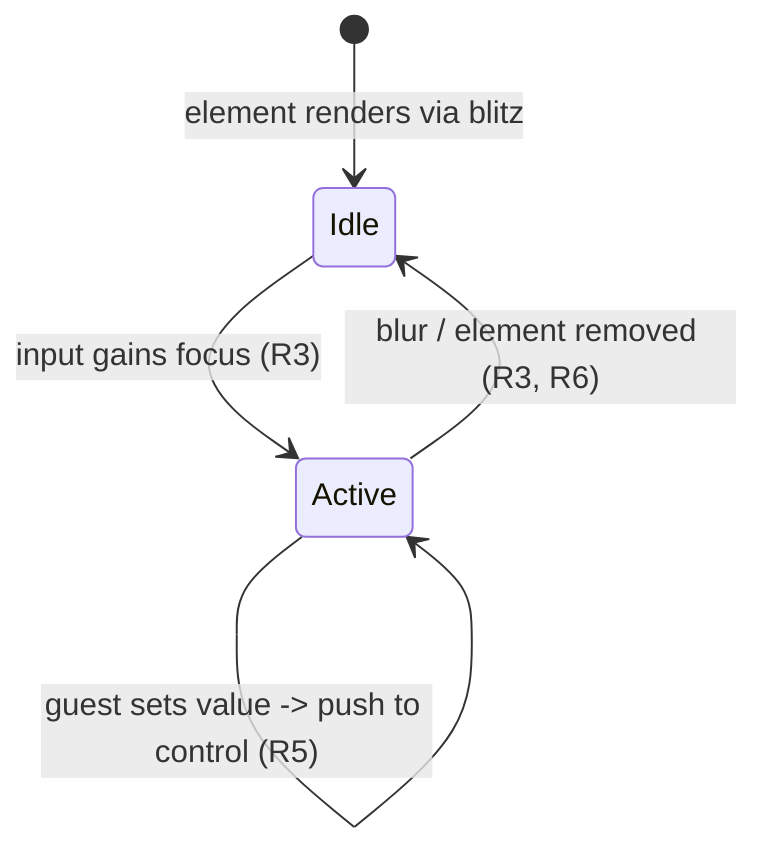
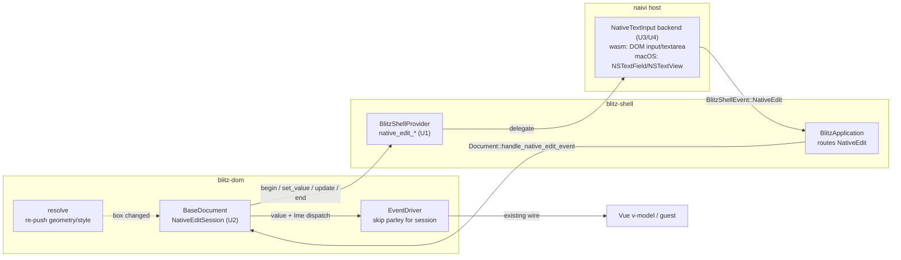

# Native Input Editing - Plan

## Goal Capsule

- **Objective:** Replace canvas-based (parley) text editing for inputs/textareas in naivi's two hosts with system-native controls — DOM `<input>`/`<textarea>` on wasm, NSTextField/NSTextView on macOS — driven by an engine-owned native-edit session that mirrors values back into the DOM so Vue `v-model` keeps working.
- **Product authority:** naivi's two hosts only (`naivi-wasm`, `naivi-native`). Other blitz hosts are not active scope.
- **Execution:** code.
- **Stop conditions:** stop if the engine session cannot suppress double input for the session element (R2), if the value round-trip breaks guest `v-model` (R4–R6), or if guest key handlers (`@keyup.*`) stop firing during a session (KTD8) — all three are the feature's reason to exist.
- **Tail ownership:** the two host backends (U3 wasm, U4 macOS) are the shipping tail; engine correctness (U2) is verified first so host verification is a smoke pass over the same AE set.
- **Open blockers:** none.

---

## Product Contract

*Product Contract unchanged (enriched from requirements-only to implementation-ready; no scope or R/AF/AE changes).*

### Summary

naivi's wasm and macOS-native hosts will edit focused inputs/textareas with system-native controls placed over the styled box instead of blitz's canvas editor. An engine-owned native-edit session owns lifecycle and value sync, so the guest (`v-model`, IME events) keeps working while the control is styled to match blitz's computed styles.

### Problem Frame

blitz renders and edits all text inside the canvas. Its parley `PlainEditor` path works but is thin where native controls are strong: on wasm the winit IME path is fragile, and there is no spellcheck, autocomplete, or mobile keyboard; password inputs cannot mask; the caret does not blink; clipboard and undo/redo are hand-rolled. Every keystroke is shaped and rasterized. Users expect an input to behave like the platform's input. The sibling `chartles-rs` project solved this with trait-based native input backends (DOM elements on web, NSTextField/NSTextView on macOS) that own editing while the app mirrors the value. naivi has the same host split (wasm + macOS winit) and the same wire — focus, blur, input, and composition events already reach the guest.

### Key Decisions

- KD1. **Opaque native rendering** (session-settled: user-directed — chosen over a transparent overlay on canvas-rendered text: native IME, clipboard, and password masking are the point of the feature). Governs R1, R2.
- KD2. **Engine-owned native-edit session** (session-settled: user-directed — chosen over per-host controllers: a single state machine prevents double input and keeps behavior consistent). Governs R1–R8.
- KD3. **All text-like inputs plus textarea** (session-settled: user-directed — chosen over text-only: password masking and native key handling are strengths worth covering). Governs R1.
- KD4. **Deep style match** (session-settled: user-directed — chosen over native default appearance: the focus transition should be visually seamless). Governs R12.
- KD5. **Deployment limited to naivi's two hosts** (session-settled: user-directed — chosen over engine-wide enablement: dioxus-native stays on the canvas path this round).

### Requirements

**Native edit session**

- R1. The native-edit session applies to text inputs and textareas in naivi hosts — types `text`, `password`, `search`, `email`, `number`, `tel`, `url`, and untyped `input`, plus `textarea` (matching the engine's existing single-line text-editor set).
- R2. During a session, the engine bypasses parley editing and winit IME for the session element, so a keystroke is processed exactly once (by the native control) and the canvas caret/selection is not drawn for it.
- R3. The session owns its lifecycle: it starts when the element gains focus and ends on blur or element removal; ending hides or destroys the platform control and returns rendering to blitz.
- R4. Value sync is bidirectional. Every native control change dispatches a DOM `input` event carrying the full value, so guest `v-model` and listeners behave as today.
- R5. A programmatic value change (guest mutation or attribute set) while focused is pushed into the control without losing focus or caret position and without firing a spurious `input` event.
- R6. On blur, the control's current value is committed to the DOM (`input` event) before the session ends, so the idle blitz render always shows the latest value.
- R7. `Tab`/`Shift+Tab` pressed inside the control routes to blitz's existing focus traversal rather than moving browser DOM focus; `Enter` on a single-line input triggers the existing implicit form submission path.
- R8. Composition (IME) events emitted by the native control are forwarded to the guest over the existing Composition wire, so guest IME handling keeps working.

**Platform controls and styling**

- R9. Each host implements a platform backend with a chartles-shaped lifecycle (`create`, `set_value`, `get_value`, `update_bounds`, `set_styles`, `destroy`): wasm uses DOM `<input>`/`<textarea>`; macOS uses NSTextField (single-line) and NSTextView in a scroll view (multi-line).
- R10. The control is positioned over the element's box in viewport coordinates, tracks the box across scroll and resize, and is present only while the session is active.
- R11. The control reflects the element's editing attributes: placeholder, maxlength, readonly, disabled, and the input type — on wasm via the DOM `type` (password masking); on macOS `password` uses NSSecureTextField so masking holds on both hosts.
- R12. The control is styled from the element's computed styles (font family, size, weight, color, background, border, padding, border-radius, text-align) so the focused state matches the idle blitz render closely enough that the transition is not jarring. The control suppresses its platform focus ring (outline:none on wasm, borderless bezel on macOS); keyboard-focus visibility is preserved by the engine's existing focus indicator, or by a session focus-ring style carried in `NativeEditStyle` where the engine has none.

### Key Flows

- F1. **Session start**
  - **Trigger:** A covered input gains focus.
  - **Steps:** Engine opens a session (R3) → host creates the control over the box (R10) → control receives keyboard/IME focus → guest receives the existing `focus` event.
- F2. **Value round-trip while editing**
  - **Trigger:** The user types, or the guest sets the value.
  - **Steps:** Native control changes → host reads the value → engine dispatches DOM `input` with the full value (R4) → guest updates → blitz re-renders the value behind the control. Programmatic sets flow the other way (R5).
- F3. **Session end**
  - **Trigger:** Focus leaves the element (pointer, `Tab`, or removal).
  - **Steps:** Value committed (R6) → session ends (R3) → control hidden or destroyed → blitz renders the value and placeholder as today.

### Acceptance Examples

- AE1. **Double-input guard** — Covers R2. Given a focused input with an active session; when the user types `a`; then exactly one character appears in the DOM value and no parley edit occurred.
- AE2. **v-model round-trip** — Covers R4, R5. Given a focused input bound to `v-model`; when the guest programmatically sets the model (the value-attribute frame path); then the control shows the new text, caret and focus are preserved, and no extra `input` event fires.
- AE3. **Tab traversal** — Covers R7. Given two inputs in a form with an active session on the first; when the user presses `Tab`; then focus moves to the second via blitz traversal, the first control hides, and a session starts on the second.
- AE4. **Password masking** — Covers R1, R11. Given a focused `input[type=password]` on wasm; then the control shows masked bullets while the DOM value is plaintext.
- AE5. **Idle render unchanged** — Covers R3. Given a page with inputs but nothing focused; then no native control is visible (a hidden reused instance may exist) and blitz renders values and placeholders exactly as today.
- AE6. **Blur commit** — Covers R6. Given a focused input with typed text; when the user clicks outside; then the DOM value is committed (`input` event) and blitz renders the final text.

### Success Criteria

- The todomvc wasm demo: typing in the new-todo input and editing existing todos works with a native control in a real browser — no double characters, `v-model` updates, and Chinese IME composition works.
- The `naivi-native` macOS demo: focusing any text input shows the system control, and editing behaves like a native macOS field.
- The idle appearance of inputs (blitz-rendered) does not change for pages that never focus them.

### Scope Boundaries

Deferred for later:

- Native controls for select, checkbox, radio, and other form controls — they stay on the canvas path.
- Windows native controls — not part of this round.
- Enabling the session for dioxus-native or other blitz hosts — the engine abstraction leaves this possible with no engine change.

### Dependencies / Assumptions

- The shell provider already exposes the focused content box to hosts via `set_ime_cursor_area` (`packages/blitz-dom/src/node/node.rs`); the session extends this to also surface the border box and computed styles to hosts.
- On wasm (winit-web 0.31), keydown/keyup listeners attach to the canvas element and there are no composition listeners; a focused overlay input therefore never reaches winit, and `request_ime_update` is unsupported. Session-element keys are routed through the backend to the engine (KTD8), and the overlay is placed as a child of the canvas so its `stopPropagation` is meaningful for events that do bubble (R2).
- The existing naivi-dom wire (focus, blur, input, composition) is used for guest events; no new guest protocol is introduced.

### Outstanding Questions

None — the reuse question is resolved in Assumptions, and the scroll re-push mechanism is resolved in U2 step 8.

### Sources / Research

- Reference pattern: module `crates/trader-widgets/src/input/` in the sibling archive repo `chartles-rs` — trait-based `NativeInputBackend`/`MultiLineInputBackend`, DOM `<input>`/`<textarea>` overlays on web, NSTextField/NSTextView via an ObjC helper on macOS, `oninput` → repaint mirror.
- Current editing path: `packages/blitz-dom/src/node/text.rs` (parley `PlainEditor`), `packages/blitz-dom/src/events/keyboard.rs` (input dispatch, implicit form submission), `packages/blitz-dom/src/events/ime.rs`, `packages/blitz-paint/src/render.rs` (caret/selection fills).
- Focus and geometry: `packages/blitz-dom/src/node/node.rs` (`focus`/`blur`, `set_ime_cursor_area`), `packages/blitz-shell/src/lib.rs`.
- Event routing: `packages/blitz-dom/src/events/driver.rs` (key/ime → `focus_node_id`).
- Guest wire: `packages/naivi-dom/src/events.rs`, `packages/naivi-dom/src/ffi.rs` (focus/blur/input/composition already exposed).
- Hosts: `packages/naivi-wasm/src/lib.rs` (canvas only, no overlay mechanism), `packages/naivi-native/src/main.rs` (winit + VelloHybrid, no AppKit controls).

<!-- ce-section: work-relationships -->
### How This Work Fits Together

This plan owns native text editing for naivi's two hosts. It is independent of the macOS CoreText text backend plan (`docs/plans/2026-08-14-1015-feat-macos-coretext-text-backend-plan.md`) and the wasm font-slicing plan (`docs/plans/2026-08-14-1512-feat-wasm-font-slicing-plan.md`): those change shaping and rasterization, while a session bypasses editing — not shaping — for focused elements. The three can proceed independently.

---

## Planning Contract

### Key Technical Decisions

- KTD1. **Session lives in `BaseDocument`; hosts only provide the platform control** (session-settled: user-directed — chosen over per-host controllers: a single state machine prevents double input and keeps behavior consistent). Governs R1–R8. The document owns session state (node id, geometry, style, attrs, last value); a host registers one platform backend per window.
- KTD2. **Backend events reach the document via `BlitzShellEvent::NativeEdit { doc_id, event }` → `Document::handle_native_edit_event`** — mirrors the existing `RequestRedraw { doc_id }` routing (proxy → application → view → document) instead of a direct shell→document callback, so no `RefCell` re-entrancy, one delivery path, and multi-window-safe routing. Governs R4, R6, R7, R8.
- KTD3. **The DOM value stays canonical; the native control is a transient editor on top**. Value changes are mirrored into the element's value attribute (and the parley editor text) so guest `v-model` and the idle blitz render read the same state. Governs R4–R6.
- KTD4. **Deep style match via a computed-style extraction** (`NativeEditStyle`: font family/size/weight, color, background, border, padding, border-radius, text-align) computed at session start and re-pushed when the box changes. Governs R12.
- KTD5. **Suppression is layered**: the `EventDriver` skips parley editing for the session element (authoritative engine guard), the engine skips `set_ime_enabled`/`set_ime_cursor_area` for the session element (the native control owns IME), and the wasm backend calls `stopPropagation` on key/composition events. winit-web attaches key listeners to the canvas, so the double-input hazard is moot on wasm; the suppression still guards macOS where winit could otherwise see keys (per the Dependencies assumption). Governs R2.
- KTD6. **Programmatic value push uses the native control's programmatic setter and preserves the caret**: on wasm `.value` assignment fires no `input`; on macOS the ObjC helper sets an `isProgrammatic` flag around `setString`/`setStringValue:` so text-change callbacks are suppressed, and single-line pushes go through the active field editor to update the live edit. Both platforms restore the previous caret/selection range around the push. Governs R5.
- KTD7. **macOS backend = NSTextField / NSTextView-in-NSScrollView as subviews of the winit window's NSView, with frame y-flip conversion; the ObjC helper is compiled via `cc`** (chartles pattern: `@try/@catch` + main-queue dispatch). The backend is built by a factory invoked from the shell's window construction — where the winit window exists — because the host never holds the window. Governs R9.
- KTD8. **All session-element keyboard events route through the backend** — the overlay holds DOM/keyboard focus during a session (and winit-web attaches key listeners to the canvas), so generic keydown/keyup never reach winit. `NativeEditEvent` carries `KeyDown`/`KeyUp`; the engine forwards them to the guest over the existing key path while the `EventDriver` keeps them out of the parley editor, so Vue `@keyup.*` handlers keep working. Governs R2, R4, R7.
- KTD9. **Composition forwarding is guest-only** — `CompositionCommit`/`CompositionPreedit` build the existing Ime event for the guest but skip the parley `apply_ime_event` step, so parley is untouched (R2) and only commit text reaches the guest (matching today's commit-only wire). Governs R8.

### High-Level Technical Design

The round trip: focus on a covered input starts a session (U2) which calls the shell provider (U1); the provider delegates to the host backend (U3/U4); backend user edits arrive back as `BlitzShellEvent::NativeEdit`, are routed to the document, which mirrors the value into the DOM and dispatches the existing `input`/composition events to the guest.

### Assumptions

- The host page places the canvas at the viewport origin, or the wasm backend accounts for the canvas offset, so the viewport box from `absolute_position` maps directly to overlay coordinates (R10).
- Each host reuses a single hidden control instance per window (chartles pattern) rather than creating one per element — resolves the first Deferred-to-Planning question.
- The macOS backend obtains the winit window's NSView via `raw_window_handle` (AppKit), the same path `accesskit_xplat` already uses.

### Sequencing

U1 → U2 → U3 → U4. U2 depends on U1; U3 and U4 each depend on U1 and U2. U3 and U4 are independent of each other and can land in either order.

---

## Implementation Units

### U1. Native text-input backend trait and shell plumbing

- **Goal:** Define the platform-control contract (`NativeTextInput`), the session-drive methods on `ShellProvider`, and the shell routing for backend events, so hosts can register a backend and the engine can drive it — with existing hosts unaffected when none is registered.
- **Requirements:** R9 (backend lifecycle shape), R1 (session hook exists), R2 (capability gate).
- **Dependencies:** none.
- **Files:**
  - create `packages/blitz-traits/src/native_input.rs` — `NativeTextInput` trait, `NativeEditEvent` (incl. `KeyDown`/`KeyUp`), `NativeEditGeometry`, `NativeEditStyle`, `NativeEditAttrs`
  - modify `packages/blitz-traits/src/shell.rs` — `ShellProvider` gains `native_edit_capable`, `begin_native_edit_session` (geometry + style + attrs), `native_edit_set_value`, `update_native_edit_geometry`, `update_native_edit_style`, `end_native_edit_session` (default no-ops, `native_edit_capable` default false)
  - modify `packages/blitz-traits/src/lib.rs` — module wiring
  - modify `packages/blitz-shell/src/lib.rs` — re-export; `BlitzShellProvider` holds `Option<Arc<dyn NativeTextInput>>`
  - modify `packages/blitz-shell/src/window.rs` — `WindowConfig::with_native_text_input(factory)` where the factory is invoked from window construction with `(Arc<dyn Window>, BlitzShellProxy)` (the host never holds the winit window); attach the shell proxy to the backend
  - modify `packages/blitz-shell/src/event.rs` — `BlitzShellEvent::NativeEdit { doc_id, event }`
  - modify `packages/blitz-shell/src/application.rs` — route `NativeEdit` by `doc_id` to the matching window's `Document::handle_native_edit_event`
  - modify `packages/blitz-dom/src/document.rs` — `Document` trait gains a default `handle_native_edit_event` that forwards to the inner document (mirroring the `handle_ui_event` default), so host `DocHandle` wrappers reach the session logic without per-host overrides
- **Approach:**
  1. Define `NativeTextInput` with `attach(proxy)`, `create`, `destroy`, `set_value`, `get_value`, `update_bounds(geometry)`, `set_styles(style)`; define `NativeEditEvent` variants `ValueChanged(String)`, `Committed(String)`, `Submit`, `Tab { shift: bool }`, `KeyDown(BlitzKeyEvent)`, `KeyUp(BlitzKeyEvent)`, `CompositionPreedit(String)`, `CompositionCommit(String)`.
  2. `NativeEditGeometry` carries the content box and border box in viewport coordinates; `NativeEditStyle` carries the computed style fields R12 names (plus the focus-ring policy); `NativeEditAttrs` carries placeholder, maxlength, readonly, disabled, input type, and multiline flag (R11).
  3. `BlitzShellProvider` delegates `native_edit_*` to its optional backend; with no backend, `native_edit_capable()` is false and all methods are no-ops. `begin_native_edit_session` returns whether the control was actually created (default false), so the engine can fail-close to the parley path.
  4. application.rs matches `BlitzShellEvent::NativeEdit { doc_id, event }` and calls `handle_native_edit_event(event)` on the view whose doc id matches (KTD2); the backend populates `doc_id` from the session.
- **Patterns to follow:** `RequestRedraw`/`BlitzShellProxy` routing (`packages/blitz-shell/src/event.rs`, `application.rs`); default-impl `ShellProvider` methods (`packages/blitz-traits/src/shell.rs`).
- **Test scenarios:**
  - Default no-op: without a registered backend, `native_edit_capable()` is false and session methods are safe no-ops (existing hosts unchanged).
  - Delegation: with a recording backend, `begin_native_edit_session`, `native_edit_set_value`, `update_native_edit_geometry`, `end_native_edit_session` reach the backend with the right arguments.
  - Event routing: a `BlitzShellEvent::NativeEdit { doc_id, event: ValueChanged("hi") }` sent through the proxy is delivered to `Document::handle_native_edit_event` on the matching window's document; a non-matching `doc_id` is not delivered.
  - Default forwarding: a `Document` wrapper that overrides only `inner`/`inner_mut` (like the naivi hosts' `DocHandle`) delivers `handle_native_edit_event` to the inner document via the default forward.
- **Verification:** `cargo test -p blitz-traits -p blitz-shell -p blitz-dom` pass; existing hosts still build unchanged.

### U2. Engine session state machine (blitz-dom)

- **Goal:** Focus-driven native-edit session with bidirectional value sync, key/IME suppression, composition forwarding, and geometry/style re-push — the single state machine that makes "native owns editing" true.
- **Requirements:** R1 (coverage), R2 (suppression), R3 (lifecycle), R4–R6 (sync), R7 (Tab/Enter), R8 (composition), R10 (geometry), R12 (style).
- **Dependencies:** U1.
- **Files:**
  - modify `packages/blitz-dom/src/document.rs` — session state + start/end hooks; `handle_native_edit_event`; geometry/style extraction; re-push on resolve; seed value from the element's value attribute
  - modify `packages/blitz-dom/src/events/driver.rs` — skip parley editing for the session element; Tab/Enter still route
  - modify `packages/blitz-dom/src/events/keyboard.rs` — reuse the existing Input dispatch and `implicit_form_submission` paths
  - modify `packages/blitz-dom/src/node/node.rs` — `focus()`/`blur()` begin/end sessions for covered inputs
  - modify `packages/blitz-dom/src/mutator.rs` — value attribute set on the session node pushes to the control; removed-node teardown ends the session
  - modify `packages/blitz-paint/src/render.rs` — skip caret/selection fills for the session node
  - create `packages/blitz-dom/src/tests/native_edit.rs` — unit tests with a `MockShellProvider` recording `native_edit_*` calls and dispatched events
  - modify `packages/blitz-dom/src/lib.rs` — register the `tests` module
- **Approach:**
  1. Add `native_edit_session: Option<NativeEditSession { node_id, geometry, style, attrs, last_value }>` to `BaseDocument`. Start in `set_focus_to` when the node is a covered input (R1) and `shell_provider.native_edit_capable()`; end in `clear_focus`/blur and removed-node teardown. Session start is fail-close: if `begin_native_edit_session` returns false, the session is not marked active and the element keeps the parley path.
  2. Session start extracts geometry (content box via the existing `focus()` math, plus border box), style (computed values → `NativeEditStyle`), and attrs (element attributes → `NativeEditAttrs`), calls `begin_native_edit_session`, seeds the value, seeds the caret/selection from the element's existing parley selection when available (otherwise end-of-value), and marks the session active.
  3. `handle_native_edit_event` (KTD2) drops every event when no session is active (stale-event guard) and skips dispatching `input` when the value is unchanged from `last_value`. `ValueChanged`/`Committed` → mirror into the value attribute + parley editor text, dispatch the existing DOM `input` event (R4); `Committed` also ends the session idempotently; `Submit` → `implicit_form_submission` then end; `Tab{shift}` → existing focus traversal; `KeyDown`/`KeyUp` → dispatch to the guest over the existing key path while leaving parley untouched (KTD8); `CompositionPreedit`/`CompositionCommit` → guest-only Ime dispatch that skips `apply_ime_event` (KTD9, R8).
  4. `EventDriver`: while a session is active for `focus_node_id`, `KeyDown`/`KeyUp`/`Ime` do not feed the parley editor; Tab/Enter still reach their existing handlers (R7).
  5. For the session element, `focus()`/`blur()` skip `set_ime_enabled`/`set_ime_cursor_area` — the native control owns IME (KTD5, R2).
  6. `render.rs` skips caret/selection for the session node but keeps the focus indicator visible (R2, R12).
  7. When a frame sets the value attribute on the session node (the guest value path — naivi frames carry only attribute sets), call `native_edit_set_value` with caret preservation, without dispatching input (R5, KTD6). Live `disabled`/`readonly`/`placeholder` changes on the session node are reflected on the control without ending the session; `disabled` also ends the session on blur.
  8. In resolve, if the session is active and the node's box changed (layout or resize), re-push geometry and style (R10, R12); additionally, a scroll of the element or any ancestor (including the wasm window scroll and the macOS NSScrollView) triggers a geometry re-push even when no relayout occurred (R10).
- **Patterns to follow:** `focus()`/`blur()` IME-area logic (`packages/blitz-dom/src/node/node.rs`); Input dispatch and `implicit_form_submission` (`packages/blitz-dom/src/events/keyboard.rs`); focus traversal; Ime dispatch (`packages/blitz-dom/src/events/ime.rs`).
- **Test scenarios** (via `MockShellProvider`):
  - Covers AE1: backend `ValueChanged("a")` produces exactly one DOM `input` with `"a"`; a subsequent synthetic `KeyDown` does not also mutate the parley editor.
  - Covers AE2: setting the value attribute on the session node calls `native_edit_set_value` and fires no `input`.
  - Covers AE3: `Tab` event runs focus traversal, ends the old session, and begins one on the next covered input.
  - Covers AE5: no focus → `begin_native_edit_session` never called; idle rendering unchanged.
  - Covers AE6: blur with edited text commits `input` then ends the session; idle render shows the final value.
  - Coverage gate (R1): sessions start for `text`/`password`/`search`/`email`/`number`/`tel`/`url`/untyped inputs and `textarea`, not for `input[type=checkbox]` or non-input elements.
  - Geometry re-push (R10): a layout change while focused calls `update_native_edit_geometry` with the new box; a scroll of the element's scroll container also triggers a re-push without relayout.
  - Composition (R8, KTD9): `CompositionCommit` reaches the guest Composition wire AND leaves the parley editor text unchanged.
  - Key forwarding (KTD8): a backend `KeyUp(Enter)` reaches the guest key path while the parley editor is untouched.
  - Stale events: a `Committed` delivered after `end_native_edit_session` is dropped — no `input` is dispatched; a second end call is a no-op.
  - Fail-close: when the backend's begin fails, the session is not active and parley editing still works.
  - Caret: session start seeds the control caret from the element's parley selection; the AE2 test asserts the caret is preserved across a programmatic push.
  - Live attributes (R11): changing `disabled` while focused reflects on the control without ending the session.
  - Teardown: removing the focused input ends the session without panic.
- **Verification:** `cargo test -p blitz-dom` passes (existing 84 + new); `cargo build -p blitz-paint` clean.

### U3. wasm DOM backend (naivi-wasm)

- **Goal:** A DOM `<input>`/`<textarea>` overlay backend for wasm with deep CSS styling, event forwarding, and winit event suppression.
- **Requirements:** R9 (wasm backend), R10 (position/track), R11 (placeholder/maxlength/readonly/disabled/type), R12 (style), R2 (suppression), R5 (value push), R6 (blur commit), R7 (Tab/Enter), R8 (composition).
- **Dependencies:** U1, U2.
- **Files:**
  - create `packages/naivi-wasm/src/native_input.rs` — `NativeTextInput` impl over DOM elements
  - modify `packages/naivi-wasm/src/lib.rs` — construct the backend inside the `WindowConfig::with_native_text_input` factory (capturing the `#blitz-target` canvas), account for canvas offset
  - modify `packages/naivi-wasm/Cargo.toml` — add web-sys features needed for `input`/`textarea` events
- **Approach:**
  1. The backend lazily creates one hidden `<input>` (and one `<textarea>`) as children of the `#blitz-target` canvas, absolutely positioned with a high z-index, `display:none` until a session begins (chartles `web_single`/`web_multi` pattern). Both elements are `aria-hidden` + `tabindex="-1"` so they stay out of the accessibility tree (the canvas node remains authoritative).
  2. `begin_native_edit_session`: choose `input` vs `textarea` from `NativeEditAttrs.multiline`, set the DOM `type` (password masking), reflect placeholder/maxlength/readonly/disabled from `NativeEditAttrs`, apply `NativeEditStyle` as inline CSS (font, color, background, border, padding, border-radius, text-align, caret-color, focus-ring policy), position over the border box in viewport coordinates (canvas offset added), show, and `focus()`. Textareas get `resize:none` so the resize handle cannot desync the control from the box.
  3. Listeners forward through the proxy (KTD2): `input` → `ValueChanged(value)`; `compositionstart/update/end` → `CompositionPreedit`/`CompositionCommit`; `keydown` → Tab/Shift+Tab → `Tab{shift}` with `preventDefault`, Enter on single-line → `Submit`, and every other key → `KeyDown`/`KeyUp`; `blur` → `Committed(value)`. All key/composition listeners call `stopPropagation` (the overlay is a canvas child, so bubbled events would otherwise reach winit's canvas listeners) (R2, KTD5).
  4. `set_value` saves `selectionStart`/`selectionEnd`, assigns `.value`, and restores the selection when focused (no `input` event, KTD6); `update_bounds`/`set_styles` reposition/re-style; `destroy` hides and clears listeners; on session end onto a non-covered focus target, `canvas.focus()` restores DOM focus so winit's canvas key listeners keep receiving events.
- **Patterns to follow:** chartles `web_single.rs`/`web_multi.rs`; existing proxy usage in `packages/naivi-wasm/src/net.rs`; the existing guest event wire (`set_event_callback`).
- **Test scenarios:**
  - Covers AE4: `input[type=password]` shows masked bullets while the DOM value stays plaintext (browser check).
  - Covers AE1/AE3/AE6 (browser): todomvc new-todo typing produces exactly one character, Tab moves focus, blur commits the value.
  - Covers AE2 (browser): `v-model` programmatic set updates the control without an extra `input` event and preserves the caret.
  - Covers AE5 (browser): with nothing focused, no overlay element is visible (a hidden reused instance may exist) and idle rendering is unchanged.
  - Covers AE3 extension (browser): Tab from an input onto a checkbox/button restores canvas DOM focus so subsequent keys still reach the engine.
  - Guest keys (browser): `@keyup.enter`/`@keyup.escape` in todomvc still fire while editing (KTD8).
  - IME (browser): Chinese composition in the new-todo input reaches the guest Composition wire and does not double-insert into the value.
- **Verification:** `cargo build -p naivi-wasm --target wasm32-unknown-unknown`; `npx nv wasm` from `examples/naivi/todomvc`; headless browser with the rAF shim from repo memory (`window.requestAnimationFrame = cb => setTimeout(() => cb(performance.now()), 16)`); AE pass per above.

### U4. macOS native backend (naivi-native)

- **Goal:** NSTextField / NSTextView backend for the macOS native host, with system editing, Tab/Enter routing, and deep style matching.
- **Requirements:** R9 (macOS backend), R10 (position/track), R11 (placeholder/maxlength/readonly/editable/type incl. password masking), R12 (style), R5 (value push), R6 (blur commit), R7 (Tab/Enter), R8 (composition).
- **Dependencies:** U1, U2.
- **Files:**
  - create `packages/naivi-native/src/native_input/mod.rs`, `packages/naivi-native/src/native_input/macos.rs`, `packages/naivi-native/src/native_input/macos_helper.m`
  - create `packages/naivi-native/build.rs` — compile `macos_helper.m` via `cc` with `-fobjc-arc`
  - modify `packages/naivi-native/src/main.rs` — register a backend factory via `WindowConfig::with_native_text_input`; the factory runs inside the shell's window construction, where it obtains the winit window's NSView via `raw_window_handle` (AppKit)
  - modify `packages/naivi-native/Cargo.toml` — `cc` build dependency
- **Approach:**
  1. ObjC helper (chartles `macos_helper.m` shape): create `NSTextField` (single-line) / `NSTextView` in `NSScrollView` (multi-line) as subviews of the parent NSView; `set_value`/`get_value`/`set_frame`; text-change and action callbacks dispatched back to Rust; `@try/@catch` + main-queue dispatch throughout. Password inputs use NSSecureTextField (or `cell.secure`) so masking holds (R11, KD3).
  2. Frame conversion: blitz reports top-left window coordinates; AppKit uses bottom-left, so y-flip by the window height before `set_frame`.
  3. Styling: map `NativeEditStyle` to `NSFont` (family/size/weight), `textColor`, `backgroundColor`, borderless bezel; map placeholder/maxlength/readonly/editable from `NativeEditAttrs`; suppress the AppKit a11y exposure of the control (`setAccessibilityElement:NO`) so the canvas node stays authoritative.
  4. Event routing: text change → `ValueChanged` (suppressed while an `isProgrammatic` flag is set, KTD6); Enter action on single-line → `Submit`; `control:textView:doCommandBySelector:` intercepts Tab/Shift+Tab → `Tab{shift}` and forwards other key events → `KeyDown`/`KeyUp`; field-editor commit on blur → `Committed`; composition via the text view's marked-text callbacks → `CompositionPreedit`/`CompositionCommit`. All forward through the proxy (KTD2).
  5. Geometry re-push: the NSScrollView clip-view scroll triggers `update_native_edit_geometry` (R10, per U2 step 8).
- **Patterns to follow:** chartles `macos_single.rs`/`macos_helper.m`; AppKit `raw_window_handle` usage in `packages/accesskit_xplat/src/platform_impl/macos.rs`.
- **Test scenarios:**
  - Compile: `cargo build -p naivi-native` on macOS.
  - Runtime (manual `nv desktop` todomvc): focus shows the system control; typing appears; Enter submits; Tab traverses; blur commits; `v-model` round-trip preserves caret; Chinese IME composition works; a `password` input shows masked bullets (macOS AE4 mirror).
  - Engine-side behaviors are covered in U2; this unit is compile + runtime smoke over the same AE set.
- **Verification:** `cargo build -p naivi-native` clean; `nv desktop` todomvc passes the AE set.

---

## Verification Contract

- `cargo test -p blitz-traits` — U1 trait defaults and delegation.
- `cargo test -p blitz-shell` — U1 event routing and backend delegation.
- `cargo test -p blitz-dom` — U2 session state machine (existing 84 tests must stay green plus the new `native_edit` tests).
- `cargo build -p naivi-wasm --target wasm32-unknown-unknown` — U3 compiles.
- `cargo build -p naivi-native` — U4 compiles on macOS.
- Browser AE pass: `npx nv wasm` from `examples/naivi/todomvc`, port 8090, headless page with the rAF shim — AE1–AE6 + IME composition + no double input + idle render unchanged.
- macOS AE pass: `nv desktop` todomvc — AE1–AE6.

---

## Definition of Done

- **Global:** all four units implemented; `blitz-dom`/`blitz-traits`/`blitz-shell` tests pass; wasm and native builds clean; todomvc passes AE1–AE6 on both `nv wasm` (real browser) and `nv desktop` (macOS); idle input rendering is unchanged for unfocused pages; abandoned experimental code from the session is removed from the diff.
- **U1:** backend trait + shell plumbing in place, default no-op keeps other hosts unchanged, delegation and event-routing tests pass.
- **U2:** session lifecycle, suppression, value sync, Tab/Enter, composition, geometry re-push all covered by unit tests; existing 84 blitz-dom tests still green.
- **U3:** wasm overlay backend verified in-browser against AE1–AE6 + IME.
- **U4:** macOS backend compiles and passes AE1–AE6 in the desktop demo.

